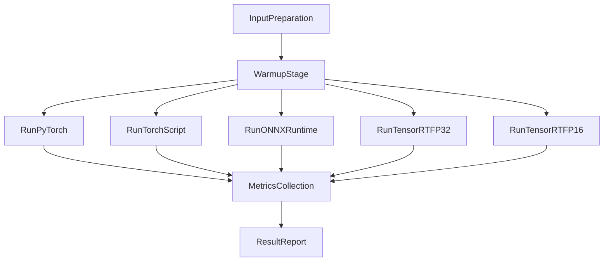
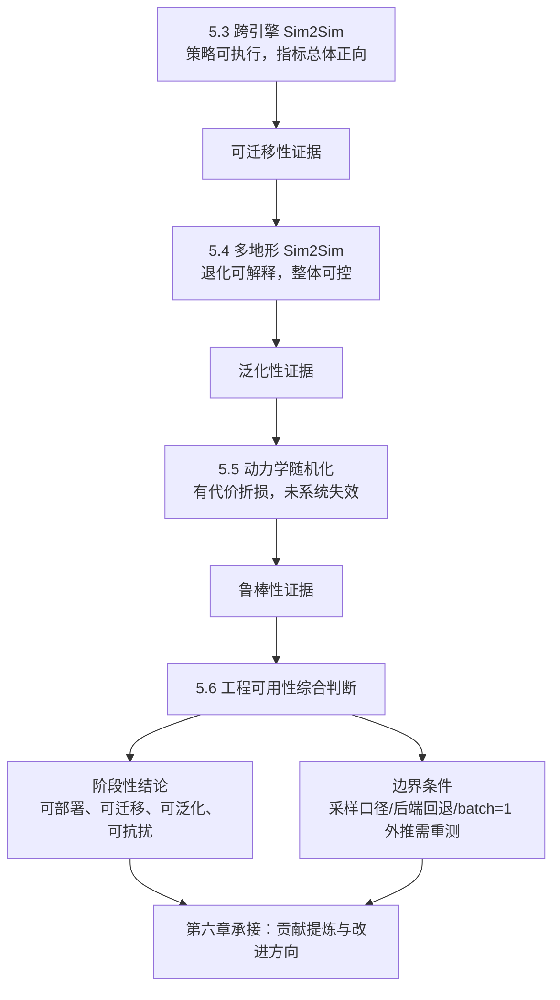

# 第五章 部署性能与跨仿真迁移验证

本章围绕“部署性能验证与跨仿真迁移可信性”展开。与第四章聚焦训练收敛和调参机理不同，本章重点回答以下问题：第一，不同推理后端在实时控制场景中的时延、吞吐、资源代价差异有多大；第二，策略从 Isaac Gym（PhysX）迁移至 MuJoCo 后是否保持行为一致性；第三，面对地形复杂度提升时性能退化是否可解释且可控；第四，在有界动力学扰动条件下是否仍具备可运行稳定性。围绕这些问题，本章构建“推理效率-跨引擎一致性-跨地形泛化-随机扰动鲁棒性”的证据链，并在章末给出工程可用性边界与后续改进方向。

## 5.1 部署验证目标与统一评估口径

部署阶段关注的核心不再是“是否能够学到策略”，而是“策略能否在目标硬件和目标运行链路中稳定、低时延、可解释地执行”。对于机器人控制任务，推理链路的时延抖动会直接影响控制闭环稳定性；当推理延迟偏高或波动较大时，控制指令会出现滞后并放大系统动态误差。因此，本章将部署验证目标统一为三类：  
（1）**部署效率验证**：比较 PyTorch、TorchScript、ONNXRuntime、TensorRT FP32/FP16 的实时性能与资源开销；  
（2）**跨仿真一致性验证**：在统一任务和控制条件下对比 Isaac Gym（PhysX）与 MuJoCo；  
（3）**泛化与抗扰验证**：在地形复杂化与动力学随机化条件下评估性能保持能力和风险分布。

在 Sim2Sim 验证方面，本章采用 MuJoCo 作为异构目标环境，原因并非“更换软件复现实验”，而是利用异构动力学求解器进行策略压力测试：若策略对单一引擎接触建模存在隐式依赖，跨引擎后往往会出现误差放大或稳定性下降。需要强调的是，Isaac Gym 与 PhysX 是“平台-引擎”关系，因此“Isaac Gym（PhysX）与 MuJoCo 对比”的本质是同一策略在不同动力学求解器下的行为对照。

为确保结果可横向解释，本章统一采用可观测且物理意义明确的指标体系：速度跟踪误差 `vx_mae`、偏航跟踪误差 `yaw_mae`、姿态稳定指标 `roll_rms/pitch_rms`、动作平滑指标 `action_delta_l2_mean/action_delta_rate_mean`、生存稳定指标 `survival_time/fall_rate`。指标优劣方向统一为：误差与波动类“越小越优”，生存时长“越大越优”，跌倒占比“越小越优”。各指标定义如下（轨迹长度为 \(T\)，控制周期为 \(\Delta t\)）：
\[
\mathrm{vx\_mae}=\frac{1}{T}\sum_{t=1}^{T}\left|v_x(t)-v_{x,\mathrm{cmd}}(t)\right|
\]
\[
\mathrm{yaw\_mae}=\frac{1}{T}\sum_{t=1}^{T}\left|\omega_{\mathrm{yaw}}(t)-\omega_{\mathrm{yaw,cmd}}(t)\right|
\]
\[
\mathrm{roll\_rms}=\sqrt{\frac{1}{T}\sum_{t=1}^{T}\mathrm{roll}(t)^2},\quad
\mathrm{pitch\_rms}=\sqrt{\frac{1}{T}\sum_{t=1}^{T}\mathrm{pitch}(t)^2}
\]
\[
\mathrm{action\_delta\_l2\_mean}=\frac{1}{T-1}\sum_{t=2}^{T}\left\|a_t-a_{t-1}\right\|_2
\]
\[
\mathrm{action\_delta\_rate\_mean}=\frac{1}{T-1}\sum_{t=2}^{T}\frac{\left\|a_t-a_{t-1}\right\|_2}{\Delta t}
\]
\[
\mathrm{survival\_time}=N_{\mathrm{alive}}\cdot \Delta t,\quad
\mathrm{fall\_rate}=\frac{1}{T}\sum_{t=1}^{T}\mathrm{fallen\_flag}(t)
\]
其中 `survival_time` 表征任务持续可执行能力，`fall_rate` 对应 step-level 跌倒占比，二者联合刻画稳定性与安全边界。

统计表达采用“趋势证据为主、关键量化为辅”。对跨引擎与跨条件比较，统一使用相对改善率口径：
\[
\mathrm{Improvement}(\%)=\frac{M_{\mathrm{PhysX}}-M_{\mathrm{MuJoCo}}}{M_{\mathrm{PhysX}}}\times 100\%
\]
该值为正表示 MuJoCo 在误差类指标上优于 PhysX。对鲁棒性组别，采用 baseline 与 randomization 的对应保持率口径。

此外，本章三个 Sim2Sim 子实验均遵循控制变量原则：`compare` 仅改变引擎，`terrain_contrast` 仅改变地形，`robustness` 仅叠加有界动力学随机化。通过此设计，避免将环境差异、任务差异与模型差异混杂在同一结论中。

## 5.2 多后端推理性能对比实验

### 5.2.1 推理链路与统一实验设置

本节面向“策略工程化落地”场景，在不改变任务语义的前提下比较五类推理链路：PyTorch checkpoint、TorchScript、ONNXRuntime、TensorRT FP32、TensorRT FP16。输入规范统一为 `obs_prop: [1,33]` 与 `obs_hist: [1,10,33]`，确保不同后端的差异主要来源于执行机制，而非输入定义差异。

统一实验口径为 `batch_size=1`、`warmup=100`、`iters=1000`、`repeats=3`，设备为 `cuda:0`（NVIDIA GeForce RTX 3080 Ti）。该配置优先刻画机器人在线控制常见的小批量低时延工况。评价维度包括：  
（1）**时延与吞吐**：平均时延、p50/p90/p99、标准差、吞吐（qps）；  
（2）**数值一致性**：最大绝对误差、平均绝对误差、余弦相似度（基准为 PyTorch checkpoint）；  
（3）**资源指标**：显存占用、GPU 利用率、功耗。

五条链路对应不同工程诉求：PyTorch 代表最小迁移成本的研究原型路径，TorchScript 代表保留 PyTorch 生态下的图化优化，ONNXRuntime 代表跨框架中间表示运行时，TensorRT 代表面向 NVIDIA GPU 的高性能部署。保留 TensorRT FP32 与 FP16 双路径，是为了区分“图优化收益”和“低精度计算收益”。  
综合来看，这并非简单快慢比较，而是覆盖研发验证、跨平台部署与极致实时优化的完整决策空间。

推理流程采用“统一输入 -> 预热 -> 正式迭代 -> 指标汇总 -> 跨后端对比”。预热用于消除首次运行初始化开销；正式迭代采集逐次时延；资源指标以固定周期采样。流程如下：

### 5.2.2 时延、吞吐与资源结果分析

实验结果显示五条链路存在稳定性能梯度。以 PyTorch checkpoint 为基线，其平均时延为 `0.6316 ms`、吞吐为 `1117.44 qps`。TorchScript 平均时延降至 `0.4734 ms`（相对加速约 `1.33x`），ONNXRuntime 为 `0.3154 ms`（约 `2.00x`）。TensorRT 路径提升最显著：FP32 为 `0.0672 ms`（约 `9.40x`），FP16 为 `0.0487 ms`（约 `12.96x`）。

吞吐排序与时延一致：TorchScript `1353.46 qps`、ONNXRuntime `3158.19 qps`、TensorRT FP32 `15521.17 qps`、TensorRT FP16 `20576.67 qps`。这表明后端优化能力越强，吞吐与时延收益越明显；FP16 相比 FP32 仍有提升，说明当前模型和硬件组合可有效利用半精度路径。

资源指标方面，PyTorch 与 TorchScript 显存均值约 `348 MB`，ONNXRuntime 约 `370 MB`，TensorRT 路径约 `488~510 MB`，峰值约 `641 MB`。功耗均值方面，TensorRT 约 `91~92 W`，ONNXRuntime 约 `90.7 W`，TorchScript 约 `89.5 W`。该结果符合“更高性能后端通常伴随更积极资源分配”的工程规律，但整体仍处于可接受范围。

为便于正文引用，核心结果汇总如下。

（表 5-1 不同推理后端的性能对比）

| 推理后端 | 平均时延 (ms) | p50 (ms) | p90 (ms) | p99 (ms) | 吞吐 (qps) | 相对 PyTorch 加速比 |
|---|---:|---:|---:|---:|---:|---:|
| PyTorch checkpoint | 0.6316 | 0.5657 | 0.6371 | 1.0589 | 1117.44 | 1.00x |
| TorchScript JIT | 0.4734 | 0.4323 | 0.4648 | 0.7485 | 1353.46 | 1.33x |
| ONNXRuntime | 0.3154 | 0.2886 | 0.3368 | 0.4505 | 3158.19 | 2.00x |
| TensorRT FP32 | 0.0672 | 0.0672 | - | 0.0672 | 15521.17 | 9.40x |
| TensorRT FP16 | 0.0487 | 0.0487 | - | 0.0487 | 20576.67 | 12.96x |

### 5.2.3 数值一致性与部署选型建议

数值一致性方面，ONNXRuntime 相对基线的最大绝对误差约 `9.54e-07`、平均绝对误差约 `3.20e-07`、余弦相似度约 `0.9999999999999738`，处于可忽略量级。TorchScript 与 PyTorch 在本轮实验中表现为零误差。TensorRT 路径当前采用 `trtexec` 回退口径，未直接采集输出张量，故误差指标记为“-”。

精度与资源汇总如下。

（表 5-2 精度与资源指标对比）

| 推理后端 | 最大绝对误差 | 平均绝对误差 | 余弦相似度 | 显存均值/峰值 (MB) | GPU 利用率均值/峰值 (%) | 功耗均值/峰值 (W) |
|---|---:|---:|---:|---:|---:|---:|
| PyTorch checkpoint | 0 | 0 | 1.0 | 348 / 348 | 6.24 / 7.33 | 76.85 / 88.60 |
| TorchScript JIT | 0 | 0 | 1.0 | 348 / 348 | 7.50 / 8.33 | 89.50 / 89.55 |
| ONNXRuntime | 9.54e-07 | 3.20e-07 | 0.9999999999999738 | 370 / 370 | 26.11 / 34.67 | 90.71 / 91.04 |
| TensorRT FP32 | - | - | - | 509.75 / 641.0 | 12.08 / 28.67 | 91.58 / 91.80 |
| TensorRT FP16 | - | - | - | 488.67 / 641.0 | 12.42 / 32.33 | 91.81 / 91.97 |

注：TensorRT 当前统计口径未直接采集输出张量，误差项与部分分位项记为“-”。

综合性能、一致性和工程复杂度，可得部署建议：对极致实时性敏感的场景优先 TensorRT（尤其 FP16）；对跨框架可移植性与数值可解释性要求较高的场景优先 ONNXRuntime；对迁移成本敏感且需保持 PyTorch 工作流的场景可采用 TorchScript。部署选型应在“实时性-维护成本-可移植性”三元约束下综合决策。

## 5.3 Sim2Sim 跨引擎一致性验证（compare）

### 5.3.1 对照实验设置

`compare` 实验关注“跨引擎迁移后行为是否一致”。任务设置为 \(20\) s 时间窗内持续跟踪 `cmd_vx=1.0 m/s`、`cmd_yaw=0.0 rad/s`（`constant_forward` 场景）。实验统一前提包括：同一 ONNX 策略模型、同一任务命令、同一控制节拍（约 `0.01 s`）、同一失稳判据（基座高度低于 `0.20 m` 记为跌倒）、对照阶段不叠加额外随机化扰动。

为便于复核，本组实验的核心图像与数据路径如下：  
- `sim2sim/results/mujoco_vs_phyX/compare.csv`  
- `sim2sim/results/mujoco_vs_phyX/figure_paper/paper_r01_core_bar.png`  
- `sim2sim/results/mujoco_vs_phyX/figure_paper/paper_r01_mujoco_advantage_percent.png`  
- `sim2sim/results/mujoco_vs_phyX/figure_paper/paper_r01_action_delta_line.png`  
- `sim2sim/results/mujoco_vs_phyX/figure_paper/paper_r01_tracking_error_lines.png`  

（图 5-1 占位：跨引擎核心指标柱状图）  
（图 5-2 占位：MuJoCo 相对 PhysX 提升比例图）  
（图 5-3 占位：动作平滑时序对比图）  
（图 5-4 占位：速度/偏航误差时序对比图）

### 5.3.2 核心指标结果与结论

四类图像对应含义如下：核心柱状图基于 `compare.csv` 聚合 `vx_mae`、`yaw_mae`、`roll_rms`、`pitch_rms`、`action_delta_l2_mean`；提升比例图按统一公式计算逐指标改善率；动作平滑时序图使用 rolling mean（窗口 40）并叠加标准差带；跟踪误差时序图统计 \(|v_x-v_{x,cmd}|\) 与 \(|\omega_{yaw}-\omega_{yaw,cmd}|\) 的 rolling 均值与离散区间。

结果显示，策略迁移至 MuJoCo 后未出现明显失效，且多项指标相对 PhysX 呈正向变化：`vx_mae`、`yaw_mae`、`roll_rms`、`pitch_rms` 约下降 `71.9%`、`93.4%`、`74.5%`、`70.2%`；动作平滑相关指标改善约 `95.5%~96.9%`。时序层面，MuJoCo 曲线整体更低、波动带更窄，说明其短时跟踪稳定性和重复一致性较好。  
据此可形成阶段性结论：策略具备跨引擎可执行性与一致性，且在本任务口径下呈现正向性能趋势。  

（表 5-3 跨引擎核心指标对比表）

| 指标维度 | 代表指标 | MuJoCo 相对 PhysX 变化 | 结果解读 |
|---|---|---:|---|
| 速度跟踪误差 | `vx_mae` | 约下降 `71.9%` | 前向速度跟踪精度显著提升 |
| 偏航跟踪误差 | `yaw_mae` | 约下降 `93.4%` | 偏航控制一致性明显增强 |
| 姿态稳定性 | `roll_rms` / `pitch_rms` | 约下降 `74.5%` / `70.2%` | 姿态波动收敛，短时稳定性更好 |
| 动作平滑性 | `action_delta_l2_mean` 等 | 约改善 `95.5%~96.9%` | 动作抖动显著降低，控制更平顺 |
| 可执行性与安全性 | `fall_rate` / `survival_time` | 未出现系统性失效 | 跨引擎迁移后保持可执行与可复验 |

注：统计口径对应 `sim2sim/results/mujoco_vs_phyX/compare.csv` 及图 5-1 至图 5-4 的一致口径聚合结果。

## 5.4 Sim2Sim 地形泛化验证（terrain_contrast）

### 5.4.1 跨地形对比任务设计

本节在 MuJoCo 单一引擎内评估跨地形泛化。任务命令保持恒定（`cmd_vx=1.0`，`cmd_yaw=0.0`，时长 `20 s`），仅替换场景几何：`flat_scene.xml`（平地）、`slope_scene.xml`（约 \(8^\circ\) 坡地）、`stairs_scene.xml`（8 级台阶）。该对照逻辑用于把性能差异归因到地形复杂度，而非命令变化。

训练侧地形机制来自 `utils/terrain.py`：`randomized_terrain` 分支对难度从 `{0.5,0.75,0.9}` 采样；`curiculum` 分支按行索引递增难度；`make_terrain` 中 `step_height/slope` 等参数与难度耦合；`terrain_mode` 支持 `stairs/wave/mixed/flat`。其中台阶通过 `pyramid_stairs_terrain` 生成（`step_width=0.61`，`step_height=0.5*step_height`），波浪地形由 `wave_terrain` 生成（`amplitude`、`wavelength` 随难度变化）。这为“训练分布具备多难度变化，而验证阶段采用固定代表场景”提供工程背景。

本组实验关键数据与图路径如下：  
- `sim2sim/results/terrain_contrast/compare.csv`  
- `sim2sim/results/terrain_contrast/figure/terrain_key_metrics_summary.csv`  
- `sim2sim/results/terrain_contrast/figure/terrain_generalization_retention.png`  
- `sim2sim/results/terrain_contrast/figure/terrain_repeat_variability.png`  
- `sim2sim/results/terrain_contrast/figure/terrain_vx_error_cdf.png`  

（图 5-5 占位：地形能力保持率图）  
（图 5-6 占位：多重复离散性图）  
（图 5-7 占位：速度误差 CDF 图）

### 5.4.2 泛化能力边界分析

保持率图按“越小越优”与“越大越优”指标分别计算归一保持率，结果为：速度跟踪保持率 slope 约 `75.4%`、stairs 约 `58.1%`；生存保持率 slope 约 `79.8%`、stairs 约 `98.5%`。说明性能随复杂度上升存在可解释退化，但未发生系统性崩溃。

离散性图显示 flat 场景方差最小，slope/stairs 离散度增大但仍可复验；CDF 结果中，complex 地形相对 flat 整体右移，表明达到同等累计概率需更高误差阈值，中高误差区占比上升。综合保持率、离散性和分布证据可得：策略具备跨地形迁移能力，主要退化集中在偏航跟踪与动作平滑相关指标，泛化边界在离散突变地形下更易触及。  

（表 5-4 地形泛化能力统计表）

| 地形场景 | 复杂度层级 | 速度跟踪保持率 | 生存保持率 | 分布与离散特征 | 泛化结论 |
|---|---|---:|---:|---|---|
| `flat` | 低（基准） | `100%` | `100%` | 方差最小，误差分布最集中 | 作为性能上限与对照基线 |
| `slope` | 中 | 约 `75.4%` | 约 `79.8%` | 离散度增大，CDF 相对平地右移 | 出现可解释退化，但整体可控 |
| `stairs` | 高 | 约 `58.1%` | 约 `98.5%` | 中高误差占比上升，尾部风险更突出 | 泛化边界更易触及，需重点优化 |

注：保持率按“越小越优/越大越优”指标分别归一计算；对应 `sim2sim/results/terrain_contrast/compare.csv` 与相关图表统计结果。

## 5.5 动力学随机化鲁棒性验证（robustness）

### 5.5.1 随机化条件与对照流程

本节采用“baseline vs dynamics randomization”成对流程：先运行不随机化基线，再在同一场景与同类任务命令下启用随机化，最后按同一指标口径比较差异。随机化条件取 `medium` 配置：摩擦缩放 `[0.8,1.2]`、质量缩放 `[0.9,1.1]`、质心三轴偏移 `±0.01 m`。  
该设计围绕摩擦、质量、质心三类关键动力学参数进行有界压力测试，用于评估对建模误差的容忍能力。

关键数据与图路径如下：  
- `sim2sim/results/robustness/baseline/*_r*.csv`  
- `sim2sim/results/robustness/dynamics_rand/*_r*.csv`  
- `sim2sim/results/robustness/figure/robustness_retention_ratio.png`  
- `sim2sim/results/robustness/figure/robustness_vx_error_cdf.png`  
- `sim2sim/results/robustness/figure/robustness_survival_fall.png`  

（图 5-8 占位：随机化能力保持率图）  
（图 5-9 占位：随机化前后速度误差 CDF 图）  
（图 5-10 占位：生存时长与跌倒率图）

### 5.5.2 鲁棒性退化与风险分布

保持率图表明，flat 受影响最小，slope 中度下降，stairs 在生存与平滑维度退化更显著。CDF 对比显示 slope/stairs 在随机化条件下明显右移，说明中高误差占比增加。生存与跌倒统计显示，全场景平均生存时长由 baseline 到 randomization 下降约 `20.1%`，跌倒占比上升约 `0.046` 个百分点；风险增量主要集中在台阶场景（生存时长约下降 `50.4%`，跌倒占比约增加 `0.128` 个百分点）。

据此可得结论：策略在动力学扰动下未出现系统性失效，体现出“可运行但有代价”的鲁棒性特征；但复杂地形中的尾部风险仍需通过后续训练与约束机制进一步压缩。  

（表 5-5 随机化鲁棒性统计表）

| 统计维度 | baseline → dynamics randomization 变化 | 主要观察 | 风险判断 |
|---|---:|---|---|
| 全场景平均生存时长 | 约下降 `20.1%` | 随机化后总体生存能力下降 | 存在可观测折损，但未系统性崩溃 |
| 全场景平均跌倒占比 | 约上升 `0.046` 个百分点 | 失稳事件增多但幅度有限 | 策略仍保持可运行 |
| `flat` 场景 | 轻微变化 | 受扰动影响最小 | 鲁棒裕量相对充足 |
| `slope` 场景 | 中度退化 | CDF 右移，中高误差占比增加 | 需进一步压缩跟踪误差波动 |
| `stairs` 场景生存时长 | 约下降 `50.4%` | 生存能力显著受损 | 复杂地形为主要脆弱点 |
| `stairs` 场景跌倒占比 | 约上升 `0.128` 个百分点 | 风险增量集中于台阶地形 | 尾部风险控制是后续重点 |

注：随机化配置为 `medium`（摩擦 `[0.8,1.2]`、质量 `[0.9,1.1]`、质心偏移 `±0.01 m`）；对应 `sim2sim/results/robustness/*` 同口径对照统计。

## 5.6 综合讨论与工程可用性分析

综合三组 Sim2Sim 实验与推理对比结果，可形成如下归纳：  
（1）在跨引擎层面，策略迁移后保持可执行，且多项指标呈正向变化；  
（2）在跨地形层面，性能随难度增加出现可解释退化，但退化总体可控；  
（3）在鲁棒性层面，动力学随机化带来可观测折损，但未触发系统性崩溃；  
（4）在部署性能层面，后端性能呈现清晰梯度，TensorRT 提供实时性上限，ONNXRuntime 提供性能与一致性平衡方案。  
四类证据共同支持“可部署、可迁移、可泛化、可抗扰”的阶段性工程结论。

结果可信度方面，本章在“性能排序”与“数量级差异”层面具有较高稳定性：多轮重复实验排序一致，ONNX 输出误差维持在 \(10^{-6}\) 量级，支持“转换链路未改变策略语义”判断。  
边界条件方面，需保持客观表述：  
（1）资源指标依赖固定周期采样，适合趋势判断，不宜过度解释瞬态峰值；  
（2）TensorRT 当前采用回退口径，分位抖动和输出误差解释需审慎；  
（3）本章 `batch_size=1` 结论主要服务在线控制场景，迁移到大 batch 离线场景需重测。  
因此，本章采用“高置信结论 + 条件化解释”的表达策略：在当前硬件、模型规模与实时口径下结论可靠；跨硬件、跨 batch、跨采样口径外推需重新执行同口径实验。

从工程工作量看，本章并非单次跑分，而是完成了从训练权重整理、格式转换、后端适配、统一采集到结构化汇总的完整链路。该工作把“算法有效”推进为“系统可用”，并将分散结果转化为可比较、可复验、可决策的工程证据。

图 5-11 可迁移性-泛化性-鲁棒性证据链图（本文绘制）

## 5.7 本章小结

本章系统完成了多后端推理对比与 Sim2Sim 三组验证，建立了从部署链路性能到跨仿真行为稳定性的完整证据闭环。推理实验表明，五类后端在时延与吞吐上呈稳定递进关系：TensorRT FP16 取得最高实时效率，ONNXRuntime 在性能与一致性间具备较好折中，TorchScript 提供低迁移成本中间方案。跨引擎实验表明，策略在 MuJoCo 下保持可执行并在多项指标上呈正向趋势；跨地形实验表明性能退化符合复杂度规律且总体可控；鲁棒性实验表明随机化下策略仍可运行，但复杂地形尾部风险显著上升。

综上，本文在部署前阶段给出了“可迁移、可泛化、可抗扰且具备工程可用性边界”的系统性结论。该结论既支撑第六章对总体贡献与局限性的提炼，也为后续 Sim2Real、在线安全约束与部署链路优化提供了明确方向。
