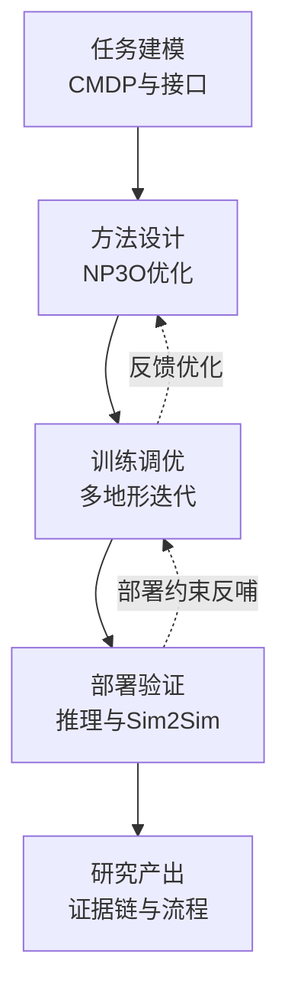
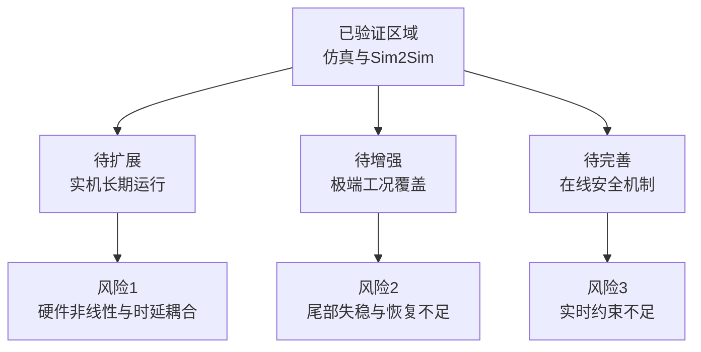
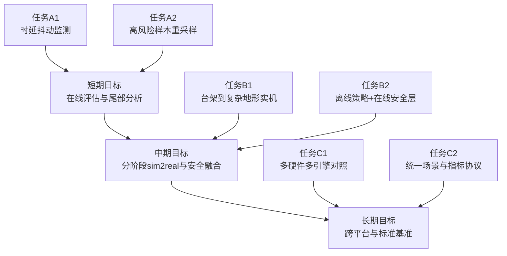

# 第六章 结论、局限与展望

前五章围绕“双轮足机器人复杂地形盲走控制”这一核心问题，完成了从问题定义、任务建模、算法设计到训练验证与部署评估的完整研究链路。随着研究从方法层逐步走向工程层，本文的关注重点也由“是否能学到可用策略”延伸到“策略是否稳定、是否安全、是否可部署、是否可迁移”。因此，本章不再重复前文细节，而是以“总结已有证据—提炼核心结论—识别真实边界—提出可执行展望”为逻辑主线，对全文进行系统收束。

## 6.1 研究工作总结

本文研究工作并非单一算法实验，而是围绕复杂地形盲走任务建立了“建模—学习—调优—验证”的递进式框架。若从研究推进路径观察，全文可以概括为三个相互衔接、逐层深入的阶段。

第一阶段是任务建模与方法构建。针对复杂地形下“性能目标与安全目标难以兼顾”的矛盾，本文将任务形式化为连续状态—连续动作 CMDP，并将控制需求拆解为指令跟踪、姿态稳定与约束满足三个并行目标。在此基础上，构建了包含本体状态、局部地形信息、历史观测序列和随机化隐变量的复合观测表达，同时完成了 8 维连续动作到关节执行命令的映射机制。围绕这一建模框架，本文采用 NP3O 约束强化学习方法，引入代价优势、代价价值与违约惩罚等机制，将“高性能学习”与“风险抑制”纳入同一优化过程，形成了可解释的双通道学习路径。

第二阶段是多地形训练与参数调优。考虑到“单场景收敛”并不等于“可部署可泛化”，本文在台阶与波浪两类代表地形上开展版本化迭代研究，构建了 `v0/v1/v2` 的演进链路，并通过“先稳定、后提效”的调优思路控制训练过程。实践表明，若仅追求奖励上升，容易出现中后期漂移、约束反弹和局部最优等问题；而在“全局指标—约束指标—稳定性指标”的联合诊断框架下，参数调整可以从经验试错转为机理驱动。该阶段的核心价值不只是得到更高分数，而是形成了可复验、可归因的调参方法，为后续部署验证提供了高质量策略候选。

第三阶段是部署性能与跨仿真迁移验证。本文将训练得到的策略延伸到多后端推理链路，系统比较了 PyTorch、TorchScript、ONNXRuntime、TensorRT FP32 与 TensorRT FP16 的实时性能、数值一致性和资源开销。实验结果显示，TensorRT FP16 相对 PyTorch 实现约 12.96 倍加速，TensorRT FP32 约 9.40 倍，ONNXRuntime 约 2.00 倍，TorchScript 约 1.33 倍，同时 ONNX 与基线保持 1e-6 量级误差，说明在当前任务中可实现“效率提升与数值可控”的平衡。进一步地，本文完成了 Sim2Sim 三组验证，分别检验跨引擎一致性、跨地形泛化性与动力学扰动鲁棒性，得到“可迁移、可泛化、可运行但存在边界代价”的阶段性结论。

综上可见，本文的研究主线不是线性拼接，而是一个具有反馈闭环的系统工程：建模定义优化目标，优化结果反向指导调参，调参质量决定部署上限，部署验证再反过来暴露训练阶段尚未覆盖的边界条件。该逻辑关系为第六章后续结论提炼与展望设计提供了直接依据。

（图 6-1 全文研究主线与产出关系图）

（表 6-1 本文研究工作与章节对应关系）

| 主线模块 | 核心内容 | 对应章节 | 关键产出 |
|---|---|---|---|
| 任务建模与目标定义 | CMDP 建模、复合观测、动作执行映射 | 第二章 | 明确“性能+安全”统一任务语义 |
| 约束学习方法设计 | NP3O 目标函数、联合网络、稳定化机制 | 第三章 | 形成可训练的约束优化框架 |
| 多地形训练调优 | 台阶/波浪对比、版本迭代、指标闭环 | 第四章 | 提炼“先稳定后提效”调参方法 |
| 部署与迁移验证 | 推理后端对比、Sim2Sim 一致性与泛化验证 | 第五章 | 形成部署选型依据与迁移证据 |
| 全文收束与延展 | 结论提炼、局限分析、后续展望 | 第六章 | 给出可持续研究路线 |

## 6.2 主要结论与创新贡献

在完成对全文工作链路的回顾后，可以进一步回答两个核心问题：其一，本文到底得出了哪些具有稳定支撑的结论；其二，这些结论相较已有工作体现了什么创新价值。为避免“结论罗列化”，本节按“从理论到工程、从可行到可用”的逻辑顺序展开。

首先，在方法层面，本文验证了“奖励回报与代价回报并行优化”在复杂地形盲走任务中的必要性与有效性。相较将安全项直接混入总奖励的做法，显式代价通道能够更清楚地区分“性能提升”与“风险增加”，减少高风险动作通过短期奖励放大而被误选的概率。这一结论并非纯理论判断，而是由第四章多指标联动趋势和第五章迁移实验共同支撑：当训练过程只看单一奖励时，容易出现局部指标改善但全局稳定性下降的现象；而在约束学习框架下，性能增长与约束收敛可以实现更高程度的同步。

其次，在训练层面，本文形成了具有可复用价值的版本化调参方法。研究表明，复杂地形任务中的核心难点往往不是“能否收敛”，而是“能否在中后期保持不退化”。通过“现象识别—机理诊断—小步调整—复验确认”的闭环，训练过程从不可解释的黑箱调参转化为可追踪的工程迭代。台阶地形侧重动作连续性与接触冲击管理，波浪地形侧重多目标耦合与长期稳定，两类地形差异化结果进一步说明：有效调参必须建立在地形机理理解之上，而不是参数堆叠。

再次，在工程层面，本文补齐了“算法好看但部署不清”的常见断层。通过多后端推理对比，本文不仅给出“谁更快”，还给出“快到什么程度、代价是什么、一致性是否可接受”的量化答案。例如 TensorRT FP16 的高加速能力为极致实时场景提供了明确方案，而 ONNXRuntime 在性能与可移植性之间展现出更平衡的工程属性。这意味着本文结果已经从“研究可行”迈向“工程可选型”。

最后，在迁移与鲁棒层面，本文建立了跨引擎、跨地形、跨扰动条件下的系统证据链。Sim2Sim 结果表明策略并未局限于单一仿真环境；地形泛化实验表明性能退化与难度增长总体同向、趋势可解释；鲁棒性实验则揭示了“可运行但有代价”的真实边界。这一结论具有重要实践意义：它避免了“过度乐观”的泛化叙事，也为后续安全增强研究提供了明确抓手。

综合以上分析，本文的创新贡献可以归纳为三点。第一，提出并落地了面向双轮足复杂地形盲走任务的约束学习建模与优化路径，实现了性能目标与安全目标的协同表达。第二，构建了多地形版本化调参体系与联合评估协议，将训练改进从经验行为升级为可复验流程。第三，打通了“训练—评估—导出—验证”工程链路，使方法评价从单一训练指标扩展到部署效率与迁移可信性。三者共同支撑了本文从算法研究到工程应用过渡的完整性。

（表 6-2 主要结论与证据来源对照表）

| 结论类型 | 代表性结论 | 主要证据来源 | 结论性质 |
|---|---|---|---|
| 方法层 | 奖励-代价并行优化优于单奖励混合 | 第三章方法分析 + 第四章多指标趋势 | 机理性结论 |
| 训练层 | 版本化调参可降低中后期退化风险 | `stairs v0->v2`、`wave v1->v2` 对比 | 实证性结论 |
| 部署层 | TensorRT 路径具备显著实时性优势 | 第五章推理对比（最高约 12.96x） | 工程性结论 |
| 迁移层 | 策略具备跨引擎与跨地形可执行性 | Sim2Sim `compare` 与 `terrain_contrast` | 阶段性结论 |
| 鲁棒层 | 扰动下“可运行但有代价” | `robustness` 实验（生存时长与风险变化） | 边界性结论 |

## 6.3 研究局限性分析

任何阶段性结论都必须放在其证据边界内理解。本文虽然在复杂地形盲走任务上取得了较完整的结果链条，但若从“真实部署可用性”这一更高目标审视，当前工作仍存在若干不可忽视的限制。明确这些局限，不是削弱研究价值，而是为后续改进建立更精确的问题坐标。

首先，证据主体仍来自仿真与跨仿真环境。Sim2Sim 已能在较低成本下检验策略跨引擎稳定性，但它本质上仍是仿真域内验证，无法完全等价于实机运行中复杂而连续的噪声源与非线性扰动。尤其在执行器间隙、传感器漂移、结构弹性和通信链路时延共同存在时，控制表现可能出现新的退化模式。因此，当前结论应被理解为“实机前高置信筛查”，而非“实机最终结论”。

其次，工况覆盖广度与深度仍有不足。本文已覆盖平地、坡地、台阶、波浪以及摩擦/质量/质心扰动等条件，但极端工况组合、持续高冲击接触、长时间连续任务等高风险场景仍测试有限。换言之，本文较好刻画了“常规复杂场景下可运行边界”，但尚未完全刻画“最坏情况下安全边界”。这也是当前多数仿真研究向工程落地过渡时面临的共同难点。

再次，鲁棒性结论体现出明显代价特征。随机化实验中，策略并未系统性崩溃，但出现了生存时长下降和风险指标上升，且退化在高难地形上更突出。这说明策略已有基础抗扰能力，但在线风险抑制能力仍不充分，尤其在地形突变与参数扰动叠加时，尾部失稳事件仍可能发生。该问题直接关联到后续在线安全机制与难例强化策略的必要性。

此外，部署评价仍以离线统计为主。当前推理实验能够清晰比较不同后端的平均时延、吞吐与资源占用，但对于真实系统更关心的“长时抖动分布、热态漂移、任务并发下的稳定性退化”等指标，仍缺少系统数据支撑。这意味着本文已经回答了“部署是否可行”，但尚未完整回答“部署能否长期稳定”。

最后，结论外推范围仍受平台约束。本文对象集中于当前双轮足形态及其控制接口，研究结论在不同机构参数、执行器性能和硬件平台上的迁移性仍需进一步实证。只有在更广的平台与统一协议下进行对照，才能将阶段性结论沉淀为更普适的方法性结论。

综上，本文的局限并不在于“缺少结果”，而在于“结果尚处于从仿真可信向实机可信过渡的中间阶段”。这也正是下一步研究应重点突破的方向。

（图 6-2 当前研究边界与风险分布示意图）

（表 6-3 局限性与改进方向映射）

| 当前局限 | 影响表现 | 主要原因 | 对应改进方向 |
|---|---|---|---|
| 仿真证据占主导 | 外推到实机存在不确定性 | 缺少分阶段实机闭环验证 | 推进台架到实机递进测试 |
| 极端工况覆盖不足 | 最坏情况边界不清晰 | 高风险样本占比不足 | 增加难例重采样与压力测试 |
| 鲁棒性有代价 | 复杂地形下尾部风险上升 | 扰动与地形耦合未完全抑制 | 强化在线安全与自适应随机化 |
| 在线评估不足 | 长时稳定性结论不充分 | 指标集中在离线统计 | 补充长时在线闭环指标体系 |
| 跨平台验证有限 | 泛化结论边界较窄 | 平台与机构覆盖面有限 | 扩展多平台统一评测 |

## 6.4 后续研究展望

基于上述局限，本文后续研究不宜采取“单点补丁式”推进，而应围绕“部署可信度提升”与“控制鲁棒性增强”两条主线并行展开。前者回答“策略如何真正落地”，后者回答“策略在复杂条件下如何更稳更安全”。两者相互依赖：没有部署侧闭环，方法优势难以证明；没有控制侧提升，部署稳定性难以保障。

在部署与迁移方向上，建议采用分阶段、可回溯的验证路线。短期内可先补齐在线运行指标，重点关注长时抖动、周期违约率与异常恢复时间，建立比离线跑分更贴近控制现场的评估口径。中期可推进“台架—低速实机—复杂地形实机”的逐级验证，避免跨阶段跃迁导致风险不可控。与此同时，还需扩大跨平台一致性研究范围，在不同引擎、不同硬件与不同控制频率下执行统一任务协议，识别“平台差异对策略行为”的可解释影响。若条件允许，可进一步探索量化、剪枝和蒸馏等压缩手段，使高性能推理能力向边缘算力场景延伸。

在控制与优化方向上，重点应由“平均性能提升”转向“尾部风险压缩”。一方面，可在离线学习策略之外叠加在线安全层，例如安全滤波与控制屏障函数，形成“离线学性能、在线保边界”的双层框架。另一方面，可根据失稳样本分布实施自适应随机化与难例重采样，将训练预算更多投入到高风险状态区域，提高策略对突发扰动和极端地形的恢复能力。此外，继续增强时序建模与记忆表达，有助于提升策略对非平稳动态过程的响应连续性；推进多目标约束权重自适应，也有助于缓解“高性能与高安全”在不同阶段的冲突。最终，建议沉淀统一场景集、统一指标集和统一统计脚本，形成可复现、可比较的标准评测流程。

从实施节奏看，后续工作可以分为三个层级。第一层是短期补强，目标是快速识别当前部署边界并补齐在线评估盲区；第二层是中期融合，目标是在实机验证中同步引入安全机制并形成稳定闭环；第三层是长期沉淀，目标是建立跨平台标准化验证体系，提升研究结论的外推能力与可复用价值。该分层推进方式能够兼顾研究风险与工程效率。

（图 6-3 后续研究技术路线图）

（表 6-4 后续研究分阶段实施建议）

| 阶段 | 时间建议 | 重点任务 | 预期结果 |
|---|---|---|---|
| 第一阶段 | 短期 | 建立在线稳定性指标与尾部风险统计 | 明确当前部署风险分布 |
| 第二阶段 | 中期 | 完成分阶段 sim2real 与安全层联调 | 提升真实场景可用性 |
| 第三阶段 | 中长期 | 推进跨平台一致性与标准基准建设 | 增强结论外推性与可复现性 |

总体而言，本文已经完成从方法提出到工程验证的阶段性闭环，证明了约束强化学习在双轮足复杂地形盲走任务中的应用潜力。下一步工作的关键，不再是简单追求更高实验指标，而是持续缩小“仿真有效”与“实机可靠”之间的差距，推动策略从可运行走向可长期运行、从可迁移走向可规模化部署。这也是本文后续研究最核心的目标与价值所在。
