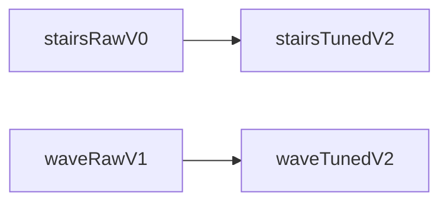
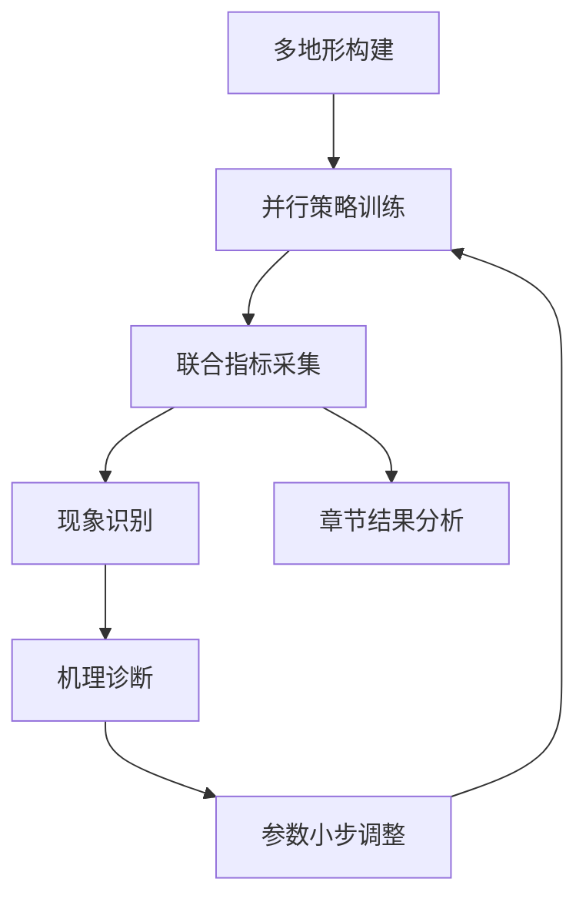

# 第四章 多地形训练与参数调优实验

第三章给出了基于 NP3O 的约束强化学习方法，但“方法可行”并不自动等价于“训练可稳、结果可复现、策略可部署”。因此，本章聚焦实验层问题：在复杂地形盲走任务下，如何通过环境构建、课程调度与参数迭代，将策略训练从“单次收敛”提升为“参数组可追溯优化”。本章实验的核心逻辑是：以多地形并行采样提供样本多样性，以课程机制控制学习难度，以多指标诊断约束调参方向，最终形成可迁移的工程经验。

与前三章一致，本章仍以“性能目标（奖励）—安全目标（代价）—过程稳定（训练统计）”三元框架组织论证。具体地，性能目标关注指令跟踪与持续运行能力，安全目标关注关节/接触相关违约风险，过程稳定关注损失曲线、噪声衰减与更新强度是否可控。基于此，本章围绕台阶地形（stairs）和波浪地形（wave）分别进行参数组对照：`stairs` 比较原始参数（v0）与调参后参数（v2），`wave` 比较原始参数（v1）与调参后参数（v2）。

## 4.1 实验目标与版本化研究思路

本章要解决的并非“如何获得更高单次奖励”，而是“如何在复杂地形上持续稳定训练并获得可部署候选策略”。从工程角度看，若只观察 `Train/mean_reward`，容易出现两类误判：其一，奖励上升但约束恶化，策略可能通过高风险动作换取短期收益；其二，局部指标改善但全局退化，某一姿态项变好却牺牲了回合持续性和综合稳定性。因此，本章实验目标定义为三条并行主线：中后期训练稳定、性能与约束协同、参数迭代可复验。

围绕该目标，本文采用“分地形、双参数组”对照策略组织实验。即 `stairs` 使用原始参数（v0）与调参后参数（v2）对比，`wave` 使用原始参数（v1）与调参后参数（v2）对比。前者聚焦中后期漂移与约束波动问题，后者聚焦局部指标与全局指标冲突问题。该路径将调参从“经验试错”转化为“问题驱动迭代”，并使每组结论都具备明确对照对象。

分地形参数对照关系如下：

其中，台阶对照主要对应“中后期漂移与约束波动”问题，波浪对照主要对应“局部指标与全局指标冲突”问题。

本章训练沿用第三章框架，不改变算法主干，仅调整训练超参数及环境机制。关键设置包括并行环境规模 `num_envs=4096`、每轮采样步长 `num_steps_per_env=24`、初始学习率 `learning_rate=3e-4`、熵系数 `entropy_coef=0.003`、梯度裁剪 `max_grad_norm=0.5`。这种控制变量策略保证本章结论主要来源于参数组调整而非模型结构变化，并为第五章部署验证提供可追溯基础。

需要说明的是，本章并不将所有可调参数同时开放，而是有意识地固定算法主干与核心结构，仅在“训练稳定性敏感参数”上进行参数组迭代。这种控制变量策略有两个直接收益：第一，能够确保各对照组差异主要来自调参策略，而非模型表达能力变化；第二，便于将第四章结论直接迁移到第五章部署验证，避免部署阶段再次引入不必要不确定性。

此外，本章实验在任务口径上与第二章、第三章保持同一语义：控制目标仍是速度跟踪、姿态稳定与约束满足的协同优化，指标统计仍基于训练日志统一采样窗口。这一点保证了章节之间的可追溯关系，即“第四章中的每一项调参收益，都可以回溯到第三章中的目标函数语义，而非额外定义的新任务”。

（表 4-1 本章实验基础设置）

| 模块 | 关键配置 | 说明 |
|---|---|---|
| 并行采样 | `num_envs=4096` | 保证多地形样本吞吐，降低单环境随机性影响 |
| 采样长度 | `num_steps_per_env=24` | 与第三章一致，保证可比性 |
| 优化器设置 | `learning_rate=3e-4`、`max_grad_norm=0.5` | 控制更新强度，避免过冲 |
| 探索设置 | `entropy_coef=0.003`、可学习噪声 | 平衡探索与收敛速度 |
| 约束通道 | `num_costs=6` + `costs.scales` | 显式建模关节与接触风险 |

### 4.2 多地形环境构建与课程化训练机制

#### 4.2.1 地形生成与表示方式

本研究地形生成实现位于 `utils/terrain.py`。整体结构采用“子地形拼接 + 难度参数化”：将大地图划分为 `num_rows x num_cols` 网格，每个子地形单元根据随机类型与难度参数生成高度场，再统一拼接为训练地图。该机制使单次迭代即可覆盖不同难度层级，提升样本多样性。

代码实现中提供了 `terrain_mode` 切换逻辑，支持 `stairs`、`wave`、`mixed` 与 `flat` 四种模式。对应关系如下：

- `stairs`：调用 `pyramid_stairs_terrain`，突出离散高度突变；
- `wave`：调用 `wave_terrain`，构造二维正弦起伏表面；
- `mixed`：以台阶为主并保留波浪尾部分布，形成复合地形；
- `flat`：平地基线，用于排查非地形因素扰动。

在物理表示层，地形先以高度场形式生成，随后在 `mesh_type="trimesh"` 下转换为三角网格接触模型。该流程既保留程序化生成效率，也具备较好的接触几何表达能力，适合双轮足机器人在突变/连续起伏地形上的接触学习。

从训练视角看，这一地形表示方式还有一个重要优点：地形生成与接触计算链路在同一工程框架内完成，减少了外部地形导入产生的坐标系、尺度和网格分辨率不一致问题。对强化学习而言，任何几何表达不一致都会放大为分布噪声，从而干扰策略更新方向。程序化生成与统一网格转换的组合，实质上提升了样本质量一致性。

进一步地，本章采用“分场景训练 + 同口径对比”，并非因为单地形更容易做出结果，而是为了让不同扰动机理能够被清晰分离。若在同一阶段混合过多地形类型，虽然样本更丰富，但会显著增加诊断难度，导致“知道变差了却不知道哪里变差”。因此，台阶与波浪的分场景对比是本章可解释性的关键设计。

值得强调的是，台阶和波浪并非“一个难、一个易”的简单关系，而是“难点类型不同”。台阶更容易触发瞬态失败，波浪更容易造成慢性退化。前者常表现为单步冲击过大导致姿态急剧偏离，后者常表现为长时间能耗上升、姿态微小漂移积累和回合质量下降。因此，本章在结果分析中分别采用“冲击稳定性”与“持续一致性”两个观察视角。

#### 4.2.2 课程学习与难度调度

在 `stairs` 模式中，核心难度来自“离散接触切换”：足端落点和轮端支撑状态在短时间内发生跳变，策略容易出现动作不连续与冲击累积。此类场景对 `action_rate` 相关平滑约束、接触代价通道与模仿稳定项更加敏感。

在 `wave` 模式中，难度来自“连续扰动耦合”：机体需要在持续坡度变化下同时保持速度跟踪和姿态稳定。`wave_terrain()` 中振幅与波长随 `difficulty` 变化，意味着地形不仅“更高”，也“更密”，使策略在时空两维上都承受更频繁扰动。

这两类地形覆盖了复杂地形控制的两种典型挑战：离散冲击与连续扰动。其对照实验有助于从机理层提炼可迁移调参规律。

值得强调的是，台阶和波浪并非“一个难、一个易”的简单关系，而是“难点类型不同”。台阶更容易触发瞬态失败，波浪更容易造成慢性退化。前者常表现为单步冲击过大导致姿态急剧偏离，后者常表现为长时间能耗上升、姿态微小漂移积累和回合质量下降。因此，本章在结果分析中分别采用“冲击稳定性”与“持续一致性”两个观察视角。

本章采用课程化训练机制而非全随机堆叠。`Terrain.curiculum()` 的实现体现了“行控制难度、列控制类型”的组织逻辑：随着行索引提升，`difficulty` 增加；列索引则映射不同类型采样区间。该设计使策略可在低难度阶段先学习基本稳定运动，再逐步迁移至高难度样本。

课程机制的工程价值主要体现在三点：

1. 降低训练早期崩溃率，减少“学不会”导致的无效采样；
2. 提升样本利用效率，将更新预算集中在“可学习边界”附近；
3. 使调参更可控，避免因地形难度过高掩盖参数真实作用。

因此，本章后续所有参数组对比均建立在“地形生成 + 难度调度”一体化框架下，而非孤立参数试验。

从学习理论角度看，课程调度可被视为对状态分布的逐步扩展：先在低风险区域形成基础策略，再逐渐逼近高难度边界。该过程能够降低策略梯度估计在训练早期的方差，提升优势估计的有效性。尤其对本任务这类高维接触系统，若直接在高难度分布训练，代价通道常出现高噪声估计，进而导致约束权重调节失真。本章通过课程化调度显著缓解了这一问题。

### 4.3 参数调优策略与关键变量设计

#### 4.3.1 两阶段调优原则

结合训练日志与实验复盘，本文将调优流程分为两个阶段：

- 阶段 A（稳定阶段）：优先压制振荡与漂移，目标是“先让训练可控”；
- 阶段 B（提效阶段）：在稳定基础上提升性能上限，目标是“再让指标协同变好”。

该原则对应一个基本判断：当策略仍处于不稳定更新区间时，提高奖励上限意义有限，因为中后期很可能出现回退。只有先把优化过程稳定下来，后续的性能提升才具备可保持性。

#### 4.3.2 关键调参维度

本章调参不追求单参数极值，而强调参数组合的系统效应。关键维度见表 4-2。

（表 4-2 参数维度、作用机理与诊断指标）

| 调参维度 | 代表参数/机制 | 作用机理 | 诊断指标 |
|---|---|---|---|
| 优化强度 | `learning_rate`、`max_grad_norm` | 控制策略更新步长，抑制价值/策略过冲 | `Loss/learning_rate`、`Loss/surrogate` |
| 探索强度 | `entropy_coef`、动作噪声调度 | 平衡新策略探索与旧策略保持 | `Policy/mean_noise_std` |
| 模仿调度 | `imi_flag` 与模仿损失调度 | 约束策略偏离，降低中后期漂移 | `Loss/mean_imitation_loss` |
| 约束强度 | `costs.scales`、`num_costs=6` | 明确不同风险通道压制优先级 | `Episode/cost_pos_limit`、`cost_dof_vel_limits`、`cost_stumble` |
| 随机化强度 | `domain_rand`（摩擦、质量、质心、推扰、执行器、时延） | 提升泛化并逼近部署扰动分布 | 收敛速度、终止率、约束波动 |

需要强调，约束权重调整并非“越大越安全”。若约束惩罚过强，策略可能过于保守，出现回合长度下降和任务收益受损；若约束惩罚过弱，又易在中后期出现风险反弹。故本章以多指标联动诊断进行平衡，而非固定阈值一刀切。

同理，探索强度也不存在全局最优常数。探索不足会导致策略早收敛于次优局部，表现为奖励平台期过早出现；探索过强则可能破坏已学习的稳定控制模式，表现为回合长度震荡和约束项反复拉升。因此，`entropy_coef` 与噪声尺度的调整必须与学习率、约束权重协同考虑，不能孤立解读。

对于域随机化，本章采用“逐步加压”而非“一次拉满”的策略。原因在于随机化范围过大时，训练会优先学习保守行为以规避最坏情形，从而牺牲任务性能；随机化范围过小时，策略又会在部署前暴露泛化不足。故本章在各参数组中更关注随机化与收敛节奏的匹配关系，而不是静态随机化强度的大小比较。

为保证每轮调优可归因，本文遵循“小步迭代 + 单轮少改”策略，即每轮仅调整少量关键维度，并与上一组参数形成直接对照。具体流程为：

1. 先识别主症状（如中后期漂移、约束反弹、噪声不收敛）；
2. 再映射到候选参数维度（优化强度、探索强度、约束权重等）；
3. 仅改动最可能有效的 1~2 类参数组合；
4. 用统一指标协议复验，若无改善则回退并更换调整方向。

该流程实质上把“调参”转化为“小规模可控实验设计”，这也是本章能够形成工程可复用结论的前提。

在实际执行中，本文还采用“失败样本先行复盘”的策略：每轮参数组对比优先分析训练异常区间，而非只关注最优区间。因为最优区间通常受偶然性影响较大，而异常区间更能暴露系统短板。通过对异常区间的复盘，可以更准确地识别参数改动应该作用的方向，例如是抑制更新过冲，还是增强约束通道，或是缓解探索扰动。

### 4.4 多指标评估协议与诊断闭环

#### 4.4.1 评价指标体系

为避免单指标误导，本文采用三层评价体系：

- 全局指标：`Train/mean_reward`、`Train/mean_episode_length`，判断策略是否“总体能跑且持续性提升”；
- 约束指标：`Episode/cost_*` 各通道，判断策略是否“在可行域内提升”；
- 稳定性指标：`Loss/mean_imitation_loss`、`Loss/learning_rate`、`Policy/mean_noise_std`，判断训练是否“更新可控且无异常漂移”。

在分析时，本文采用“趋势优先、绝对值谨慎”原则。即先关注曲线形态（单调、波动、拐点、回退），再讨论数值高低。该原则特别适用于参数组对比场景，能够降低单次随机性的干扰。

为了保证统计口径一致，本章所有核心结论均基于相同指标命名、相同日志来源和相同训练阶段划分。换言之，不同参数组之间不更换指标定义，不替换统计窗口，不选择性展示有利片段。该约束虽然降低了“呈现上的灵活度”，但显著提高了结论可信度，也是本章强调可复验的重要体现。

#### 4.4.2 诊断与迭代流程

针对“看不懂曲线该如何决策”的问题，本文先建立指标联动判据：

1. 若奖励上升但约束代价同步上升，则判定为潜在高风险增益，不作为优选参数组；
2. 若约束下降但回合长度显著下降，则判定为过保守策略，需要回调惩罚或探索强度；
3. 若奖励、约束均改善但稳定性指标持续振荡，则判定为尚未收敛，不直接固化参数；
4. 仅当三层指标同时改善或至少不存在显著冲突时，才进入下一轮调参基线。

该判据为后续 `stairs` 与 `wave` 对比提供统一解释框架，避免“不同地形不同口径”造成结论不可比。

另外，本章在判据执行上引入“延迟确认”原则：即参数改动后不在短期窗口内立即下结论，而是观察其在中后期是否仍成立。该原则主要针对本任务中常见的“前期好看、后期回退”现象。只有当中后期指标仍维持协同改善时，才将该参数组视为有效改进。

本文采用“现象识别—问题诊断—参数调整—复验确认”迭代闭环，见图 4-1。

（图 4-1 多指标诊断闭环流程图）

该闭环的本质是把训练过程从“黑箱优化”转为“可解释迭代”。每组对照都具备明确输入（参数改动）与输出（指标变化），从而为第五章部署验证提供可追溯来源。

### 4.5 台阶与波浪地形实验结果分析

#### 4.5.1 台阶地形版本对比（v0->v2）

台阶实验中，`v0` 在训练前期可较快提升回报，但中后期出现明显不稳定信号：模仿损失回升、约束项波动扩大、局部姿态收益难以持续。这说明策略在离散接触切换阶段存在“学会通过但不够稳”的问题。

从轨迹行为角度可进一步解释这一现象：`v0` 在台阶边缘附近更容易出现动作修正过快，导致连续两个控制周期内输出方向反复切换。虽然这种高频修正在短时间内可能维持通过，但会放大关节负载波动，并在代价通道中积累风险信号。中后期一旦叠加探索噪声，策略便容易从“可通过”退化为“可通过但不稳定”。

从机理角度看，台阶地形的关键难点在于接触状态突变。当策略更新过快或探索扰动过强时，动作连续性容易被打破，表现为局部冲击放大与约束项反弹。因此，`v2` 的核心优化并非单点增益，而是通过优化强度、模仿稳定项与约束通道协同，抑制中后期漂移。

`v2` 曲线相较 `v0` 呈现两个主要特征：

1. 训练主趋势更平滑，回报增长更连续；
2. 约束代价通道波动减弱，风险指标回落更稳定。

（图 4-2 台阶地形训练对比曲线，来源：`training_param/训练结果/stairs_contrast.png`）

据此可得：台阶场景中的主要收益不是“更高短期峰值”，而是“更低中后期退化概率”。这类改进对部署候选策略更具价值。

这也解释了为什么本章将台阶任务作为稳定性优先的核心验证场景：如果在离散冲击场景下仍能保持训练后期曲线平滑与约束收敛，则策略在实际部署中的安全冗余更高。反之，若台阶场景无法稳定，后续跨仿真验证即使表现“平均可运行”，也往往伴随较大风险波动。

#### 4.5.2 波浪地形版本对比（v1->v2）

波浪地形中，`v1` 虽在局部姿态项上有所改善，但全局奖励、约束代价与噪声衰减之间仍存在冲突，表现为“局部变好、全局不稳”。这说明连续扰动场景下，策略对参数耦合更加敏感，单维优化难以取得系统性收益。

与台阶任务不同，波浪任务的退化往往不是突然崩溃，而是“渐进失配”：例如速度跟踪误差缓慢增大、姿态补偿动作逐步变大、能耗相关项隐性抬升。这类退化更难通过单一瞬时指标识别，因此必须依赖多指标联合观察。`v1` 的局部改善未能转化为全局收益，正是该类渐进失配的典型表现。

与之相比，`v2` 在多指标层面呈现更一致趋势：奖励持续提升、代价稳步回落、噪声衰减更平稳。该结果说明 `v2` 并非依赖某一通道的偶然改进，而是通过参数协同实现了“性能—安全—稳定”三者平衡。

（图 4-3 波浪地形训练对比曲线，来源：`training_param/训练结果/wave_contrast.png`）

因此，波浪场景对调参策略提出的核心要求是：不追求局部指标最优，而追求多指标一致性最优。

从部署导向看，波浪场景的意义在于检验策略长时间运行质量。若策略仅能在短窗口内保持良好表现，而在长窗口下出现持续小幅漂移，则在真实任务中会表现为效率下降、风险累积和任务质量不稳定。`v2` 在波浪任务上的改进，说明其更接近“可持续运行”的策略形态，这对第五章的跨仿真与鲁棒性验证具有直接支撑作用。

#### 4.5.3 跨地形调参规律总结

综合 `stairs` 与 `wave` 两组实验，本文总结如下跨地形规律：

1. 离散冲击场景优先解决动作连续性与约束稳定性；
2. 连续扰动场景优先解决多目标耦合与全局一致性；
3. 小步调参优于大幅改动，便于归因与复验；
4. 参数优劣必须在三层指标下联合判定，禁止单曲线决策。

上述规律可进一步抽象为“先稳定后提效”的工程方法论：先构建可控训练轨道，再逐步提升性能上限。其有效性体现在两类地形均可复现改进方向，而非仅在单场景下成立。

进一步地，这一方法论还体现出“地形驱动调参”的思想：参数没有抽象意义上的好坏，只有在具体地形机理下的适配程度。对于离散冲击地形，优先控制更新冲击和动作连续性；对于连续扰动地形，优先优化长期一致性与多目标平衡。该认识有助于后续将调参经验迁移到其他地形任务，而不是机械复用固定参数模板。

（表 4-3 多地形参数组对比趋势总结）

| 地形 | 参数组对比 | 全局奖励趋势 | 回合长度趋势 | 约束代价趋势 | 稳定性趋势 | 主要改进点 |
|---|---|---|---|---|---|---|
| stairs | `v0 -> v2` | 上升 | 持平/上升 | 下降 | 波动减弱 | 抑制中后期漂移，提升接触切换稳定性 |
| wave | `v1 -> v2` | 上升 | 上升 | 下降 | 一致性增强 | 缓解多指标冲突，提升连续扰动鲁棒性 |

注：本章以趋势级结论为主，强调方向一致性与稳定性改进，不将单次实验绝对数值作为唯一判据。

### 4.6 本章小结

本章围绕多地形训练与参数调优，构建并验证了“地形建模—课程调度—参数组迭代—多指标诊断”的实验闭环。结果表明，针对不同地形建立“原始参数—调参后参数”的对照能够显著提升复杂地形训练的中后期稳定性，并在不牺牲总体性能的前提下改善约束指标表现。具体而言，台阶场景的核心收益是降低离散接触切换引发的退化风险，波浪场景的核心收益是提升连续扰动下的指标一致性与鲁棒性。

从方法论层面看，本章沉淀了三项可复用经验：第一，调参应以问题诊断驱动而非经验堆叠；第二，评价应采用“性能+约束+稳定性”联合口径；第三，参数组迭代应坚持小步可回溯策略。上述经验不仅支撑了本章结论，也为第五章部署性能对比与跨仿真迁移验证提供了高质量策略候选和可解释的实验依据。

综合来看，第四章的贡献不在于给出某一组“万能参数”，而在于建立一套可执行、可复验、可迁移的训练调优范式：当出现训练异常时，能够依据指标联动快速定位问题；当需要提升性能时，能够在约束安全边界内逐步推进；当进入部署验证阶段时，能够明确每个候选策略的来源、优势与风险。该范式为全文后续章节提供了稳定的实验方法基础，也使本文研究从“算法实现”进一步走向“工程化研究闭环”。
