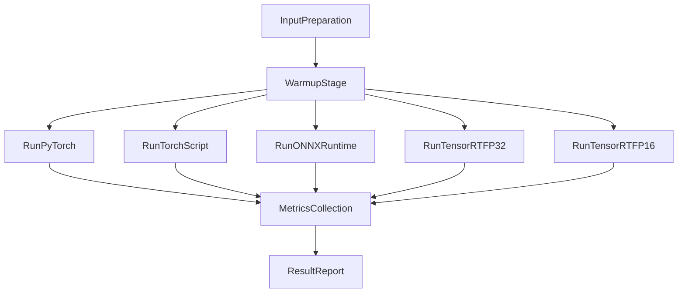

# 推理对比分析

## 1. 研究背景与问题定义

本课题面向强化学习控制策略的工程化落地场景。与离线训练阶段不同，部署阶段关注的核心问题不再是“是否能学到策略”，而是“策略能否在目标硬件上稳定、低时延地执行”。对于机器人控制任务而言，策略推理链路的时延抖动会直接影响控制闭环的实时性与稳定性；当推理延迟偏高或波动较大时，控制指令将出现滞后，进一步放大系统动态误差。因此，在毕业设计中开展系统化的推理对比实验，不仅是性能测试工作，更是连接“算法效果”与“工程可用性”的关键环节。

本项目围绕同一策略模型，构建了从训练权重到多后端部署格式的完整推理路径，并在统一硬件环境下对不同后端进行横向评估。实验对象覆盖五种典型部署链路：PyTorch 原生权重推理、TorchScript 推理、ONNXRuntime 推理、TensorRT FP32 引擎推理、TensorRT FP16 引擎推理。该设计能够回答三个核心问题：第一，不同后端在实时性能上存在多大数量级差异；第二，性能提升是否以精度偏差为代价；第三，在资源受限场景下，不同后端的显存与功耗特征是否可接受。通过这三类问题的联合分析，可以为后续部署方案提供有依据的决策标准，而非单一依赖经验判断。

## 2. 实验目标与评价维度

为避免仅比较平均时延而导致结论片面，本研究采用多维评价指标体系。首先是**时延与吞吐指标**，包括平均时延、p50/p90/p99 分位时延、标准差以及吞吐量（qps），用于描述实时性能及其稳定性。其次是**数值一致性指标**，以 PyTorch checkpoint 路径作为基线，计算候选后端输出的最大绝对误差、平均绝对误差和余弦相似度，评估不同推理图优化后是否引入明显数值偏移。再次是**资源指标**，包括显存占用、GPU 利用率和功耗，用于反映后端性能收益背后的硬件代价。

在实验口径上，为保证可比性，统一采用 `batch_size=1`、`warmup=100`、`iters=1000`、`repeats=3`，部署设备为 `cuda:0`（NVIDIA GeForce RTX 3080 Ti）。该设置优先刻画控制系统常见的小批量低时延场景，能够较真实地反映在线控制任务中的单步推理特性。通过多轮重复实验并取聚合统计，减少偶然波动对结论的影响。

## 3. 推理链路与实验设计

本研究在不改变策略任务语义的前提下，采用统一输入规范进行推理后端对比。模型输入由当前观测分量与历史观测分量共同构成，输入维度固定为 `obs_prop: [1,33]` 与 `obs_hist: [1,10,33]`，确保各后端在同一数据语义下进行前向计算。该约束保证了“后端差异主要来自推理框架与图执行机制”，而非输入定义差异。

在后端构建层面，五条链路覆盖了从研究原型到工业部署的典型技术路径：  
（1）PyTorch checkpoint 路径作为参考基线，代表训练框架原生执行；  
（2）TorchScript 路径代表图化后的 PyTorch 推理；  
（3）ONNXRuntime 路径代表跨框架中间表示的推理执行；  
（4）TensorRT FP32 路径代表面向 GPU 的高性能图优化与运行时调度；  
（5）TensorRT FP16 路径进一步引入半精度推理，以换取更高吞吐与更低时延。  

之所以选择上述“四类部署格式”（PyTorch、TorchScript、ONNX、TensorRT）进行对比，核心原因在于它们分别对应部署链路中不同层级的工程诉求，能够形成完整且有代表性的技术谱系。PyTorch checkpoint 代表“最小迁移成本”的研究原型路径，可作为数值与功能基线；TorchScript 代表“保留 PyTorch 生态前提下的图化优化”，可验证仅靠图编译是否足以满足实时性要求；ONNXRuntime 代表“跨框架中间表示 + 通用推理运行时”，用于评估模型可移植性与性能折中；TensorRT 则代表“面向 NVIDIA GPU 的专用高性能部署路径”，用于衡量当前硬件条件下可达到的性能上限。通过该分层设计，本实验不仅比较“谁更快”，还能够回答“性能提升来自哪一级优化、代价是什么、是否具备跨平台可复用性”等工程问题。

针对 TensorRT 的两种精度模式，FP32 与 FP16 的差异主要体现在数值表示、算子执行路径和硬件资源利用效率。FP32 使用单精度浮点计算，数值动态范围更大、稳定性更高，通常更适合作为高性能部署中的精度参考；FP16 使用半精度浮点计算，在支持 Tensor Core 的 GPU 上可显著提升并行吞吐，并降低单次计算与访存开销，从而进一步降低时延。其代价是潜在的数值舍入误差与动态范围收缩风险。因此在本研究中同时保留 TensorRT FP32 与 FP16 两条链路，可用于明确回答“TensorRT 的收益究竟来自图优化本身，还是还叠加了低精度计算收益”这一关键问题，也有助于在实时性与数值稳健性之间做可解释的工程取舍。

将五条链路统一比较时，可概括为以下差异结构：  
（1）**执行机制差异**：PyTorch 偏解释执行，TorchScript 进行图化执行，ONNXRuntime 依赖 ONNX 计算图与 EP（Execution Provider）调度，TensorRT 通过离线构建引擎后进行高度融合执行；  
（2）**可移植性差异**：PyTorch/TorchScript 更依赖 PyTorch 运行环境，ONNX 在跨框架和跨语言部署上更灵活，TensorRT 主要面向 NVIDIA GPU 生态；  
（3）**性能上限差异**：在本实验口径下，性能呈现 PyTorch < TorchScript < ONNXRuntime < TensorRT FP32 < TensorRT FP16 的递进关系；  
（4）**精度与风险差异**：PyTorch 与 TorchScript 一致性最高，ONNX 存在可控的转换误差，TensorRT FP16 相比 FP32 可能引入更多数值近似；  
（5）**工程复杂度差异**：PyTorch 上手最直接，TorchScript 改造较小，ONNX 需维护导出与算子兼容，TensorRT 还需额外处理引擎构建、版本兼容和硬件绑定等问题。  

由此可见，这五条链路并非简单的“快慢比较”，而是覆盖了从研发验证、跨平台部署到极致实时优化的完整工程决策空间。将其置于同一实验框架内，可以使本章结论同时具备性能解释力与部署指导价值。

实验流程可概括为“统一输入 -> 预热 -> 正式迭代 -> 指标汇总 -> 跨后端对比”。其中预热阶段用于消除首次运行的初始化开销；正式迭代阶段采集逐次推理时延；资源采样通过固定周期监控 GPU 指标；最终输出结构化结果文件供统计复核。该流程形成了完整的实验闭环，确保结果具备可追溯性与可重复性。

## 4. 实验结果与现象分析

实验结果表明，五条链路在性能上呈现清晰梯度。以 PyTorch checkpoint 为基线，其平均时延为 **0.6316 ms**，吞吐为 **1117.44 qps**。TorchScript 平均时延下降至 **0.4734 ms**，相对加速约 **1.33x**，说明在保持 PyTorch 技术栈的前提下，图化执行已经能够带来可观收益。ONNXRuntime 平均时延进一步下降至 **0.3154 ms**，相对加速约 **2.00x**，显示中间表示与运行时优化在该任务上具有明显价值。TensorRT 路径性能提升最显著，其中 FP32 平均时延 **0.0672 ms**（约 **9.40x**），FP16 平均时延 **0.0487 ms**（约 **12.96x**），体现了面向 GPU 的专用推理引擎在小批量场景下的优势。

从吞吐角度看，结果与时延结论一致：TorchScript 为 **1353.46 qps**，ONNXRuntime 为 **3158.19 qps**，TensorRT FP32 为 **15521.17 qps**，TensorRT FP16 为 **20576.67 qps**。这一排序表明，后端优化能力越强，其在吞吐与时延上的综合收益越明显。值得注意的是，FP16 相比 FP32 仍有进一步提升，说明在当前模型与硬件组合下，半精度推理可以有效释放硬件执行潜力。

精度一致性方面，ONNXRuntime 与基线输出保持高度一致，最大绝对误差约 **9.54e-07**，平均绝对误差约 **3.20e-07**，余弦相似度近似 **1.0**。这说明在当前转换链路中，ONNX 路径没有引入会影响控制语义的显著数值偏移。TorchScript 与基线路径在本轮实验中表现为零误差，进一步验证了图化前后策略输出的一致性。

资源指标方面，PyTorch 与 TorchScript 的显存均值均约 **348 MB**，ONNXRuntime 约 **370 MB**，TensorRT 路径升至约 **488~510 MB**，峰值达到 **641 MB**。该现象反映了“高性能后端通常伴随更积极的运行时资源分配”这一工程常识。功耗方面，TensorRT 路径约 **91~92 W**，ONNXRuntime 约 **90.7 W**，TorchScript 约 **89.5 W**，整体处于可接受区间；在保证实时性的前提下，这一功耗水平对桌面级部署具有较好可行性。

综合上述结果，本研究得到两个直接结论：第一，若目标是极致实时性，TensorRT 尤其 FP16 路径具备明显优势；第二，若强调跨框架可移植性与数值可解释性，ONNXRuntime 提供了性能与一致性较为平衡的方案。该结论为后续不同部署场景下的技术选型提供了量化依据。

### 表格版结果小节（可直接用于论文）

为便于论文排版与结果引用，本文将核心实验指标汇总为表 4-1 与表 4-2。两表均基于相同实验口径（`batch_size=1`、`warmup=100`、`iters=1000`、`repeats=3`、`cuda:0`）统计得到。

**表 4-1 不同推理后端的性能对比**

| 推理后端 | 平均时延 (ms) | p50 (ms) | p90 (ms) | p99 (ms) | 吞吐 (qps) | 相对 PyTorch 加速比 |
|---|---:|---:|---:|---:|---:|---:|
| PyTorch checkpoint | 0.6316 | 0.5657 | 0.6371 | 1.0589 | 1117.44 | 1.00x |
| TorchScript JIT | 0.4734 | 0.4323 | 0.4648 | 0.7485 | 1353.46 | 1.33x |
| ONNXRuntime | 0.3154 | 0.2886 | 0.3368 | 0.4505 | 3158.19 | 2.00x |
| TensorRT FP32 | 0.0672 | 0.0672 | - | 0.0672 | 15521.17 | 9.40x |
| TensorRT FP16 | 0.0487 | 0.0487 | - | 0.0487 | 20576.67 | 12.96x |

**表 4-2 精度与资源指标对比**

| 推理后端 | 最大绝对误差 | 平均绝对误差 | 余弦相似度 | 显存均值/峰值 (MB) | GPU 利用率均值/峰值 (%) | 功耗均值/峰值 (W) |
|---|---:|---:|---:|---:|---:|---:|
| PyTorch checkpoint | 0 | 0 | 1.0 | 348 / 348 | 6.24 / 7.33 | 76.85 / 88.60 |
| TorchScript JIT | 0 | 0 | 1.0 | 348 / 348 | 7.50 / 8.33 | 89.50 / 89.55 |
| ONNXRuntime | 9.54e-07 | 3.20e-07 | 0.9999999999999738 | 370 / 370 | 26.11 / 34.67 | 90.71 / 91.04 |
| TensorRT FP32 | - | - | - | 509.75 / 641.0 | 12.08 / 28.67 | 91.58 / 91.80 |
| TensorRT FP16 | - | - | - | 488.67 / 641.0 | 12.42 / 32.33 | 91.81 / 91.97 |

注：TensorRT 当前采用 `trtexec` 回退口径，结果中未直接采集输出张量，因此其误差指标记为“-”；同时 p90 在该口径下未给出，表中以“-”表示。

## 5. 结果可信度、边界条件与客观性讨论

本章结论在“性能排序”与“数量级差异”层面具有较高可信度。不同后端的排序稳定且跨多轮重复实验保持一致，说明结果并非由偶然噪声驱动。同时，ONNX 路径误差维持在 1e-6 量级，也支持“转换链路未改变核心策略语义”的判断。

但仍需指出若干边界条件。首先，资源指标中的 GPU 利用率和功耗基于固定周期采样，属于低频监控口径，对短瞬态峰值可能存在低估或平滑效应，因此更适合用于趋势判断而非绝对峰值判断。其次，TensorRT 当前采用引擎加载回退口径进行测试，其时延统计更强调整体吞吐与平均水平，对分位数与抖动的细粒度解释应保持审慎。再次，本实验以 `batch_size=1` 为主，结论主要服务于单步实时控制场景；若迁移至离线批处理场景，后端优劣可能随 batch 增大而发生相对变化。

因此，本章采用“高置信结论 + 条件化解释”的表达方式：在当前硬件、模型规模与实时控制口径下，后端性能差异结论可靠；在跨硬件、跨批量或跨采样口径比较时，应重新执行同口径实验后再做外推。

## 6. 工程工作量与项目价值体现

从工程角度看，本章节工作并非单次跑分，而是围绕“训练模型可部署化”构建了完整技术链条：从训练权重整理、推理格式转换、后端执行适配，到统一指标采集与结果汇总，形成了可复用的实验流程。这一过程将原本分散的模型产物组织为可比较、可解释、可复现的系统实验，显著提升了项目工程成熟度。

从毕业设计价值看，该工作将“强化学习算法有效”进一步推进为“强化学习系统可用”。具体体现为：第一，建立了部署端性能评估基线，为后续优化提供了参照；第二，量化了不同后端在时延、吞吐、精度和资源上的折中关系，支撑工程选型决策；第三，暴露并记录了实验边界条件，为后续章节中的系统落地与优化方向提供依据。换言之，本章将模型研究成果转化为面向工程实践的决策信息，是连接研究与应用的重要中间层。

## 7. 本章小结

本章围绕同一策略模型完成了多后端推理对比，验证了从 PyTorch 到 TorchScript、ONNXRuntime、TensorRT 的性能递进关系。在当前实验口径下，TensorRT FP16 取得最高推理效率，ONNXRuntime 在性能与数值一致性之间表现出良好平衡，TorchScript 则提供了低迁移成本的中间方案。基于这些结果，可以在后续系统实现中按应用目标进行差异化选型：对极致实时性敏感的场景优先考虑 TensorRT 路径；对可移植性与维护便利性要求较高的场景可优先采用 ONNXRuntime 或 TorchScript。通过该章分析，项目已形成从算法效果验证到部署性能论证的完整证据链，为毕业设计后续章节提供了坚实支撑。
