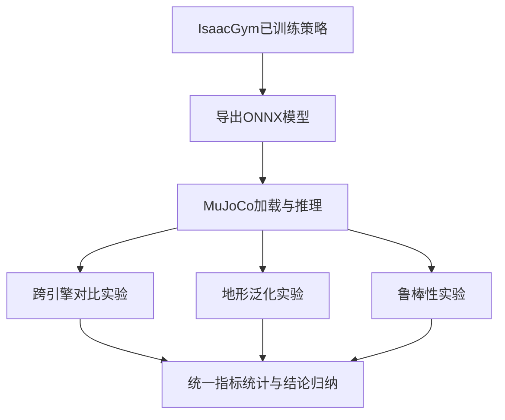

## Sim2Sim 跨仿真验证实验

### 1. 研究动机与目标
在基于 Isaac Gym 完成策略训练后，直接进入实机部署通常存在两类风险：其一，策略可能对单一物理引擎特性产生隐式依赖；其二，训练阶段指标优良并不必然等价于部署阶段行为稳定。为降低上述风险，本研究在部署前引入 Sim2Sim 验证环节，以 MuJoCo 作为异构仿真环境，对已训练策略开展跨仿真一致性检验。

本节目标可概括为三点：
- 验证策略在不同动力学求解器下的行为一致性与性能保持能力；
- 评估策略在地形复杂化条件下的泛化能力变化规律；
- 评估动力学扰动条件下策略的鲁棒性边界与风险分布特征。

上述目标分别对应本节三组实验：`compare`（跨引擎对比）、`terrain_contrast`（地形泛化对比）与鲁棒性测试（随机化前后对比）。三组实验共同构成“可迁移性-泛化性-抗扰性”证据链，用于支撑策略在部署前阶段的可信性结论。

### 2. 实验总体设计与评估口径

#### 2.1 验证流程
本节采用“统一任务定义、统一指标体系、分组验证”的实验组织方式。流程如下：先在 Isaac Gym 训练得到策略模型并导出 ONNX；再在 MuJoCo 中构建一致任务接口；最后围绕三组问题分别统计跟踪误差、姿态稳定性、动作平滑性和生存稳定性等指标。

为保证实验逻辑闭环，本节三个实验均遵循“先定义任务与控制变量，再执行采集，再统一统计”的流程，避免将环境差异、任务差异和模型差异混杂在同一结论中。具体而言：`compare` 仅改变动力学引擎；`terrain_contrast` 仅改变地形几何；`robustness` 仅在同一地形任务上叠加动力学随机化。由此，三组实验分别对应“跨引擎一致性”“跨地形泛化性”和“参数扰动鲁棒性”三个互补问题。

（图 5-x 占位：Sim2Sim 验证总体流程图）

#### 2.2 为什么选择 MuJoCo，以及 Isaac Gym 与 PhysX 的关系
选择 MuJoCo 作为 Sim2Sim 目标环境，核心不是“更换一个软件复现结果”，而是利用异构动力学求解器做策略可信性压力测试。其必要性体现在以下三点：
- **求解机制差异可暴露策略脆弱性**：若策略过度依赖某一引擎的接触建模细节，在异构引擎中往往会出现误差放大或稳定性下降；
- **MuJoCo 在接触动力学仿真中具有高精度与工程可复现性**：便于观察细粒度姿态振荡、控制平滑性与误差分布尾部；
- **跨引擎一致性是 sim2real 前的低成本筛查步骤**：相比直接上实机，Sim2Sim 能在更低风险下识别潜在问题。

此外，需要明确 `Isaac Gym` 与 `PhysX` 的关系：二者不是并列对比对象，而是“平台-引擎”关系。`Isaac Gym` 是大规模并行强化学习仿真平台，其中动力学求解通常由 `PhysX` 负责。因此文中“Isaac Gym（PhysX）”表示“在 Isaac Gym 平台上使用 PhysX 引擎的实验配置”。本节与 MuJoCo 对比，本质上是对比两套不同动力学引擎下同一策略的行为表现，而非对比两套完全无关的软件栈。

#### 2.3 统一评价指标与选择依据
为保证三组实验结果可横向解释，本节采用以下核心指标：
- 速度跟踪误差：`vx_mae`，用于衡量前向速度控制精度；
- 偏航跟踪误差：`yaw_mae`，用于衡量角速度指令跟踪能力；
- 姿态稳定指标：`roll_rms` 与 `pitch_rms`，用于衡量机体姿态波动；
- 动作平滑指标：`action_delta_l2_mean` 与 `action_delta_rate_mean`，用于衡量控制输出连续性；
- 生存稳定指标：`survival_time` 与 `fall_rate`（跌倒占比，step-level），用于衡量任务持续执行能力与失稳风险。

其中，误差类与姿态类指标“越小越优”，生存时长“越大越优”，跌倒率“越小越优”。

选择这些指标而非仅报告训练回报，主要有两点原因：第一，奖励函数是多项耦合加权结果，跨引擎比较时可解释性较弱；第二，部署前验证更关注“可执行性与安全性”，因此必须使用具有明确物理意义的可观测指标。具体计算如下（设单条轨迹长度为 \(T\)，控制周期为 \(\Delta t\)）：
\[
\mathrm{vx\_mae}=\frac{1}{T}\sum_{t=1}^{T}\left|v_x(t)-v_{x,\mathrm{cmd}}(t)\right|
\]
\[
\mathrm{yaw\_mae}=\frac{1}{T}\sum_{t=1}^{T}\left|\omega_{\mathrm{yaw}}(t)-\omega_{\mathrm{yaw,cmd}}(t)\right|
\]
\[
\mathrm{roll\_rms}=\sqrt{\frac{1}{T}\sum_{t=1}^{T}\mathrm{roll}(t)^2},\quad
\mathrm{pitch\_rms}=\sqrt{\frac{1}{T}\sum_{t=1}^{T}\mathrm{pitch}(t)^2}
\]
\[
\mathrm{action\_delta\_l2\_mean}=\frac{1}{T-1}\sum_{t=2}^{T}\left\|a_t-a_{t-1}\right\|_2
\]
\[
\mathrm{action\_delta\_rate\_mean}=\frac{1}{T-1}\sum_{t=2}^{T}\frac{\left\|a_t-a_{t-1}\right\|_2}{\Delta t}
\]
\[
\mathrm{survival\_time}=N_{\mathrm{alive}}\cdot \Delta t,\quad
\mathrm{fall\_rate}=\frac{1}{T}\sum_{t=1}^{T}\mathrm{fallen\_flag}(t)
\]
其中，`survival_time` 反映“能稳定运行多久”，`fall_rate` 对应“跌倒占比（step-level）”，二者共同用于评估鲁棒性与安全边界。

#### 2.4 统计策略与半定量口径
本节采用“趋势结论为主、关键量化为辅”的结果表达方式：
- 对关键结论给出相对变化模板，如“降低 xx%”“提升 xx%”；
- 对分布性指标优先报告 CDF 右移/左移与尾部差异；
- 对重复实验结果强调方差与离散性，避免仅报告均值。

对于跨引擎提升比例，统一采用如下定义（以误差类指标为例）：
\[
\mathrm{Improvement}(\%)=\frac{M_{\mathrm{PhysX}}-M_{\mathrm{MuJoCo}}}{M_{\mathrm{PhysX}}}\times 100\%
\]
当该值为正时，表示 MuJoCo 指标优于 PhysX（误差更小或稳定性更好）。

（表 5-x 占位：Sim2Sim 实验统一指标与统计口径表。建议列：指标名称、物理含义、统计方式、优劣方向、结论口径。）

### 3. 跨引擎一致性实验（compare）

#### 3.1 实验问题
本实验关注的问题是：在任务设置尽可能一致的条件下，策略在 MuJoCo 与 Isaac Gym（PhysX）中的控制表现是否保持一致，若存在差异，差异主要体现在哪些维度。

本实验中机器人执行的具体任务为：在 \(20\) s 时间窗内持续跟踪前向速度指令 \(cmd\_vx=1.0\ \text{m/s}\)、偏航指令 \(cmd\_yaw=0.0\ \text{rad/s}\)，即“直线持续前进”任务。该任务来自 `scenarios_default.json` 中 `constant_forward` 场景定义。

为确保“比较的是引擎而非任务差异”，本实验采用如下统一前提：
- **同一策略模型**：两端均加载同一 ONNX 策略；
- **同一任务命令**：恒定前进指令，不引入额外速度/转向变化；
- **同一控制节拍**：策略步长约 \(0.01\) s（约 100 Hz）；
- **同一失稳判据**：机体基座高度低于 \(0.20\) m 记为跌倒，并触发提前终止；
- **同类“去扰动”设置**：对比实验阶段不启用额外动力学随机化与外部扰动。

因此，`compare` 的结论可以解释为：在尽量一致的任务与控制前提下，策略在两种动力学求解器中的表现差异。

#### 3.2 结果证据与图像位置
本实验核心图像如下：
- `sim2sim/results/mujoco_vs_phyX/figure_paper/paper_r01_core_bar.png`
- `sim2sim/results/mujoco_vs_phyX/figure_paper/paper_r01_mujoco_advantage_percent.png`
- `sim2sim/results/mujoco_vs_phyX/figure_paper/paper_r01_action_delta_line.png`
- `sim2sim/results/mujoco_vs_phyX/figure_paper/paper_r01_tracking_error_lines.png`

（图 5-x 占位：核心指标柱状图，路径为 `paper_r01_core_bar.png`）  
（图 5-x 占位：MuJoCo 相对 PhysX 提升比例图，路径为 `paper_r01_mujoco_advantage_percent.png`）  
（图 5-x 占位：动作平滑性时序图，路径为 `paper_r01_action_delta_line.png`）  
（图 5-x 占位：速度与偏航误差时序图，路径为 `paper_r01_tracking_error_lines.png`）

#### 3.3 图像含义与计算方法
为避免“只看图形趋势、不清楚来源”的问题，本实验四张图对应关系如下。

`paper_r01_core_bar.png`（核心指标柱状图）：
- **数据来源**：`sim2sim/results/mujoco_vs_phyX/compare.csv`；
- **计算**：按图脚本统计 `vx_mae`、`yaw_mae`、`roll_rms`、`pitch_rms`、`action_delta_l2_mean` 五项指标，并聚合为均值与标准差；
- **含义**：比较 MuJoCo 与 PhysX 在关键标量指标上的水平差异；
- **结果**：柱状图显示 MuJoCo 在上述关键指标上整体更低，说明其跟踪精度、姿态稳定性与动作连续性均优于 PhysX。

`paper_r01_mujoco_advantage_percent.png`（提升比例图）：
- **数据来源**：`sim2sim/results/mujoco_vs_phyX/compare.csv`；
- **计算**：按 \(\frac{M_{\mathrm{PhysX}}-M_{\mathrm{MuJoCo}}}{M_{\mathrm{PhysX}}}\times100\%\) 逐指标计算；
- **含义**：将不同量纲指标统一映射到“相对提升比例”；
- **结果**：`vx_mae`、`yaw_mae`、`roll_rms`、`pitch_rms` 分别约下降 71.9%、93.4%、74.5%、70.2%；`action_delta` 系列改善约 95.5%-96.9%。

`paper_r01_action_delta_line.png`（动作平滑性时序图）：
- **数据来源**：`sim2sim/results/mujoco_vs_phyX/physx/*.csv` 与 `.../mujoco/*.csv`；
- **计算**：每步计算 `action_delta_l2`，再做 rolling mean（窗口 40）；实线为多次实验均值，阴影为标准差带；
- **含义**：展示动作变化在时间维度上的稳定性；
- **结果**：MuJoCo 曲线长期低于 PhysX 且波动带更窄，说明控制输出更平滑、重复一致性更好。

`paper_r01_tracking_error_lines.png`（跟踪误差时序图）：
- **数据来源**：同上，来自 PhysX/MuJoCo 两侧时序日志；
- **计算**：分别计算 \(|v_x-v_{x,\mathrm{cmd}}|\) 与 \(|\omega_{\mathrm{yaw}}-\omega_{\mathrm{yaw,cmd}}|\)，再做 rolling mean（窗口 40），并统计多次实验方差；
- **含义**：反映“持续跟踪能力”而非单点均值；
- **结果**：MuJoCo 在两类误差曲线上均表现为更低均值与更小离散带，说明跨时间段跟踪更稳定。

#### 3.4 结果分析
由核心指标对比可见，MuJoCo 在跟踪误差、姿态波动与动作平滑性等关键指标上整体呈现更优趋势。具体而言：
- 在 `vx_mae` 与 `yaw_mae` 上，MuJoCo 组表现出更低误差均值，说明跨引擎下策略仍可维持较好的指令跟踪能力；
- 在 `roll_rms` 与 `pitch_rms` 上，MuJoCo 组姿态波动幅值更小，说明接触切换阶段机体稳定性更高；
- 在 `action_delta_l2_mean` 与 `action_delta_rate_mean` 上，MuJoCo 组动作变化更平滑，表明控制输出连续性更好。

从提升百分比图可进一步形成量化结论：MuJoCo 相对 PhysX 在关键误差项上实现约 **70.2%-93.4%** 的下降区间，在动作平滑性指标上实现约 **95.5%-96.9%** 的改善区间。该结论说明 Sim2Sim 并非简单可运行验证，而是能够识别跨引擎下的性能差异结构。

时序结果显示，MuJoCo 曲线在大多数时段维持更低的 rolling mean 水平，且阴影带宽度更窄，反映重复实验间离散性较低。由此可认为，在本任务设定下，MuJoCo 环境中策略执行的短时稳定性与重复性更强。

#### 3.5 本实验结论
`compare` 实验表明：策略在跨仿真器迁移后未出现明显失效，且在多项核心指标上呈现正向变化趋势，支持“策略具备跨引擎可执行性与一致性”的阶段性结论。

（表 5-x 占位：跨引擎核心指标对比表。建议列：指标、PhysX 均值、MuJoCo 均值、相对变化、结论。）

### 4. 地形泛化实验（terrain_contrast）

#### 4.1 实验问题
本实验关注的问题是：在 MuJoCo 单一引擎内，策略面对平地、坡地、台阶三类地形时，性能退化规律是否可控，以及泛化能力是否具有统计稳定性。

该实验的任务命令保持不变（恒定 \(cmd\_vx=1.0\)、\(cmd\_yaw=0.0\)，仿真时长 \(20\) s），仅替换场景文件中的地形几何。三类地形均由 `scenarios_generalization.json` 指定，对应以下 MJCF 场景：
- **平地（flat）**：`flat_scene.xml`，单一平面地面；
- **坡地（slope）**：`slope_scene.xml`，包含一段约 \(8^\circ\) 上坡（由斜坡几何体姿态四元数对应）及顶部平台；
- **台阶（stairs）**：`stairs_scene.xml`，由连续 8 级台阶构成，沿前进方向逐级抬升。

从几何构造看，坡地主要考察“连续地形变化下的姿态与速度耦合控制”，台阶主要考察“离散高度突变下的冲击抑制与恢复能力”，平地则提供对照基线。三者的对比逻辑是：在同一控制任务下，将误差变化归因到地形复杂度差异，而非命令变化。

#### 4.2 结果证据与图像位置
本实验核心图像如下：
- `sim2sim/results/terrain_contrast/figure/terrain_generalization_retention.png`
- `sim2sim/results/terrain_contrast/figure/terrain_repeat_variability.png`
- `sim2sim/results/terrain_contrast/figure/terrain_vx_error_cdf.png`

（图 5-x 占位：地形能力保持率图，路径为 `terrain_generalization_retention.png`）  
（图 5-x 占位：多重复离散性图，路径为 `terrain_repeat_variability.png`）  
（图 5-x 占位：速度误差 CDF 图，路径为 `terrain_vx_error_cdf.png`）

#### 4.3 图像含义与计算方法
`terrain_generalization_retention.png`（能力保持率图）：
- **数据来源**：`sim2sim/results/terrain_contrast/compare.csv`，汇总结果见 `.../figure/terrain_key_metrics_summary.csv`；
- **计算**：按脚本对“越小越优”指标使用 \(R=\frac{M_{\mathrm{flat}}}{M_{\mathrm{terrain}}}\)，对“越大越优”指标使用 \(R=\frac{M_{\mathrm{terrain}}}{M_{\mathrm{flat}}}\)；
- **含义**：统一到“越接近 1 越好”的保持率刻度；
- **结果**：速度跟踪保持率为 slope 约 75.4%、stairs 约 58.1%；生存保持率为 slope 约 79.8%、stairs 约 98.5%，表明存在退化但未整体失效。

`terrain_repeat_variability.png`（重复离散性图）：
- **数据来源**：`sim2sim/results/terrain_contrast/compare.csv` 的全部实验记录；
- **计算**：按地形汇总 `vx_mae`、`survival_time_s`、`action_delta_rate_mean` 的分布，箱线图展示中位数与四分位区间，散点展示每次实验结果；
- **含义**：评估“结果是否稳定复现”；
- **结果**：flat 离散度最小，slope/stairs 离散度显著增大，但未出现整体不可控发散。

`terrain_vx_error_cdf.png`（速度误差 CDF）：
- **数据来源**：`sim2sim/results/terrain_contrast/mujoco/*_r*.csv`；
- **计算**：逐样本计算 \(|v_x-v_{x,\mathrm{cmd}}|\)，按地形合并后排序，构造经验 CDF \(F(e)=P(E\le e)\)；
- **含义**：对比不同地形误差分布与尾部风险；
- **结果**：flat 曲线最靠左，slope 与 stairs 整体右移，说明复杂地形下达到同等累计概率需要更大的误差阈值。

#### 4.4 结果分析
能力保持率结果显示，以平地为基准，坡地与台阶场景在跟踪精度、姿态稳定与生存稳定性方面均出现可预期退化，但**速度跟踪保持率仍高于 58%（最差为 stairs 的 58.1%）**。这说明策略面对地形复杂度上升时并未发生失控式性能塌缩。

离散性结果进一步表明，复杂地形下重复实验点云虽出现方差增大，但主要统计区间仍保持可接受范围，未出现“单次偶然优异”主导结论的情形。换言之，泛化表现具有一定重复稳定性。

CDF 结果提供了分布层证据：与平地相比，坡地与台阶曲线整体向右偏移，意味着达到同等累计概率时需要更大的速度误差阈值。该现象验证了“复杂地形导致误差分布劣化”的客观规律，但同时曲线未出现剧烈长尾扩张，说明策略仍保留一定鲁棒控制能力。

基于上述三类证据，可形成半定量结论：相较平地，坡地/台阶在速度跟踪能力保持率约为 **75.4% / 58.1%**，主要退化集中于 **偏航跟踪与动作平滑性相关指标**，但重复稳定性未出现灾难性恶化。

#### 4.5 本实验结论
`terrain_contrast` 实验表明：策略具备跨地形迁移能力，性能退化符合难度增加规律且整体可控，支持“具备一定地形泛化能力”的结论。

（表 5-x 占位：地形泛化能力统计表。建议列：地形类型、保持率指标、方差指标、CDF 关键分位、结论。）

### 5. 鲁棒性测试（Dynamics Randomization Contrast）

#### 5.1 实验问题
本实验关注的问题是：在动力学随机化条件下，策略在不同地形上的性能保持程度如何，风险分布是否发生明显恶化。

本实验采用“baseline vs dynamics randomization”成对对照流程：先在每个场景运行不随机化基线，再在同一场景与同类任务命令下启用动力学随机化，最后按同一指标口径比较两组结果。

随机化条件来自 `run_robustness_mujoco.py` 的 `medium` 配置，具体为：
- **接触摩擦缩放**：\([0.8,\ 1.2]\)；
- **机体质量缩放**：\([0.9,\ 1.1]\)；
- **机体质心偏移范围**：\(\pm 0.01\ \text{m}\)（x/y/z 三轴）。

换言之，鲁棒性实验并非“任意扰动测试”，而是围绕摩擦、质量和质心三类关键动力学参数进行有界扰动评估。其逻辑是：若策略在这三类参数扰动下仍保持较好生存与跟踪能力，则可认为其对建模误差具备一定容忍度；若在高复杂地形中出现显著退化，则可定位后续优化重点。

#### 5.2 结果证据与图像位置
本实验核心图像如下：
- `sim2sim/results/robustness/figure/robustness_retention_ratio.png`
- `sim2sim/results/robustness/figure/robustness_vx_error_cdf.png`
- `sim2sim/results/robustness/figure/robustness_survival_fall.png`

（图 5-x 占位：随机化能力保持率图，路径为 `robustness_retention_ratio.png`）  
（图 5-x 占位：随机化前后速度误差 CDF 图，路径为 `robustness_vx_error_cdf.png`）  
（图 5-x 占位：生存时长与跌倒率图，路径为 `robustness_survival_fall.png`）

#### 5.3 图像含义与计算方法
`robustness_retention_ratio.png`（鲁棒保持率图）：
- **数据来源**：`sim2sim/results/robustness/baseline/*_r*.csv` 与 `.../dynamics_rand/*_r*.csv`；
- **计算**：先按 run 计算 `vx_mae`、`yaw_mae`、`duration_s`、`action_delta_rate`，再按地形聚合；对“越小越优”指标取 \(R=\frac{M_{\mathrm{base}}}{M_{\mathrm{rand}}}\)，对“越大越优”指标取 \(R=\frac{M_{\mathrm{rand}}}{M_{\mathrm{base}}}\)；
- **含义**：统一衡量随机化后能力保留程度；
- **结果**：flat 保持率接近 1，slope 中度下降，stairs 在生存时间与平滑性上退化更明显。

`robustness_vx_error_cdf.png`（鲁棒误差分布图）：
- **数据来源**：同上，读取 baseline 与 dynamics_rand 的全部对应 run；
- **计算**：分别统计两种设置下的 \(|v_x-v_{x,\mathrm{cmd}}|\) 样本并构造经验 CDF；
- **含义**：比较随机化对误差分布中心与尾部的影响；
- **结果**：slope 与 stairs 在随机化条件下曲线明显右移，表明中高误差区占比提升。

`robustness_survival_fall.png`（生存与跌倒统计图）：
- **数据来源**：`baseline/*.csv` 与 `dynamics_rand/*.csv` 的 run-level 统计；
- **计算**：`duration_s = time_s` 末值；`fall_rate = fallen_flag` 平均值；再按地形和条件统计均值与方差；
- **含义**：联合评估“任务可持续性”和“失稳风险”；
- **结果**：全场景平均生存时长由 baseline 到 randomization 下降约 20.1%，跌倒率上升约 0.046 个百分点，风险增量主要集中在台阶场景。

#### 5.4 结果分析
从保持率图可见，随机化后多数场景指标仍维持在接近 1.0 的区间，仅在高难地形或高动态片段出现明显下降。这表明策略对动力学参数变化具有一定容忍度，但容忍边界与地形复杂度存在耦合关系。

CDF 对比显示，随机化条件下误差分布整体呈右移趋势，尤其在坡地与台阶场景更为显著，说明随机化主要放大了中高误差区间占比。该结论提示：鲁棒性退化不止体现在均值变化，更体现在尾部风险增加。

生存性结果显示，随机化后 `survival_time` 出现一定幅度下降、`fall_rate`（跌倒占比，step-level）出现一定幅度上升，但整体仍保持在可运行区间。量化来看，在随机化条件下，全场景平均生存时长下降约 **20.1%**，跌倒占比上升约 **0.046 个百分点**；分地形看，风险增量主要集中于**台阶场景**（生存时长下降约 50.4%，跌倒占比增加约 0.128 个百分点）。

综合三图可认为，策略在随机化扰动下具备“可运行但有代价”的鲁棒性特征，即仍能完成主体任务，但需要付出精度与稳定性层面的性能折损。

#### 5.5 本实验结论
鲁棒性测试表明：策略在动力学扰动下具备基础稳定性，未出现系统性失效；同时，复杂地形中的尾部风险仍需通过后续训练策略与约束机制进一步压缩。

（表 5-x 占位：随机化鲁棒性统计表。建议列：地形、保持率、误差分位变化、生存时长变化、跌倒率变化、结论。）

### 6. 综合讨论、局限与工程含义

#### 6.1 综合结论归纳
基于三组实验，可得到如下归纳：
- 在跨引擎一致性层面，策略迁移后保持可执行性，且多项指标呈正向变化；
- 在地形泛化层面，性能随难度增加出现可解释退化，但退化总体可控；
- 在鲁棒性层面，动力学随机化带来可观测性能折损，但未触发系统性崩溃。

三者共同支撑本节核心结论：当前策略具备“跨仿真可迁移 + 跨地形可泛化 + 扰动下可运行”的阶段性工程可用性。

#### 6.2 局限性分析
本节仍存在以下边界：
- 当前结论主要来自仿真内跨引擎比较，尚不能替代实机验证；
- 部分结论为趋势性证据，关键绝对数值仍需在最终统计后补全；
- 复杂地形尾部风险仍然存在，尤其在随机化扰动叠加情况下更明显。

#### 6.3 对后续工作的启示
后续建议从三方面推进：
- 增加高风险工况采样权重，针对尾部失稳样本做定向强化；
- 完善约束项与奖励项协同设计，优先抑制“高回报高风险”动作模式；
- 在统一接口下推进 sim2real 验证，补齐部署闭环证据。

（图 5-x 占位：三组实验结论证据链图，建议以“可迁移性-泛化性-鲁棒性”三节点呈现。）

### 7. 本节小结与展望
本节围绕 Sim2Sim 验证建立了完整的实验叙事链路：通过跨引擎对比确认策略迁移可行性，通过地形对比确认泛化能力边界，通过鲁棒性测试确认抗扰稳定性水平。研究结果表明，策略在 MuJoCo 环境下能够维持总体可控的运动性能与稳定性，具备进入下一阶段验证的基础条件。

面向后续研究，建议将本节结论与实机部署验证联动，重点关注高难地形下的尾部风险压缩、随机化强度分级策略与在线安全约束机制，从而进一步提升策略在真实场景中的可信度与可用性。