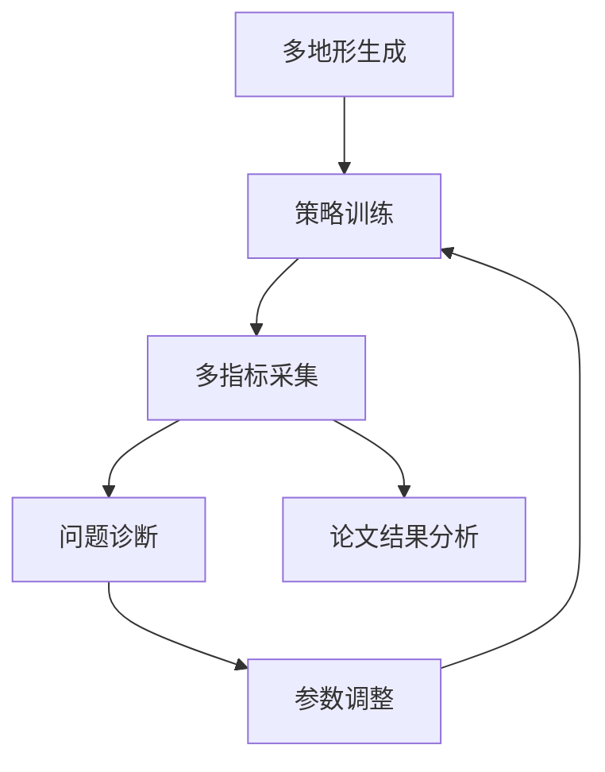

## 多地形训练与参数调优分析

### 1 研究背景与问题定义
在强化学习控制中，策略“能在某一种地形上收敛”并不等于“具有真实场景可用性”。机器人在实际部署中会面临台阶边缘冲击、连续坡度扰动、接触摩擦变化和模型误差累积等问题，这些问题往往不会在单地形、单参数训练中完整暴露。基于此，本课题将训练目标从“单任务收敛”升级为“多地形稳健收敛”，并以版本化参数优化方式构建实验闭环。

本章围绕两类代表性地形展开：  
- 台阶地形（stairs）：强调离散高度突变下的足端落点与冲击管理。  
- 波浪地形（wave）：强调连续高度变化下的姿态保持与速度跟踪。

实验版本定义如下：  
- 台阶地形：`v0`（原始参数）与 `v2`（二轮调优参数）。  
- 波浪地形：`v1`（一轮调优参数）与 `v2`（二轮调优参数）。

通过上述设置，本章尝试回答三个核心问题：  
1) 多地形建模如何支撑“从易到难”的学习过程；  
2) 参数调优如何从“稳定性优先”逐步过渡到“性能与约束并重”；  
3) 如何避免只看单一奖励指标而导致的误判。

### 2 多地形训练环境设计

#### 2.1 地形生成机制
本研究基于 `utils/terrain.py` 构建程序化地形，采用“子地形拼接 + 难度参数化”的组织方式。整体地形可理解为一个二维网格：行方向主要控制难度，列方向主要控制类型采样。该设计使并行环境在同一训练迭代中即可覆盖不同复杂度分布，从而提升样本多样性。

在实现层面，地形首先以高度场形式生成，随后根据仿真设置转换为三角网格（trimesh）用于接触计算。该流程兼顾了生成效率和物理接触表达能力。

#### 2.2 地形类型与训练意义
- **台阶地形（stairs）**：通过台阶高度和宽度参数控制难度，能够检验策略在离散跃迁条件下的动作连续性、冲击抑制能力和姿态恢复能力。  
- **波浪地形（wave）**：通过二维正弦叠加构造连续起伏表面，能够检验策略在持续扰动下的稳定跟踪能力，尤其适合观察 `orientation`、`base_height` 与 `dof` 约束之间的耦合。

#### 2.3 课程学习与难度调度
多地形训练并非随机堆叠地形，而是与课程化调度联合使用：  
1. 地形网格先天提供“多难度并行采样”；  
2. 环境根据策略表现动态调整训练重心，使策略在可学习范围内持续挑战更高难度。  
这种机制降低了训练初期直接崩溃概率，也避免策略长期停留在低难度区域造成欠拟合。

### 3 参数调优方法与版本演进

#### 3.1 调优总体原则
本课题将调优分为两个阶段：  
- **阶段A（稳定性阶段）**：优先抑制训练振荡、减少策略发散、降低约束项突增。  
- **阶段B（性能阶段）**：在稳定前提下提升任务性能，并修复中后期退化问题。

在实践中，调优关注的并非单个参数，而是“参数组合效应”，重点围绕优化强度、探索强度、模仿约束调度、代价项权重和域随机化范围进行协同调整。

#### 3.2 版本演进流程图

#### 3.3 关键调参关注项
为便于论文呈现，参数调整可抽象为五个维度：

| 维度 | 主要目的 | 典型影响指标 |
|---|---|---|
| 优化强度（学习率/更新幅度） | 降低过冲，减少训练抖动 | `Loss/learning_rate`, `Loss/surrogate` |
| 探索强度（熵/噪声） | 平衡探索与收敛 | `Policy/mean_noise_std` |
| 模仿调度（imitation权重） | 降低中后期策略漂移 | `Loss/mean_imitation_loss` |
| 约束代价权重 | 抑制不安全动作与违规 | `cost_pos_limit`, `cost_dof_vel_limits`, `cost_stumble` |
| 域随机化范围 | 控制泛化与可学习性平衡 | 训练收敛速度与稳定性 |

### 4 实验结果与图表分析

#### 4.1 训练评估框架
本章采用“全局指标 + 约束指标 + 稳定性指标”的联合评估方式：  
- 全局指标：`Train/mean_reward`, `Train/mean_episode_length`；  
- 约束指标：`Episode/cost_*`；  
- 稳定性指标：`Loss/mean_imitation_loss`, `Loss/learning_rate`, `Policy/mean_noise_std`。

该框架避免了“平均奖励上升即视为最优”的片面结论，更适合机器人控制中“性能-安全-稳定”并存的目标需求。

#### 4.2 图表：训练流程与评价闭环

#### 4.3 台阶地形（v0 vs v2）结果分析
从台阶任务的对比曲线看，`v0` 虽可达到较高回合长度，但中后期存在明显的漂移征兆：模仿损失抬升、局部约束项波动增强、姿态相关奖励改善不稳定。`v2` 在不牺牲收敛能力的前提下，整体训练曲线更平滑，说明调优后策略更新更加可控。

这一结果表明，台阶场景的核心并不只是“走得更快”，而是“在接触切换时保持动作连续与约束可控”。从工程角度看，`v2` 的价值在于降低了训练后期退化风险，使模型更适合作为后续部署候选策略。

#### 4.4 波浪地形（v1 vs v2）结果分析
波浪地形中，`v1` 与 `v2` 的差异主要体现在多指标耦合关系：`v1` 在部分局部姿态指标上有改进，但全局奖励、约束代价与训练稳定性之间存在冲突；`v2` 通过更均衡的调参策略，使奖励提升趋势、代价控制和噪声衰减表现更一致。

该现象说明连续扰动地形对策略鲁棒性的要求更高，若仅优化某一类局部指标，容易出现“局部变好、整体变差”的情况。`v2` 的改进方向验证了多指标协同优化在波浪地形中的必要性。

#### 4.5 指标趋势对照表
下表给出本章实验的趋势级结论（箭头表示相对于前一版本）：

| 地形 | 版本对比 | 平均奖励 | 回合长度 | 约束代价 | 模仿损失稳定性 | 总体结论 |
|---|---|---|---|---|---|---|
| stairs | v0 -> v2 | ↑ | ≈/↑ | ↓ | ↑（更稳） | v2 更适合中后期稳定训练 |
| wave | v1 -> v2 | ↑ | ↑ | ↓ | ↑（波动减弱） | v2 体现更好的多指标平衡 |

注：本章基于训练曲线进行趋势分析，强调“变化方向与稳定性”，不以单次实验的绝对数值作为唯一判据。

### 5 工作价值与方法启示
结合两类地形与三版参数演进，本课题形成了可复用的调参方法论：

1. **先稳定，后提效**：先解决训练发散和中后期退化，再追求更高奖励上限。  
2. **多指标协同诊断**：将奖励、约束、模仿、噪声和学习率联合分析，避免误判。  
3. **小步迭代优于大幅改动**：每轮调整只改动少量关键参数，更利于归因和复现。  
4. **地形驱动的针对性优化**：离散地形优先动作连续性，连续地形优先鲁棒稳定性。  
5. **工程导向验证闭环**：形成“现象-诊断-调整-复验”的流程，可直接迁移到新任务。

### 6 本章小结
本章完成了多地形训练与参数调优的系统分析。通过台阶（`v0 -> v2`）和波浪（`v1 -> v2`）两组实验可以看出，版本化调参显著提升了训练稳定性与指标一致性，减少了策略中后期退化风险。更重要的是，本工作不仅得到更优的训练结果，还沉淀出一套可解释、可复现、可迁移的优化路径，为后续部署和进一步研究提供了可靠基础。