# 《双轮足机器人复杂地形盲走运动控制策略研究》

## 摘要
面向双轮足机器人在复杂非结构化地形中的盲走控制问题，本文围绕“运动性能与安全约束协同优化”开展研究。针对传统模型驱动方法在高维接触动力学场景下建模困难、参数依赖强、跨场景调参成本高等问题，本文将控制任务建模为连续状态—连续动作马尔可夫决策过程，构建“指令跟踪—姿态稳定—约束满足”统一优化目标。在状态建模方面，采用由本体运动状态、局部地形高度扫描、历史观测序列与动力学随机化隐变量组成的复合观测表达；在动作建模方面，采用 8 维连续动作经缩放后映射至关节目标并由位置控制器执行，从而实现策略输出到执行器控制的闭环衔接。围绕任务中“高性能”与“高安全”并存的需求，本文在奖励函数中引入速度跟踪、机体姿态、能耗与动作平滑等性能项，并通过代价函数对关节限位、力矩/速度边界、接触冲击与步态异常等风险行为进行显式约束建模。

方法上，本文采用 NP3O 约束强化学习框架，在 PPO 裁剪更新基础上引入代价优势估计、代价价值学习与违约惩罚项，形成奖励回报与代价回报并行优化机制。网络结构采用策略—价值—代价联合架构：策略网络以历史信息编码为核心，提升对时序动态的刻画能力；价值网络与代价网络融合本体特征、地形扫描特征与隐变量特征，增强复杂地形下的状态评估与约束判别能力；同时结合 Barlow Twins 表征约束与特权信息对齐机制，进一步提高训练稳定性。实验上，本文已完成 Isaac Gym 并行训练框架搭建，并围绕台阶地形与波浪地形开展分场景训练及参数调优，形成可复现的训练与评估流程；在部署分析侧，完成 PyTorch、TorchScript、ONNXRuntime 与 TensorRT 等后端的推理对比实验，系统评估时延、吞吐、数值一致性与资源开销；进一步将 ONNX 模型接入 MuJoCo 完成 sim2sim 验证，初步检验跨仿真器行为一致性与工程可迁移性。研究结果表明，所提出方法在复杂地形盲走任务中能够兼顾运动性能与安全约束，具备较好的工程复现基础与后续实机扩展潜力。

## 关键词
双轮足机器人；盲走控制；复杂地形；约束强化学习；NP3O；并行仿真；策略部署

## 第一章 绪论

### 1.1 研究背景与意义
随着智能制造、灾害应急、能源巡检与服务机器人等应用场景快速拓展，移动机器人面临的运行环境正由结构化场景向非结构化场景迁移。与平整路面不同，碎石坡道、台阶群、软硬交替地面及不连续障碍共同构成了显著的地形不确定性。机器人在此类环境中不仅要完成速度与路径相关任务，还需在持续扰动下保持姿态稳定、接触可行与控制可执行，这对控制系统的实时性、鲁棒性和安全性提出了更高要求。双轮足机器人兼具轮式平台的高效率滚动能力与腿式平台的地形适应能力，能够在“高速运动”与“高通过性”之间提供更优折中，因而成为复杂地形自主移动研究的重要对象。

双轮足系统的控制难点来源于多源耦合动力学。轮地滚动与腿部摆动同时作用于机体姿态；机体姿态又反向影响接触力分布、关节负载与可行动作空间；执行器带宽、时滞和饱和约束进一步限制了控制律的可实现性。特别是在盲走任务中，机器人难以依赖完整全局地图或高质量外部定位，仅能利用本体状态、局部地形扫描与有限历史信息进行闭环决策。该设定使控制问题呈现出“高维观测、连续动作、强非线性、强约束”的综合特征，也使策略必须同时具备短时响应能力和跨场景泛化能力。

从应用需求看，该问题具有鲜明的任务驱动特征。以工业巡检为例，机器人需要在厂区金属坡道、设备基座台阶与局部积水区域之间连续通行，控制系统既要保证巡检路径的时效性，又要抑制湿滑接触带来的姿态波动；以灾后搜救为例，地面由碎石、塌陷边缘和不规则障碍构成，机器人必须在弱感知条件下保持机体稳定并避免二次冲击；以室内外过渡场景为例，机器人常需跨越门槛、坡道和地砖缝隙，系统对低速精细姿态控制与中高速通过能力提出并行要求。上述场景共同说明：复杂地形控制并非单纯“走得快”问题，而是“稳、快、安全、可持续”四维目标的协同问题。

（图 1-1 占位：双轮足机器人在典型复杂地形中的应用场景示意图。建议包含工业巡检、灾后通行、室内外过渡地形三类代表场景。）

传统模型驱动方法（如基于动力学线性化、MPC、WBC 的层级控制）在已知工况下具有良好可解释性和稳定性，但在复杂地形盲走场景中存在三方面局限：其一，多体接触、摩擦变化与冲击切换导致统一精确模型难以建立，实时求解压力较大；其二，参数配置对平台结构与工况依赖显著，跨地形迁移需要频繁人工整定；其三，模型误差与感知误差耦合后易引发性能退化，极端情况下可能导致跌倒或任务中断。可见，仅依赖精细模型难以满足复杂场景长期稳定运行需求。

强化学习为复杂地形运动控制提供了数据驱动的新范式。通过将任务形式化为连续状态-连续动作决策问题，策略可在大规模并行仿真交互中学习非线性控制规律，降低对显式解析模型的依赖。进一步地，约束强化学习能够将“性能提升”与“安全满足”拆分建模并联合优化，使速度跟踪、姿态稳定等收益目标与关节限位、冲击抑制、终止风险控制等安全目标在同一框架内协同收敛，这更符合工程部署中“可用且可信”的技术要求。

以本研究当前已完成的训练范式为例：在 Isaac Gym 并行仿真中，策略已在台阶地形与波浪地形完成分场景训练与参数调优；在优化目标中，奖励函数用于引导速度跟踪与姿态保持，代价函数用于约束接触风险与执行器边界；在训练后评估阶段，通过终止率、约束违约水平和关键姿态指标验证策略安全性。进一步地，本文通过多后端推理对比与 ONNX-MuJoCo 的 sim2sim 测试补充部署侧证据链，体现“学习能力—约束能力—部署验证能力”一体化设计思路，为后续实机研究提供更高可信度基础。

（图 1-2 占位：本文方法总体思路图。建议展示“复杂地形任务定义—观测/动作建模—约束强化学习优化—仿真训练与评估—策略导出部署”的流程链路。）
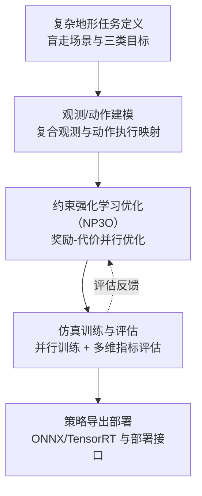
结合本课题工程实现，本文以 Isaac Gym 并行仿真为训练载体，面向双轮足复杂地形盲走任务构建“指令跟踪-姿态稳定-约束满足”协同优化目标，并采用 NP3O 约束强化学习框架开展训练与验证。围绕“训练-评估-部署验证”链路，本文已形成阶段性工程闭环：在训练阶段完成基础训练框架搭建及台阶、波浪地形训练与参数调优；在评估阶段统计性能与安全指标并开展推理后端对比分析；在部署验证阶段完成策略向 ONNX/TensorRT 格式转换，并将 ONNX 模型接入 MuJoCo 进行 sim2sim 测试，为后续 sim2real 扩展提供接口基础。

因此，本文研究意义可归纳为：在理论层面，探索高维接触系统中性能目标与安全约束协同学习机制；在方法层面，推动轮足复杂地形控制由强模型依赖向“数据驱动+约束优化”范式转变；在工程层面，构建可复现实验链路与可迁移部署接口；在应用层面，为双轮足机器人在弱感知、未知地形中的稳定通行提供技术支撑。

（表 1-1 研究意义归纳表）

| 意义维度 | 对应问题 | 本文思路 | 预期价值 |
|---|---|---|---|
| 理论意义 | 复杂地形盲走中，运动性能目标与安全约束目标高度耦合，缺少统一建模与协同优化表述。 | 将任务形式化为 CMDP，采用“奖励回报—代价回报”并行建模，建立性能与安全的统一优化语义。 | 丰富复杂接触场景下约束强化学习的理论表达，为高维连续控制任务提供可解释的建模框架。 |
| 方法意义 | 传统单奖励强化学习易出现奖励语义混叠与风险行为投机，难以稳定兼顾“快、稳、安全”。 | 基于 NP3O 构建约束优化流程，引入代价优势估计、代价价值学习和违约惩罚机制，并结合历史编码与表征约束提升训练稳定性。 | 形成可复用的“性能-安全协同优化”方法范式，提高复杂地形任务下策略鲁棒性与约束满足能力。 |
| 工程意义 | 从训练到评估再到部署的链路常存在割裂，导致结果难复现、方法难迁移。 | 依托 Isaac Gym 构建并行训练、课程学习、域随机化、日志评估与 ONNX/TensorRT 导出的闭环流程。 | 提升实验可复现性与工程可迁移性，为 sim2sim/sim2real 扩展提供标准接口与流程基础。 |
| 应用意义 | 工业巡检、灾后通行等弱感知复杂场景下，对机器人长期稳定通行与风险可控要求高。 | 面向双轮足盲走场景，围绕指令跟踪、姿态稳定与约束满足开展系统优化与验证。 | 为双轮足机器人在非结构化地形中的自主运动提供技术支撑，增强实际任务中的可用性与可信性。 |

### 1.2 国内外研究现状
双轮足及腿足机器人复杂地形控制研究总体经历了“模型驱动主导-数据驱动增强-约束优化融合”的演进过程。早期研究集中在动力学建模、接触力分配和层级控制架构，典型方法包括 ZMP、MPC 与 WBC 等。该类方法在结构化环境下具有明确物理解释与稳定实时性能，但在复杂非结构地形中常受模型不完备、接触切换不连续与参数漂移影响，性能随场景变化波动明显。对于轮足耦合系统而言，轮地滚动与腿部摆动协同导致系统动力学呈现更强非线性，传统解析控制难以同时保证高速度通过性与高鲁棒稳定性。

国外研究在高动态腿足与轮足平台上起步较早，近年来已形成“硬件能力提升+学习控制增强”的双线发展路径。一方面，通过高功率密度执行器、低时延状态估计和鲁棒控制器提升机器人本体能力；另一方面，通过深度强化学习、课程学习与域随机化提高复杂地形适应能力。相关研究表明，学习策略在坡面、台阶、碎石与混合障碍等场景中可获得优于固定规则控制的通过性能。尤其在轮足方向，研究重点已由平地高效滚动扩展为“姿态-速度-接触”联合控制，并开始强调历史信息建模、局部地形感知和策略鲁棒性评估。

从方法演进细节看，国外部分研究已由“单策略端到端控制”转向“结构化策略学习”。典型做法包括：将历史编码模块显式加入策略网络以捕获隐式动力学状态；将评论家网络接入更丰富地形特征以提升价值估计精度；通过教师-学生蒸馏提升部署侧推理效率。该类工作对本文启示在于：在不显著增加推理负担的前提下，通过训练阶段的信息增强与结构设计，可有效提升策略学习质量和部署可行性。

国内研究近年来发展迅速，研究范式由“机构与控制参数设计”逐步转向“感知-决策-控制”一体化学习框架。大量工作依托高并行仿真平台开展复杂地形训练，在速度跟踪、抗干扰和姿态稳定方面取得了可观进展。与此同时，国内在约束强化学习、多目标奖励构造、训练稳定化与部署导出链路方面的工程化探索较为活跃，形成了较强的可复现导向。总体而言，国内研究在工程落地效率方面优势明显，但在跨场景统一评测协议、长期运行稳定性验证及安全约束可解释建模方面仍有进一步完善空间。

结合工程实践可见，国内研究在“从算法到系统”的链路打通方面积累较快：一方面，基于 Isaac Gym 等平台可快速形成多地形批量训练流程；另一方面，围绕 ONNX/TensorRT 等推理链路已形成初步部署范式。然而，当前公开工作中仍常见“训练指标充分、部署指标不足”的问题，例如同一策略在不同推理后端下的时延波动、控制频率变化对稳定性的影响、以及极端地形组合下长期运行的退化现象等。上述问题直接构成本文实验与分析环节需要重点补足的内容。

从算法视角看，基于策略梯度的方法已成为复杂地形运动控制的主流路线。PPO 及其扩展方法因训练稳定、实现成熟、易于并行采样等特点被广泛采用。为提升策略对时序信息和隐式动力学变化的感知能力，研究者进一步引入历史编码、注意力机制与表征学习约束。然而，传统单一奖励驱动方法往往将性能与安全语义混合在同一目标中，容易产生“奖励投机”现象：策略可能在短期回报提升的同时放大接触冲击、关节越界或高频抖动风险，这在高动态轮足盲走任务中尤为突出。

在此背景下，约束强化学习逐渐成为关键研究方向。其核心思想是将安全要求从奖励项中部分剥离，构建“奖励回报-代价回报”双通道优化框架，并通过拉格朗日法、罚函数法或约束策略梯度控制违约水平。已有研究表明，该框架在终止率下降、碰撞抑制和可行域收敛方面具有明显优势，但也面临代价估计高方差、约束系数敏感、训练早期可行样本不足等挑战。此外，不同工作对“约束满足”的定义和统计窗口存在差异，导致方法横向比较难度较高。

仿真到部署迁移（sim2sim/sim2real）是验证方法工程价值的关键环节。当前主流做法包括动力学随机化、观测噪声注入、外力扰动、时延建模及执行器参数随机化，以降低仿真与真实系统差异；同时结合模型压缩、策略蒸馏、ONNX/TensorRT 导出等技术提升推理效率。尽管迁移成功率已有提升，但复杂地形盲走场景仍存在共性问题：训练期安全约束与部署期风险指标缺乏一致性验证；极端地形组合下策略长期鲁棒性不足；多推理格式下时延-精度-稳定性权衡研究仍不充分。

以部署流程为例，同一策略通常需要经历“训练模型保存-中间表示导出-推理引擎转换-控制循环集成”多阶段处理，每一阶段都可能引入数值误差、时延变化或接口不一致问题。若缺少统一验证协议，训练期表现良好的策略在部署期可能出现动作抖动增大、姿态恢复变慢或终止率上升等现象。因此，构建覆盖训练指标与部署指标的一致性评测框架，是实现复杂地形控制工程落地的必要条件。

综上，现有研究已为双轮足复杂地形控制提供了重要基础，但“高性能与高安全协同优化”以及“泛化能力与可部署性统一评估”仍是核心挑战。本文在此基础上，面向复杂地形盲走任务引入约束强化学习框架，并结合并行仿真、课程学习和域随机化开展系统验证，力求在性能与安全兼顾前提下提高策略鲁棒性、可解释性与工程复现性。

（图 1-3 国内外复杂地形运动控制研究路线演进图）

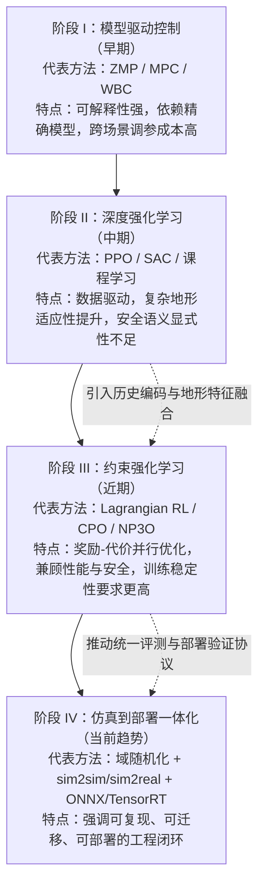

（表 1-2 国内外研究对比表）

| 研究方向 | 典型方法 | 优势 | 局限 | 对本文启示 |
|---|---|---|---|---|
| 模型驱动控制 | ZMP、MPC、WBC、层级控制 | 物理可解释性强、稳定性分析基础成熟、局部工况性能可靠 | 依赖精确模型与参数整定；面对复杂接触切换和地形突变时鲁棒性下降；跨场景迁移成本高 | 需要引入数据驱动能力弥补模型不完备问题，同时保留可解释的约束语义与控制边界 |
| 策略梯度强化学习 | PPO、TRPO、SAC（在复杂地形中常配合课程学习） | 可直接处理高维连续状态-动作问题；并行仿真下样本吞吐高；复杂地形适应能力较强 | 以单奖励为主时易出现奖励投机；安全语义表达弱；在高风险任务中可能出现“高回报高风险”策略 | 应将性能目标与安全目标解耦建模，构建奖励与代价并行优化框架，避免安全语义混叠 |
| 约束强化学习 | Lagrangian RL、CPO、PCPO、NP3O 等 | 可显式建模约束可行域；能在优化中直接抑制违约行为；更契合工程安全需求 | 代价估计方差较大；约束权重与阈值敏感；训练早期可行样本不足时易不稳定 | 采用 NP3O 并结合代价优势、代价价值网络与违约惩罚，配合稳定化机制提升收敛质量 |
| 仿真到部署迁移（sim2real/sim2sim） | 域随机化、扰动注入、系统辨识、策略蒸馏、ONNX/TensorRT 部署链路 | 缩小训练与部署分布差异；提升跨平台可迁移性；推动算法工程落地 | 缺少统一一致性评测协议；不同后端时延与数值误差导致行为偏移；长期鲁棒性验证不足 | 在方法设计阶段同步考虑导出与部署接口，建立“训练-评估-导出-验证”闭环，并报告精度与实时性双指标 |

### 1.3 研究问题与目标
围绕双轮足机器人复杂地形盲走控制任务，本文聚焦“高运动性能与高安全性难以兼顾”的核心矛盾。该任务需要在同一控制周期内同时满足速度指令跟踪、机体姿态稳定、接触约束可行与执行器边界限制等要求，不同目标之间存在显著耦合与冲突：例如提升前向速度通常会增大俯仰扰动和接触冲击，而过于保守的安全控制又会显著降低通过效率与任务连续性。因此，如何在连续状态-连续动作框架下实现性能目标与安全约束的统一优化，是本文第一个关键研究问题。

第二个研究问题聚焦于“观测表达与泛化能力”。盲走设定下策略无法依赖全局地图，需要从本体状态、局部地形扫描与历史时序中提取对控制最有价值的信息。若观测建模不足，策略容易出现短视行为，无法有效应对地形突变和动力学扰动；若安全语义全部隐含于奖励函数，又容易产生奖励投机。基于此，本文关注如何构建兼顾可表达性与可学习性的观测-动作接口，并通过奖励回报与代价回报并行建模提升策略对安全语义的显式感知能力。

第三个研究问题聚焦于“工程复现与部署衔接”。复杂地形控制方法的有效性不仅体现在仿真收敛，还体现在能否形成可复现实验流程与可迁移部署接口。结合本项目代码实现，已打通的关键链路包含：Isaac Gym 并行训练框架搭建、台阶与波浪地形训练和参数调优、训练日志与指标统计、策略导出到 ONNX/TensorRT 及多后端推理对比、ONNX 模型在 MuJoCo 中的 sim2sim 测试。如何将上述环节组织为可验证、可复用、可扩展的闭环流程，并为后续 sim2real 验证预留标准接口，是本文第三个关键问题。

上述三个研究问题之间并非孤立关系，而是存在明确因果链：任务复杂性决定观测与动作建模需求，建模方式决定优化问题形式，优化策略再决定部署可行性与安全边界。换言之，若仅在算法层局部优化而忽视任务建模与部署验证，最终难以形成可推广的工程方案。本文因此采用“问题分解-模块对应-指标闭环”的研究组织方式，以保证章节之间逻辑一致、实验结论可追溯。

基于上述问题，本文总体目标定义为：面向双轮足机器人复杂地形盲走任务，构建“指令跟踪-姿态稳定-约束满足”协同优化方法，并在并行仿真平台完成系统验证。围绕该目标，本文从任务建模、算法设计、实验评估与工程部署四个层面协同展开：在建模层明确观测、动作、奖励与代价语义；在算法层采用 NP3O 框架实现收益与约束联合优化；在实验层建立收敛性、性能、安全性和鲁棒性评估体系；在工程层打通策略导出与推理部署接口。

为保证研究目标可测、可证与可复现，本文设置如下分目标：
（1）构建统一的复杂地形盲走任务描述和评价指标体系，明确速度跟踪误差、姿态偏差、终止率与约束违约水平等核心指标；
（2）构建职责清晰的性能项与安全项联合目标，降低奖励语义混叠导致的风险行为；
（3）通过课程学习、域随机化和扰动注入提高策略对地形变化与动力学不确定性的适应能力；
（4）形成“训练-评估-导出”闭环工程流程，为跨仿真验证及实机部署提供可对接接口与实验依据。

（图 1-4 研究问题分解与目标映射图）

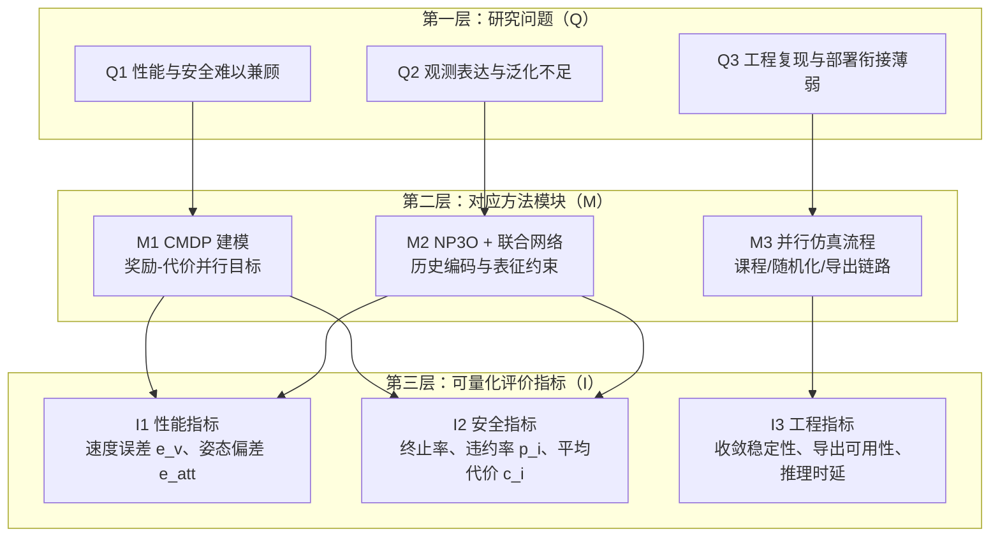

（表 1-3 本文研究目标与评价指标对应表）

| 目标层级 | 具体目标 | 支撑方法 | 评价指标 | 预期结果 |
|---|---|---|---|---|
| 总体目标 | 构建双轮足复杂地形盲走“指令跟踪-姿态稳定-约束满足”协同优化方法，并完成系统验证 | CMDP 任务建模 + NP3O 约束强化学习 + 并行仿真评估与部署导出 | 综合回报、综合代价、终止率、训练稳定性、导出可用性 | 在复杂地形中实现性能与安全兼顾，形成可复现实验闭环 |
| 建模层目标 | 建立可表达、可执行、可评价的观测-动作-奖励-代价统一接口 | 复合观测（本体+扫描+历史+隐变量）与连续动作执行映射；奖励/代价分通道设计 | 速度跟踪误差 \(e_v\)、偏航误差 \(e_\omega\)、姿态偏差 \(e_{att}\)、代价通道统计 | 降低奖励语义混叠，提升任务建模可解释性与可学习性 |
| 算法层目标 | 在保证训练稳定的前提下实现收益与约束联合优化 | NP3O（代价优势、代价价值学习、违约惩罚）+ Actor-Critic-Cost 联合网络 + 表征约束 | `Loss/value_function`、`Loss/cost_value_function`、`Loss/mean_viol_loss`、约束违约率 \(p_i\) | 收敛过程稳定，违约水平下降，避免“高回报高风险”策略 |
| 实验与工程层目标 | 形成“训练-评估-导出”闭环并支持后续 sim2sim/sim2real 扩展 | Isaac Gym 并行训练、课程学习、域随机化、扰动注入、ONNX/TensorRT 导出链路 | 成功率/终止率、鲁棒性指标、导出成功率、推理时延与一致性偏差 \(\delta_a\) | 提升跨场景泛化与工程可迁移性，为部署验证提供标准接口 |

### 1.4 研究内容与技术路线
围绕双轮足机器人复杂地形盲走控制任务，本文按照“任务建模-方法设计-实验验证-部署衔接”四层结构组织研究内容，形成由问题定义到工程验证的完整技术闭环。

第一层为任务与环境建模。本文基于 Isaac Gym 构建高并行复杂地形训练环境，采用三角网格地形生成、难度递进课程机制与域随机化策略，覆盖平整地面、坡面、台阶与离散障碍等典型场景。针对盲走控制特征，构建“本体状态+局部地形扫描+历史观测+随机化隐变量”的复合观测表达，并定义连续动作到关节控制目标的可执行映射，为后续优化提供统一任务接口与语义边界。

第二层为约束强化学习方法设计。本文以 NP3O 为核心，在 PPO 裁剪更新框架上引入代价优势估计、代价价值学习与违约惩罚机制，形成奖励回报与代价回报并行优化路径。网络结构采用策略-价值-代价联合架构，通过历史信息编码、地形特征融合和表征约束提升高维接触场景下的学习稳定性与风险辨识能力，从而缓解单一奖励目标下的安全语义混叠问题。

第三层为实验评估体系构建。本文从收敛性、性能、安全性、鲁棒性与部署效率五个维度建立指标体系与分析流程：跟踪训练中回报与代价演化；统计速度跟踪误差、姿态偏差和通过表现；分析约束违约水平与终止事件分布；在台阶与波浪地形上开展参数调优与对比；并通过多后端推理实验评估时延、吞吐、数值一致性与资源开销。该评估框架强调“指标-目标”一一对应，确保实验结论具备可解释性和可复核性。

在实验组织上，本文进一步设置了“分层验证”思路：先完成基础训练框架与策略收敛性验证，再在台阶与波浪地形开展分场景训练与参数调优，随后通过推理后端对比分析部署实时性，最后以 ONNX-MuJoCo sim2sim 测试检验跨仿真器一致性边界。该流程能够区分“是否学会运动”“是否学会安全控制”“是否具备部署可用性与跨仿真迁移能力”三个层次，避免单一指标结论掩盖方法短板。

第四层为部署衔接与扩展接口。本文打通策略导出链路，实现训练模型向 ONNX 与 TensorRT 推理格式转换；并将 ONNX 模型接入 MuJoCo 开展 sim2sim 测试，验证策略在不同仿真器下的可执行性与一致性。该设计使研究不仅停留在仿真算法有效性层面，也具备向实时部署与跨平台验证延伸的工程基础。

总体上，本文技术路线体现为：以任务建模定义问题边界，以约束学习解决性能-安全协同优化，以系统实验验证方法有效性，以导出与部署接口提升工程可迁移性。四层内容相互耦合、逐层递进，构成完整研究主线。

（图 1-5 本文研究内容构成图）

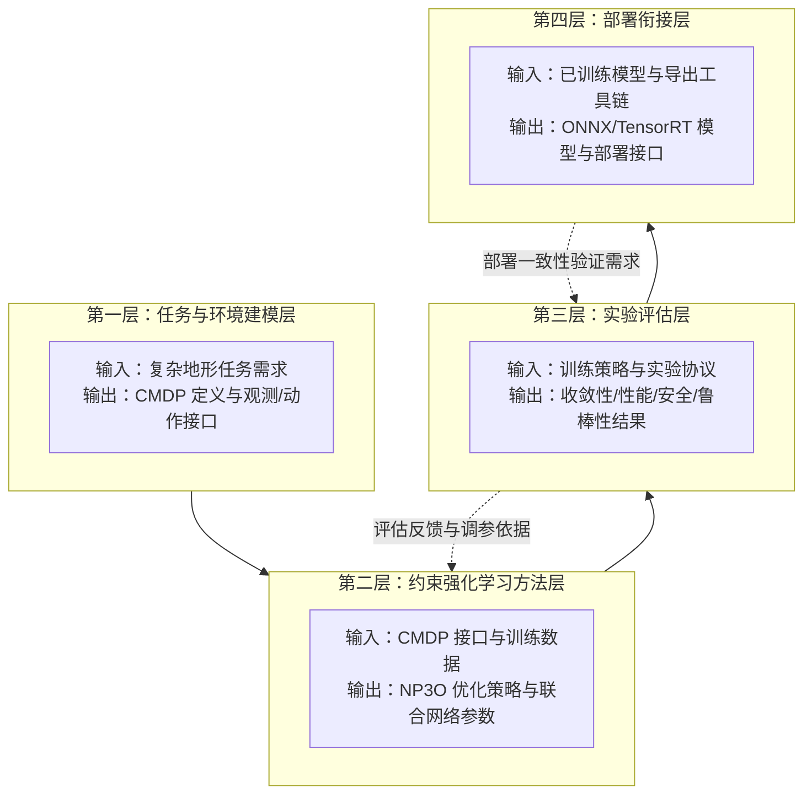

（图 1-6 本文技术路线流程图）

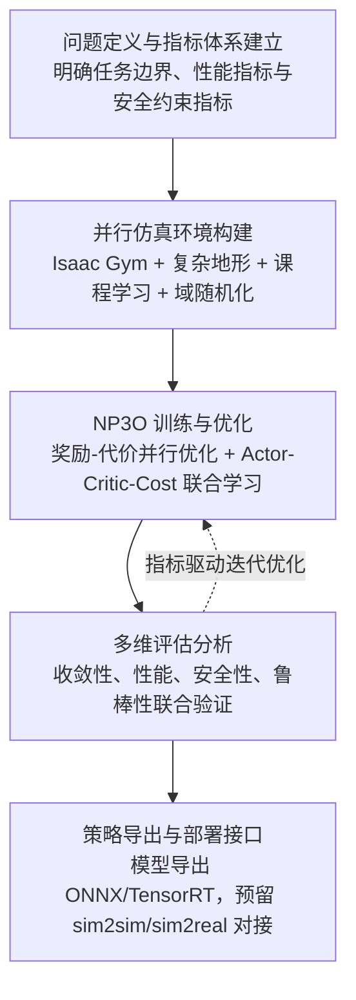

（表 1-4 研究内容—技术方法—评价指标对应表）

| 研究内容模块 | 关键技术 | 实现载体（代码/配置） | 评价指标 | 预期产出 |
|---|---|---|---|---|
| 任务与环境建模 | CMDP 形式化；复合观测（本体+扫描+历史+隐变量）；连续动作到关节控制映射 | 任务配置 `tita_constraint`；环境参数（观测维度、动作维度、控制频率） | 观测/动作接口一致性；指令可执行性；基础稳定性指标 | 完整任务定义与可训练接口，为算法层提供标准输入输出 |
| 约束强化学习方法 | NP3O（代价优势估计、代价价值学习、违约惩罚）；Actor-Critic-Cost 联合网络；表征约束 | `OnConstraintPolicyRunner`、`RolloutStorageWithCost`、`NP3O`、`ActorCriticBarlowTwins` | `Train/mean_reward`、`Loss/value_function`、`Loss/cost_value_function`、`Loss/mean_viol_loss` | 获得兼顾性能与安全的策略参数，提升训练稳定性与可解释性 |
| 仿真训练与评估 | 大规模并行采样；课程学习；域随机化与扰动注入；分层评估协议 | Isaac Gym 并行环境配置（`num_envs`、地形课程、`domain_rand`、`push_robots`） | 速度误差 \(e_v\)、姿态偏差 \(e_{att}\)、终止率、违约率 \(p_i\)、鲁棒性统计 | 形成可复核实验结果，验证方法在复杂地形下的有效性与泛化性 |
| 导出与部署衔接 | 模型导出与推理后端转换；训练-部署一致性检查 | 导出脚本与推理接口（TorchScript/ONNX/TensorRT） | 导出成功率、推理时延、行为一致性偏差 \(\delta_a\) | 建立“训练-评估-导出”闭环，为后续 sim2sim/sim2real 提供工程基础 |

### 1.5 论文结构安排
本文围绕双轮足机器人复杂地形盲走控制任务，按照“问题提出-任务建模-方法设计-实验验证-总结展望”的逻辑组织全文，力求实现理论分析、算法实现与工程验证的一体化闭环。全文共分六章，各章关系如下。

第一章为绪论，阐明研究背景与意义，综述国内外研究现状，提出本文研究问题、总体目标与技术路线。该章的核心作用是明确研究动机、边界条件与评价维度，为全文建立统一问题语境。

第二章为任务建模章节，完成从工程控制问题到可优化学习问题的形式化转换。该章重点定义任务场景、马尔可夫决策过程、观测与动作表示、奖励函数和约束代价，回答“学什么、如何表示、如何评价”的基础问题，为算法设计提供标准化输入输出接口。

第三章为方法章节，在第二章建模基础上系统介绍基于 NP3O 的约束强化学习框架。该章围绕目标函数构造、策略-价值-代价联合网络、非对称信息利用与训练稳定化机制展开，回答“如何在性能目标与安全约束并存条件下实现稳定优化”的核心方法问题。

第四章为实验平台与协议章节，介绍 Isaac Gym 并行仿真平台、复杂地形构建、课程学习、域随机化与扰动注入设置，以及训练参数和评估协议。该章用于保证实验过程可复现、评测标准可对比。

第五章为实验结果与分析章节，围绕训练收敛、台阶与波浪地形性能、约束满足与安全性、推理后端对比结果、ONNX-MuJoCo sim2sim 表现等方面展开定量与定性分析，并结合策略导出链路讨论方法的工程可行性与扩展潜力。

该章将采用“现象描述-指标解释-机制归因”的分析框架：首先给出训练曲线与通过结果，再结合消融或对比实验解释性能变化来源，最后从网络结构、奖励-代价协同与随机化策略三个层面讨论方法有效性边界。这一写作方式有助于避免仅汇报结果而缺乏机制解释的问题。

第六章为结论与展望章节，总结本文主要工作与结论贡献，分析研究局限，并面向跨平台迁移、实时推理优化与实机鲁棒控制提出后续研究方向。

总体而言，本文结构遵循“从问题定义到方法提出、从方法验证到工程落地”的主线。第二章与第三章构成理论与算法主体，第四章与第五章构成实验验证主体，第六章完成研究收束与拓展，使全文在学术问题、技术实现与应用价值之间形成清晰对应关系。

（图 1-7 论文整体结构与章节逻辑关系图）

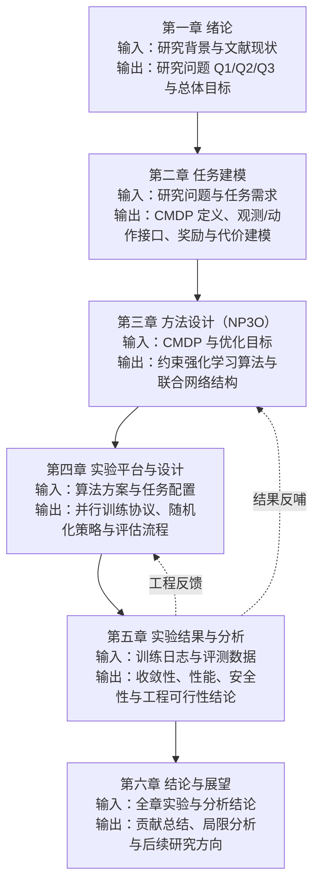

（表 1-5 章节内容与研究目标对应表）

| 章节 | 核心内容 | 解决问题 | 对应研究目标 | 主要产出 |
|---|---|---|---|---|
| 第一章 绪论 | 阐明研究背景与意义，综述国内外现状，提出研究问题与技术路线 | 明确“为何研究、研究什么、如何组织” | 总体目标界定；Q1/Q2/Q3 问题分解 | 研究问题集、目标体系与全文逻辑主线 |
| 第二章 任务建模 | 将复杂地形盲走任务形式化为 CMDP，定义观测、动作、奖励与代价 | 解决“学什么、如何表示、如何评价” | 建模层目标：建立统一且可执行的任务接口 | 完整任务数学描述与可训练环境接口定义 |
| 第三章 方法设计 | 给出 NP3O 约束强化学习目标函数、联合网络与稳定化机制 | 解决“如何在性能与安全并存条件下稳定优化” | 算法层目标：收益与约束协同优化 | 可复现算法流程、损失函数与网络架构方案 |
| 第四章 实验平台与设计 | 构建并行仿真、课程学习、域随机化、扰动注入与评估协议 | 解决“如何保证实验可复现、可比较、可验证” | 实验层目标：建立标准化训练与评测流程 | 可复现实验配置、数据采集口径与对比协议 |
| 第五章 实验结果与分析 | 从收敛、性能、安全、鲁棒与部署衔接维度进行定量与定性分析 | 解决“方法是否有效、边界在哪里、工程是否可行” | 验证目标：证明方法有效并识别适用边界 | 多维实验结论与机制归因分析 |
| 第六章 结论与展望 | 总结主要贡献，分析局限并提出后续研究方向 | 解决“研究结论如何沉淀与延展” | 总结目标：形成可延续研究路线 | 结论清单、局限说明与未来工作框架 |

## 第二章 双轮足机器人盲走任务建模

### 2.1 机器人平台与任务场景定义

#### 2.1.1 机器人平台介绍

本文研究对象为双轮足机器人 TITA，其动力学模型由 `resources/tita/urdf/tita_description.urdf` 给出，并在 Isaac Gym 中加载为训练与评估的统一本体。机器人整体采用“机身 + 双侧腿部 + 轮端执行”构型：机身作为主要载荷平台，左右两侧腿机构用于姿态调节与接触几何适配，末端轮式部件承担连续滚动与地形通过任务。该结构兼具轮式平台的高效率与腿式平台的地形适应能力，能够支持本文关注的复杂地形盲走控制问题。

从参数层看，机身主链接 `base_link` 质量为 13.2 kg，碰撞近似包围盒尺寸为 \(0.47\times 0.30\times 0.19\) m。机器人左右对称，每侧包含 4 个转动关节，共 8 个可控自由度，对应本文控制器的 8 维连续动作输出。关节命名上，左侧为 `joint_left_leg_1` 至 `joint_left_leg_4`，右侧为 `joint_right_leg_1` 至 `joint_right_leg_4`。其中每侧前三级关节主要承担腿部姿态调节，末级关节连接轮端并支持滚动驱动，从而形成“姿态调节 + 轮式推进”的耦合执行链。

在执行约束方面，URDF 中对关节能力给出了显式边界：每侧前三级关节力矩上限为 60 N·m、角速度上限为 25 rad/s；轮端关节力矩上限为 15 N·m、角速度上限为 20 rad/s。位置约束方面，一级关节范围约为 \([-0.785,\,0.785]\) rad，二级关节约为 \([-1.920,\,3.491]\) rad，三级关节约为 \([-2.670,\,-0.698]\) rad；轮端关节在模型中采用大范围转角设置，用于近似连续转动。上述边界在后续奖励与代价建模中分别对应“控制性能上限”与“安全可行域约束”，是构建 CMDP 任务接口的重要物理基础。

结合本课题工程实现，本文在训练侧采用“高层策略输出关节目标、低层 PD 控制器完成力矩执行”的分层控制范式。该范式能够将复杂非线性接触问题转化为可学习的低维连续控制问题：策略层专注于学习复杂地形下的动作决策规律，执行层专注于保障动作可实现性与控制稳定性。由此，机器人平台模型不仅是仿真载体，也是后续观测设计、动作映射、约束定义与部署验证的一致性基准。

（图 2-1 TITA 机器人结构与关节拓扑示意图）
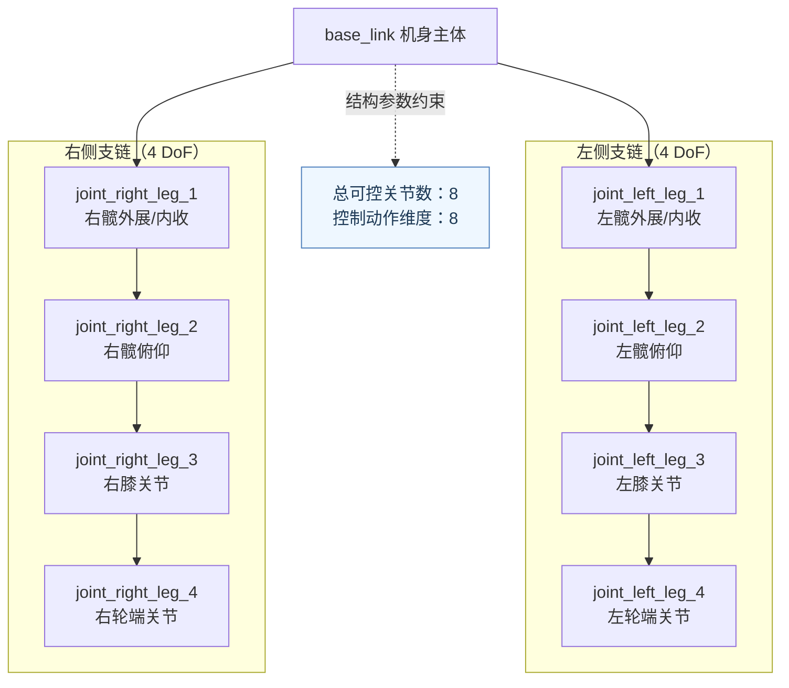

（表 2-1 占位：机器人平台关键参数表。建议按“参数类别、符号/名称、数值、单位、在控制中的作用”五列组织，可包含机身质量、包围盒尺寸、关节数量、关节限位、力矩与速度边界等。）

#### 2.1.2 任务场景与控制目标定义
本节面向双轮足机器人复杂地形盲走任务，给出训练场景、任务约束与控制目标的统一定义。所谓“盲走”，是指策略在决策时不依赖前向视觉语义与全局地图，而主要基于本体状态、局部地形高度扫描和短时历史信息进行闭环控制。在该设定下，机器人需要在未知起伏地形中持续执行速度指令，同时保持机体姿态稳定并避免跌倒、碰撞和执行器越界等风险行为。

从工程实现看，任务环境构建于 Isaac Gym 并行物理仿真平台，地形采用三角网格形式并包含坡面、台阶、离散障碍等典型非结构化要素。训练中通过地形课程机制逐步提升难度，并叠加摩擦、质量、驱动参数和外力推扰等随机化因素，以逼近实际运行中“地形不确定 + 动力学不确定”的组合条件。由此，控制问题不再是单一平地速度跟踪，而是面向复杂接触条件的多目标协同优化问题。

（图 2-2 任务场景与感知-控制闭环示意图）
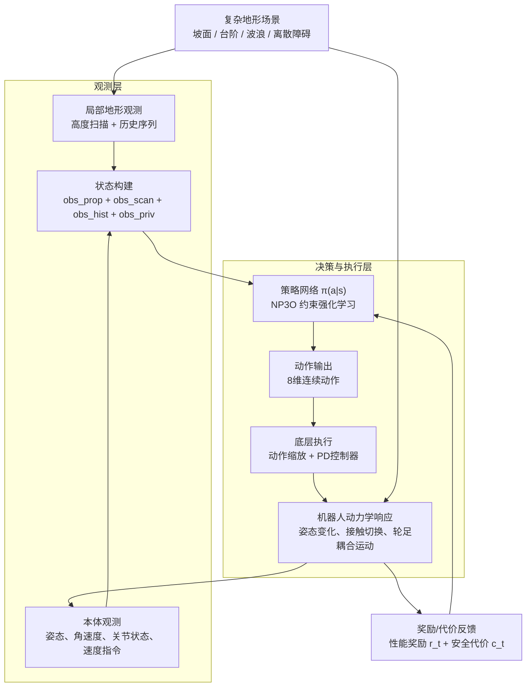

结合本课题需求，任务目标定义为以下三个层次：  
（1）**指令跟踪目标**：机器人应在连续控制过程中准确跟踪期望线速度与偏航角速度，减小指令误差并保证运动连续性；  
（2）**姿态稳定目标**：在地形起伏与接触切换过程中抑制俯仰/横滚波动，维持机体可控姿态与合理离地高度；  
（3）**安全约束目标**：显式约束关节位置、速度与力矩边界，抑制异常接触冲击与高风险动作，降低终止事件发生概率。  
上述三类目标之间存在天然耦合关系：仅追求速度容易放大姿态波动与接触风险，仅强调保守稳定又会牺牲通过效率。因此，本文在后续章节中采用“奖励目标 + 代价约束”并行建模方式，以实现性能与安全的协同优化。

在控制执行层，机器人采用关节空间位置控制范式，策略输出为 8 维连续动作，经缩放后映射为关节目标并由底层 PD 控制器执行。仿真基础步长设置为 0.0025 s，每 4 个仿真子步更新一次控制命令，等效控制周期为 0.01 s（100 Hz）。该频率设置兼顾了两方面需求：一是保证接触切换场景下的动态响应能力，二是控制训练与部署阶段的计算开销，使策略学习与后续推理部署具备工程可实现性。控制周期同时参与奖励项时间尺度归一，确保不同目标项在优化过程中具有一致量纲解释。

进一步地，本任务将“可完成性”与“可安全完成性”区分描述：前者关注机器人是否能在给定指令下持续通过复杂地形，后者关注完成过程中是否满足约束、是否保持稳定、是否避免高风险行为。该区分为后续马尔可夫决策过程建模提供了语义基础，即通过状态-动作-奖励刻画性能收益，通过代价函数刻画安全语义，并在同一训练框架中联合优化。

（表 2-1 占位：任务场景与控制目标定义表。建议按“目标层级、形式化描述、对应观测信息、主要评价指标、风险项”五列组织，用于与第 4 章评估协议直接对齐。）

### 2.2 马尔可夫决策过程建模
为将双轮足机器人复杂地形盲走控制问题转化为可学习、可优化的统一数学问题，本文将任务形式化为连续状态—连续动作的约束马尔可夫决策过程（Constrained Markov Decision Process, CMDP）：
\[
\mathcal{M}=\langle \mathcal{S},\mathcal{A},\mathcal{P},r,\mathbf{c},\gamma,\rho_0 \rangle
\]
其中，\(\mathcal{S}\) 为状态空间，\(\mathcal{A}\) 为动作空间，\(\mathcal{P}(s_{t+1}|s_t,a_t)\) 为状态转移概率，\(r(s_t,a_t)\) 为性能奖励，\(\mathbf{c}(s_t,a_t)\in\mathbb{R}^{m}\) 为多维安全代价，\(\gamma\in(0,1)\) 为折扣因子，\(\rho_0\) 为初始状态分布。与标准 MDP 不同，CMDP 在追求累计回报最大化的同时，要求代价回报满足可行域约束，从而显式表达“运动性能—安全约束”并行优化需求。

结合本工程实现，策略优化目标可写为：
\[
\max_{\pi_\theta}\;J_r(\pi_\theta)=\mathbb{E}_{\pi_\theta}\left[\sum_{t=0}^{T-1}\gamma^t r_t\right],\qquad
\text{s.t.}\;J_{c,i}(\pi_\theta)=\mathbb{E}_{\pi_\theta}\left[\sum_{t=0}^{T-1}\gamma^t c_{i,t}\right]\le d_i,\;i=1,\dots,m
\]
其中 \(m=6\) 对应本任务中启用的六类代价约束通道。该形式化描述的核心意义在于：将“跑得更好”与“跑得更安全”从目标语义上解耦，再通过统一优化器进行耦合求解，避免单一奖励函数对安全语义表达不足而引发的奖励投机行为。

在状态定义上，系统采用“本体状态 + 局部地形 + 历史信息 + 随机化隐变量”的复合表示。状态向量可抽象写为
\[
s_t=\left[o_t^{prop},\,o_t^{scan},\,o_t^{priv},\,h_t\right]
\]
其中 \(o_t^{prop}\) 为本体观测（角速度、重力投影、指令、关节位置偏差、关节速度、上一时刻动作等），\(o_t^{scan}\) 为局部地形高度扫描，\(o_t^{priv}\) 为训练期动力学随机化相关隐变量，\(h_t\) 为长度为 10 的本体历史序列展开特征。按当前配置，该状态总维度为 586 维，能够同时覆盖瞬时动力学、局部地形几何和短时序动态信息，为后续策略学习提供足够可观测性。

在动作定义上，策略输出 8 维连续动作 \(a_t\in\mathbb{R}^8\)，经动作缩放与关节映射后生成关节目标，再由 PD 控制器转换为力矩执行。动作到执行器的映射可写为：
\[
\mathbf{q}^{target}_t=\mathbf{q}^{default}+k_a\cdot a_t,\qquad
\boldsymbol{\tau}_t=K_p(\mathbf{q}^{target}_t-\mathbf{q}_t)-K_d\dot{\mathbf{q}}_t
\]
并在实现中叠加动作滤波、力矩限幅与随机时滞处理。该设计使策略层维持低维连续决策表达，而底层执行层负责物理可实现性约束，从而兼顾学习效率与控制可执行性。

奖励函数承担性能优化语义，采用可加形式：
\[
r_t=\sum_{k} w_k\,\phi_k(s_t,a_t)
\]
其中主要项包括线速度/角速度指令跟踪、姿态稳定（俯仰/横滚相关）、机体高度保持、功率与动作变化率惩罚、碰撞惩罚与终止惩罚等。工程实现中，非零奖励权重按控制步长 \(\Delta t\) 进行时间尺度缩放，使不同频率设定下的优化目标保持量纲一致性；终止项在正奖励裁剪后单独加入，以强化对跌倒等失败事件的惩罚语义。

代价函数承担安全约束语义，采用向量形式：
\[
\mathbf{c}_t=\left[c_t^{pos},c_t^{torque},c_t^{vel},c_t^{acc},c_t^{impact},c_t^{stumble}\right]
\]
分别对应关节位置越界、力矩越界、关节速度越界、加速度平滑性、足端接触力异常与绊足风险等约束维度。与奖励不同，代价并不用于“鼓励某行为更优”，而用于“惩罚某行为不可行”，其本质是定义策略可行域边界。该分工使本文后续 NP3O 优化中的奖励优势与代价优势可并行估计，并通过违约项抑制高风险行为。

状态转移由 Isaac Gym 物理引擎隐式给出，即在给定 \(s_t,a_t\) 下，经多子步物理仿真与接触求解得到 \(s_{t+1}\)。由于地形变化、接触切换、随机扰动和参数随机化共同作用，转移过程表现为高维、强非线性、含不确定性的随机过程，难以显式解析建模。采用基于采样的策略梯度方法可直接利用交互数据对该转移进行“黑箱”学习，这是本文采用强化学习框架的关键动机之一。

终止机制方面，本文将“任务自然结束”与“失败终止”区分处理：达到最大步长记为超时终止；机体关键部位异常接触地面记为失败终止并触发显式惩罚。该机制一方面保证训练过程中的样本边界清晰，另一方面通过失败成本强化策略对安全边界的学习敏感性。

综上，本文的 MDP/CMDP 建模并非仅是形式化表达，而是贯穿任务定义、网络输入输出、目标函数构造与训练评估协议的统一接口。该接口将复杂地形盲走问题拆解为“状态可表达、动作可执行、奖励可优化、代价可约束”的四元协同结构，为第三章的 NP3O 约束优化方法提供直接建模基础。

（图 2-3 复杂地形盲走任务的 CMDP 建模示意图）
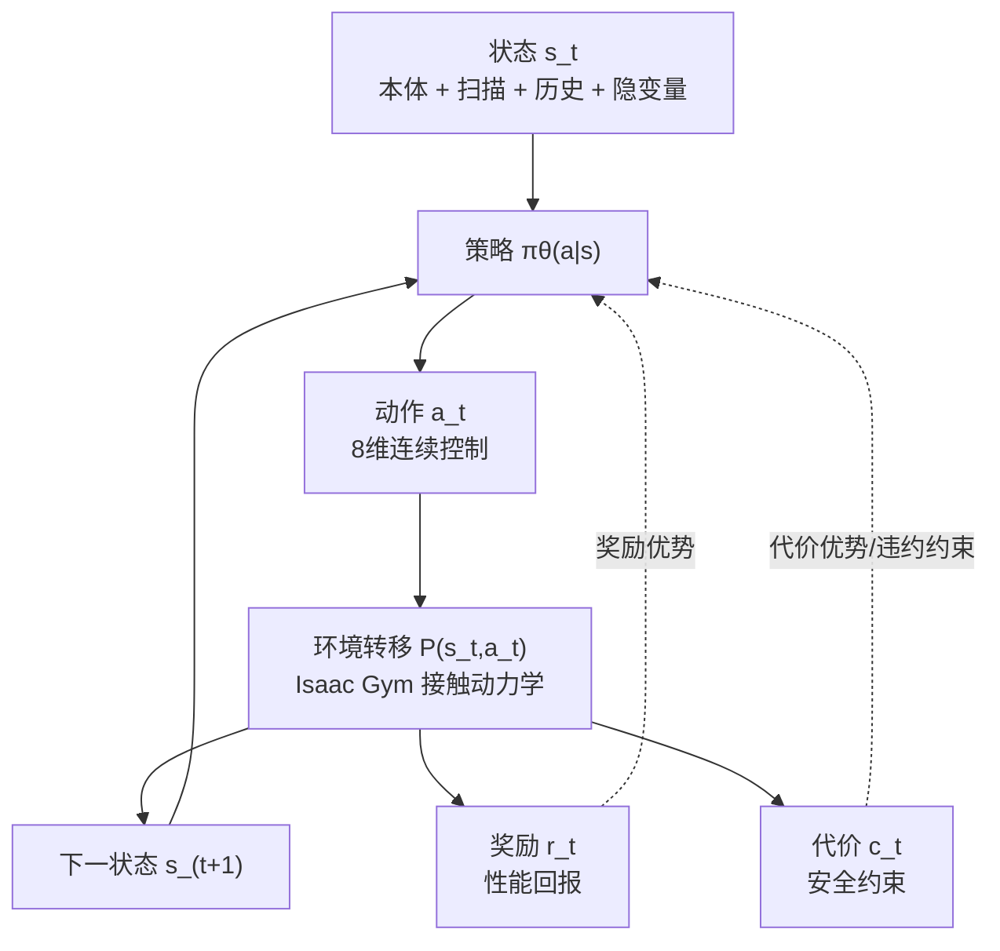

（表 2-2 占位：CMDP 各组成要素与工程实现映射表。建议按“数学符号、代码实现载体、物理含义、维度/单位、在优化中的作用”五列组织。）

### 2.3 观测空间建模
观测空间设计直接决定策略对地形变化和动力学扰动的可感知能力。结合本课题“复杂地形盲走 + 安全约束优化”的任务特点，本文采用由本体状态、局部地形高度扫描、随机化隐变量和历史序列共同构成的复合观测表达。该设计遵循“策略输入尽量可部署、训练输入尽量可辨识”的原则：一方面保留与在线控制直接相关的低延迟本体信息，另一方面引入训练阶段可获取的随机化语义与短时历史信息，提高策略在非平稳接触条件下的鲁棒性。

在工程实现中，观测维度由配置项显式给出：
\[
\dim(o_t)=n_{prop}+n_{scan}+n_{priv}+H\cdot n_{prop}
\]
其中 \(n_{prop}=33\)、\(n_{scan}=187\)、\(n_{priv}=36\)、历史长度 \(H=10\)，故总观测维度为
\[
\dim(o_t)=33+187+36+10\times 33=586.
\]
该结果与训练配置保持一致，确保了任务建模、网络输入和实验统计之间的统一性。

从结构上看，单步观测可写为
\[
o_t=\left[o_t^{prop},\;o_t^{scan},\;o_t^{priv},\;o_t^{hist}\right].
\]
其中，\(o_t^{prop}\) 为 33 维本体观测，具体由机体角速度、重力方向在机体坐标系下的投影、速度指令、关节位置偏差、关节速度以及上一控制周期动作拼接而成。该部分是策略闭环控制的核心即时信息，能够直接反映当前姿态与执行器运动状态。

\(o_t^{scan}\) 为局部地形高度观测。本文在机器人周围固定采样网格上提取高度信息，采样点由 \(17\times 11\) 的平面网格构成，共 187 个高度点。高度值按“机体高度参考减去地形采样高度”的方式构造，并进行区间裁剪与尺度变换，以抑制异常地形尖峰对梯度估计的冲击。相较仅使用本体状态的建模方式，引入局部高度扫描可显著增强策略对台阶、坡面和离散障碍的前馈适应能力。

\(o_t^{priv}\) 为 36 维随机化隐变量特征，包含与动力学随机化相关的训练期辅助信息，如机体线速度、接触状态统计、执行时滞、质量与摩擦等参数扰动因子。该部分用于提升评论家与策略学习阶段的状态可辨识性，使网络能够区分“同一外观状态下由不同动力学参数引起的行为差异”，从而降低训练过程中的表观同态干扰问题。

\(o_t^{hist}\) 为长度 \(H=10\) 的本体历史展开特征，即将最近 10 个时刻的 \(o_t^{prop}\) 级联为 \(10\times 33=330\) 维向量。其作用在于补偿单步观测对隐式系统状态（如接触切换趋势、短时振荡模式）的表达不足。尤其在轮足系统中，动作-接触-姿态之间存在明显时序耦合，仅依赖瞬时观测容易出现策略短视；加入历史特征后，策略可基于时序上下文形成更平滑、更稳定的控制输出。

（图 2-4 观测空间组成与维度分解示意图）
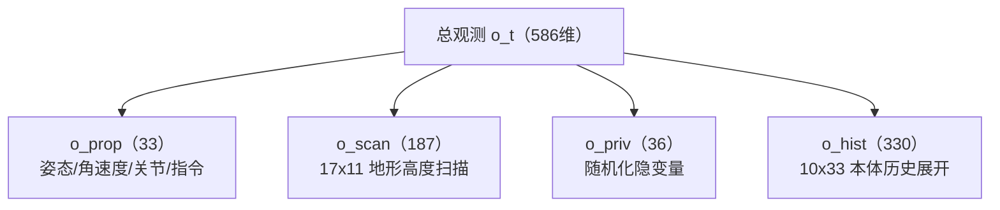

为提升训练稳定性，本文在观测预处理阶段引入归一化尺度、噪声注入与裁剪机制。归一化方面，角速度、关节速度、地形高度等量分别按预设尺度进行缩放，使不同物理量在数值范围上更均衡，降低网络训练中的梯度尺度失配风险。噪声方面，在本体观测中按统一噪声等级进行随机扰动注入，噪声幅值与各观测分量的物理尺度一致；其中速度指令与上一时刻动作通道不注入噪声，用于保持控制目标语义和动作反馈语义的稳定性。裁剪方面，观测向量在进入策略网络前进行幅值限制，避免极端状态导致的异常激活和更新震荡。

在机制层面，这三类预处理分别对应“量纲统一”“鲁棒性增强”和“数值安全边界”三重作用：归一化改善优化条件，噪声注入缓解策略对理想观测的过拟合，裁剪机制抑制异常样本对训练过程的破坏性影响。三者共同作用下，策略在复杂地形、随机扰动和接触突变场景中的收敛稳定性与泛化能力得到同步提升。

（表 2-3 观测分量与预处理配置表）

| 观测子空间 | 维度 | 主要变量 | 归一化尺度 | 噪声设置 | 是否裁剪 |
|---|---:|---|---|---|---|
| 本体观测 \(o_t^{prop}\) | 33 | 角速度、重力投影、速度指令、关节位置/速度、上一时刻动作 | 按配置对角速度、关节速度等分量进行尺度归一 | 启用；指令与上一时刻动作通道通常不加噪 | 是 |
| 地形扫描 \(o_t^{scan}\) | 187 | 机器人周围 \(17\times 11\) 网格高度值 | 按高度观测尺度统一缩放 | 可选（通常弱噪声或不加噪） | 是 |
| 隐变量 \(o_t^{priv}\) | 36 | 质量、摩擦、时滞、接触统计等随机化相关特征 | 按通道配置缩放 | 一般不额外注入噪声 | 是 |
| 历史展开 \(o_t^{hist}\) | 330 | 最近 10 步本体观测级联（\(10\times 33\)） | 继承本体观测归一化尺度 | 继承本体观测噪声策略 | 是 |
| 总观测 \(o_t\) | 586 | \(o_t^{prop}+o_t^{scan}+o_t^{priv}+o_t^{hist}\) | 统一输入网络 | 统一按观测配置执行 | 是 |

### 2.4 动作空间与执行映射
为保证策略输出能够稳定落地到机器人执行层，本文将动作空间设计为 8 维连续向量，并构建“策略动作 \(\rightarrow\) 关节目标 \(\rightarrow\) 力矩执行”的分层映射机制。该设计的核心思想是：策略网络只负责低维、归一化决策；执行层负责物理约束、带宽限制与安全边界控制，从而兼顾学习效率与控制可实现性。

在形式化上，策略于每个控制时刻输出
\[
a_t\in\mathbb{R}^{8},
\]
各通道对应双侧腿部关键驱动关节的目标偏置。环境侧首先对动作进行幅值裁剪：
\[
\tilde a_t=\operatorname{clip}(a_t,\,-a_{\max},\,a_{\max}),
\]
其中 \(a_{\max}\) 由配置项 `clip_actions` 给定。尽管当前配置中该值较大（100），网络输出仍主要分布在归一化范围内，裁剪步骤主要用于防止异常梯度更新导致的极端动作穿透执行层。

考虑到训练张量布局与机器人实际关节编号并不完全一致，系统在执行前对动作通道进行固定重排，以统一“策略输出顺序”和“仿真/部署执行顺序”。该映射可抽象记为
\[
\bar a_t=\mathbf{P}\tilde a_t,
\]
其中 \(\mathbf{P}\) 为置换矩阵（工程实现中对应索引重排 \([4,5,6,7,0,1,2,3]\)）。该步骤的意义在于将策略学习空间与硬件执行语义解耦，便于后续 sim2sim/sim2real 接口对接。

为抑制高频动作抖动，执行层进一步引入一阶低通滤波（启用配置 `use_filter=True`）：
\[
a_t^{f}=\alpha a_{t-1}+(1-\alpha)\bar a_t,\qquad \alpha=0.2.
\]
该设计等价于对当前策略动作实施平滑约束，可有效降低关节目标突变引发的瞬时冲击与数值振荡，提高复杂接触切换场景下的控制连续性。与奖励中的 `action_rate` 惩罚项相比，低通滤波属于“执行前约束”；两者共同作用于“优化层+执行层”双重平滑机制。

在缩放与关节目标构造阶段，动作首先按全局缩放系数 \(k_a\) 映射为关节偏置，再叠加默认站立位姿：
\[
\Delta q_t = k_a\,a_t^f,\qquad
q_t^{target}=q^{default}+\Delta q_t.
\]
其中 \(k_a=0.5\)。此外，髋关节通道施加额外缩放 \(k_{hip}=0.5\)，即相应通道满足 \(\Delta q_{hip}\leftarrow k_{hip}\Delta q_{hip}\)。该“分通道缩放”机制可在保持整体机动性的同时抑制髋部大幅摆动，降低姿态耦合带来的横滚/俯仰不稳定风险。

针对控制链路中常见的执行时滞问题，本文在训练中引入随机时滞建模。若启用时滞随机化，系统将历史动作偏置写入滞后缓冲区，并按环境随机滞后步数 \(d_t\) 选取延迟动作生成关节目标：
\[
q_t^{target}=q^{default}+\Delta q_{t-d_t},\qquad d_t\in\{0,1,\dots,D-1\}.
\]
该机制可模拟通信延迟、驱动响应迟滞等非理想因素，使策略在训练期提前学习“延迟鲁棒”控制行为，提升部署迁移稳定性。

在力矩执行阶段，系统采用位置型 PD 控制。对一般关节，执行力矩可写为
\[
\tau_t=K_p\left(q_t^{target}-q_t\right)-K_d\dot q_t.
\]
当启用域随机化时，\(K_p,K_d\) 进一步乘以随机比例因子，以模拟执行器参数不确定性；同时所有关节力矩再乘以电机强度随机因子，实现“控制增益+驱动能力”联合随机化。针对轮关节（索引 3、7）还采用了特化的控制表达，以更好匹配轮式驱动通道的速度/牵引控制特性。

最终，执行力矩在发送到仿真器前进行逐关节饱和约束：
\[
\tau_t^{exec}=\operatorname{clip}(\tau_t,\,-\tau^{lim},\,\tau^{lim}),
\]
其中 \(\tau^{lim}\) 由 URDF 执行器能力给出。该限幅步骤与上游动作裁剪、目标平滑共同构成由“策略输出—目标生成—力矩下发”逐层收紧的安全链路，可显著降低越界驱动与接触冲击导致的失稳风险。

结合控制时序设置，策略动作以 100 Hz 更新，每个策略动作在 4 个物理子步上重复执行。该“慢策略—快物理”结构使动作空间建模具备明确工程含义：策略层学习“控制意图”，物理层完成高频动力学响应。由此，本文动作空间不仅是算法输入输出定义，更是连接学习决策与可执行控制的关键中间接口。

（图 2-5 动作空间到执行器力矩的映射流程图）
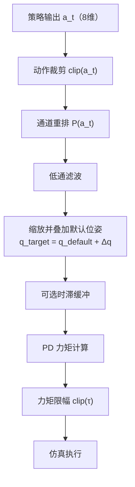

（表 2-4 占位：动作执行映射关键参数表。建议按“环节、数学表达、关键配置项、当前取值、工程作用”五列组织，至少包含 `clip_actions`、`action_scale`、`hip_scale_reduction`、滤波系数、滞后步数范围、PD 增益与力矩上限。）

### 2.5 奖励函数与约束代价设计
奖励函数与约束代价的设计目标，是在同一控制周期内同时回答两个问题：一是“策略是否在朝更优运动性能收敛”，二是“该性能是否以可接受风险为代价获得”。结合本文工程实现，系统采用“标量奖励 + 向量代价”的并行建模方式：奖励用于驱动任务表现提升，代价用于界定安全可行域边界。

奖励侧采用加权求和形式：
\[
r_t=\sum_{k\in\mathcal{K}_r}\bar w_k\,\phi_k(s_t,a_t),\qquad \bar w_k=w_k\cdot \Delta t
\]
其中 \(\Delta t=0.01\) s 为控制周期。实现中，除终止项外，非零奖励系数在初始化阶段统一乘以 \(\Delta t\)，用于保证不同控制频率下目标量纲一致；若启用正奖励裁剪，则先对累计奖励执行 \(\max(r_t,0)\)，再单独叠加终止惩罚项，以突出失败事件语义。

结合当前任务配置（`tita_constraint`），奖励通道主要包含以下十项：  
（1）**线速度跟踪奖励**：\(\phi_{lin}=\exp(-\|v_{xy}^{cmd}-v_{xy}\|^2/\sigma)\)，鼓励平面速度跟踪；  
（2）**偏航角速度跟踪奖励**：\(\phi_{yaw}=\exp(-(\omega_z^{cmd}-\omega_z)^2/\sigma)\)，保证转向指令可执行性；  
（3）**横滚/俯仰角速度惩罚**：\(\phi_{angxy}=\omega_x^2+\omega_y^2\)，抑制机体快速摆动；  
（4）**姿态偏离惩罚**：\(\phi_{ori}=g_x^2+g_y^2\)，通过重力投影约束机体水平性；  
（5）**机体高度惩罚**：\(\phi_h=(\bar h-h_{tar})^2\)，稳定离地高度并降低“蹲伏/抬升”异常；  
（6）**功率惩罚**：\(\phi_P=\sum_i\tau_i\dot q_i\)，抑制高能耗控制行为；  
（7）**关节加速度惩罚**：\(\phi_{acc}=\sum_i((\dot q_i^{t-1}-\dot q_i^{t})/\Delta t)^2\)，缓解高速振荡；  
（8）**动作变化率惩罚**：\(\phi_{\Delta a}=\sum_i(a_i^{t-1}-a_i^{t})^2\)，提升动作时序平滑性；  
（9）**碰撞惩罚**：对指定惩罚连杆（如腿部中间连杆）发生接触事件进行计数惩罚；  
（10）**终止惩罚**：对非超时终止（如基座触地）施加强惩罚，强化策略对跌倒风险的规避。

上述奖励项的作用机理可概括为“跟踪项提供前进驱动力，稳定项抑制姿态发散，能耗与平滑项抑制粗暴控制，事件项约束失败行为”。相较仅使用速度跟踪奖励的设定，该多项协同结构能显著降低奖励投机风险，使策略在复杂接触切换场景下保持更高可控性。

（图 2-6 奖励函数组成及作用路径示意图）
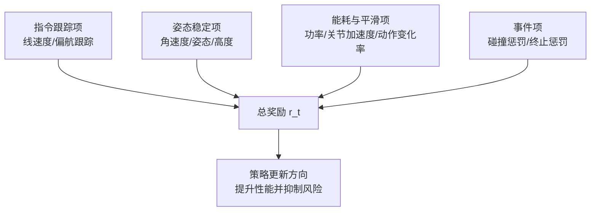

约束侧采用 6 维代价向量：
\[
\mathbf{c}_t=\left[c_t^{pos},\,c_t^{torque},\,c_t^{vel},\,c_t^{acc},\,c_t^{force},\,c_t^{stumble}\right]\in\mathbb{R}^{6}
\]
并在每步由环境函数并行计算，其中多数代价为“是否违约”的指示型信号。具体定义如下：  
（1）\(c_t^{pos}\)：任一关节超出位置上下限即记违约；  
（2）\(c_t^{torque}\)：任一关节力矩超过软限幅即记违约；  
（3）\(c_t^{vel}\)：任一关节速度超过软速度边界即记违约；  
（4）\(c_t^{acc}\)：关节加速度超过阈值部分的均值，刻画控制突变程度；  
（5）\(c_t^{force}\)：任一足端接触力超过阈值（`max_contact_force`）即记违约；  
（6）\(c_t^{stumble}\)：足端切向冲击力显著大于法向支撑力时记为绊足风险。

需要说明的是，`costs.scales` 在本实现中不直接作为环境侧逐项乘子，而是作为 NP3O 中各约束通道的惩罚权重 \(k_i\) 参与违约损失聚合；约束阈值 \(d_i\) 由 `costs.d_values` 给出（当前配置为 0）。因此，本文约束优化可理解为：先由代价网络估计各通道长期风险，再通过通道化权重调节实现“哪类风险优先被压制”的训练策略。

综合来看，奖励函数负责“把策略推向更优”，代价函数负责“把策略拉回可行域”，二者在 NP3O 中以优势估计和违约项并行进入梯度更新，形成性能与安全协同收敛机制。这一设计为后续第三章目标函数构造和第五章安全性分析提供了可解释、可量化的建模基础。

（表 2-5 奖励项与代价项配置对照表）

| 通道类别 | 名称 | 数学表达（示意） | 配置权重 | 物理语义 | 风险类型 |
|---|---|---|---|---|---|
| 奖励 | 线速度跟踪 | \(\exp(-\|v_{xy}^{cmd}-v_{xy}\|^2/\sigma)\) | \(w_{lin}\) | 提升平面速度跟踪精度 | 低（性能驱动） |
| 奖励 | 偏航跟踪 | \(\exp(-(\omega_z^{cmd}-\omega_z)^2/\sigma)\) | \(w_{yaw}\) | 提升转向指令可执行性 | 低（性能驱动） |
| 奖励 | 角速度稳定 | \(\omega_x^2+\omega_y^2\)（惩罚） | \(w_{angxy}\) | 抑制机体横滚/俯仰摆动 | 中（姿态发散） |
| 奖励 | 姿态偏离 | \(g_x^2+g_y^2\)（惩罚） | \(w_{ori}\) | 保持机体水平姿态 | 中（失稳） |
| 奖励 | 机体高度 | \((\bar h-h_{tar})^2\)（惩罚） | \(w_h\) | 维持合理离地高度 | 中（通过性下降） |
| 奖励 | 功率惩罚 | \(\sum_i \tau_i\dot q_i\) | \(w_P\) | 抑制高能耗与粗暴驱动 | 中（执行器压力） |
| 奖励 | 加速度惩罚 | \(\sum_i((\dot q_i^{t-1}-\dot q_i^{t})/\Delta t)^2\) | \(w_{acc}\) | 抑制高频振荡 | 中（机械冲击） |
| 奖励 | 动作变化率 | \(\sum_i(a_i^{t-1}-a_i^{t})^2\) | \(w_{\Delta a}\) | 提升动作平滑性 | 中（抖振） |
| 奖励 | 碰撞事件 | 接触事件计数惩罚 | \(w_{col}\) | 减少非期望碰撞 | 高（结构风险） |
| 奖励 | 终止事件 | 非超时终止惩罚 | \(w_{term}\) | 强化跌倒与失败规避 | 高（任务失败） |
| 代价 | 位置越界 \(c^{pos}\) | \(\mathbb{I}(q\notin[q_{min},q_{max}])\) | \(k_1\) | 关节限位约束 | 高（机械损伤） |
| 代价 | 力矩越界 \(c^{torque}\) | \(\mathbb{I}(|\tau|>\tau_{lim})\) | \(k_2\) | 执行器力矩安全边界 | 高（过载） |
| 代价 | 速度越界 \(c^{vel}\) | \(\mathbb{I}(|\dot q|>\dot q_{lim})\) | \(k_3\) | 关节速度边界 | 中高（失稳） |
| 代价 | 加速度异常 \(c^{acc}\) | 超阈值加速度均值 | \(k_4\) | 抑制突变控制 | 中（冲击） |
| 代价 | 接触力异常 \(c^{force}\) | \(\mathbb{I}(f_{contact}>f_{lim})\) | \(k_5\) | 抑制过大接触冲击 | 高（跌倒/损伤） |
| 代价 | 绊足风险 \(c^{stumble}\) | \(\mathbb{I}(f_t/f_n>\eta)\) | \(k_6\) | 抑制切向冲击主导接触 | 高（失足） |

注：奖励权重按控制周期 \(\Delta t\) 进行时间尺度缩放；代价阈值采用 `costs.d_values`（当前配置多为 0），约束权重采用 `costs.scales` 对应的 \(k_i\)。

### 2.6 本章小结

本章围绕双轮足机器人复杂地形盲走任务，完成了从工程问题到可优化学习问题的统一建模。首先，基于 TITA 机器人平台给出了本体结构、执行约束与控制接口定义，明确了“机身—双侧关节链—轮端执行”构型及其 8 维动作控制语义；随后将任务形式化为 CMDP，建立“状态—动作—奖励—代价”协同描述框架，将运动性能目标与安全约束目标在数学层面解耦并统一到同一优化语义下。

在具体建模层面，本文构建了 586 维复合观测空间（本体观测、地形扫描、隐变量、历史展开），并设计了“策略动作—关节目标—PD 力矩—执行限幅”的分层动作映射链路，使策略学习与物理可执行性保持一致。与此同时，奖励函数以跟踪、稳定、能耗和平滑项驱动性能提升，代价函数以位置、力矩、速度、冲击与绊足风险约束策略可行域，二者共同构成后续 NP3O 优化的直接输入。综上，本章为第三章算法设计与第五章实验验证提供了统一、可解释、可复现的任务接口与评价基础。

## 第三章 基于 NP3O 的约束强化学习方法

### 3.1 方法总体框架
本章在第二章 CMDP 建模基础上，给出本文采用的 NP3O 约束强化学习求解框架。方法目标不是单纯最大化任务回报，而是在提升运动性能的同时抑制安全违约风险。为此，训练过程采用“奖励回报—代价回报”并行建模，并通过统一梯度更新实现协同优化。

整体流程可划分为四个阶段：  
（1）**并行采样阶段**：在 \(N_{env}=4096\) 个环境中同步执行策略，收集 \((s_t,a_t,r_t,\mathbf{c}_t,s_{t+1},d_t)\)；  
（2）**回报估计阶段**：分别对奖励与代价通道执行 bootstrap 与 GAE，得到 \(\hat A_t^r,\hat A_t^c,\hat R_t,\hat C_t\)；  
（3）**联合优化阶段**：在 PPO 裁剪更新框架下，联合优化策略损失、违约损失、奖励价值损失与代价价值损失；  
（4）**闭环迭代阶段**：更新网络参数后重新采样，形成 on-policy 迭代闭环。

从样本组织看，单轮采样长度为 \(T=24\)，故每次策略更新可获得
\[
N_{sample}=N_{env}\times T=98304
\]
条转移。随后在固定样本上执行 `num_learning_epochs=5` 与 `num_mini_batches=4` 的多轮小批量更新，实现“单次采样、多次参数利用”的策略梯度优化。这一机制在保持 on-policy 属性前提下提高了样本利用效率。

与标准 PPO 相比，NP3O 的关键增量在于：不仅学习 \(V(s)\) 与奖励优势，还同步学习代价价值 \(U(s)\) 与代价优势，并通过违约惩罚项将约束语义直接注入策略更新。这使算法能够显式处理“性能提升”与“安全约束”之间的冲突关系，而非仅通过单一奖励权重间接折中。

工程实现中，该流程由 `OnConstraintPolicyRunner`、`RolloutStorageWithCost` 与 `NP3O` 三个模块协同完成：Runner 负责采样与调度，Storage 负责双通道轨迹缓存与回报计算，NP3O 负责联合损失优化。模块边界清晰，有利于实验复现与方法扩展。

（图 3-1 NP3O 训练总流程图）
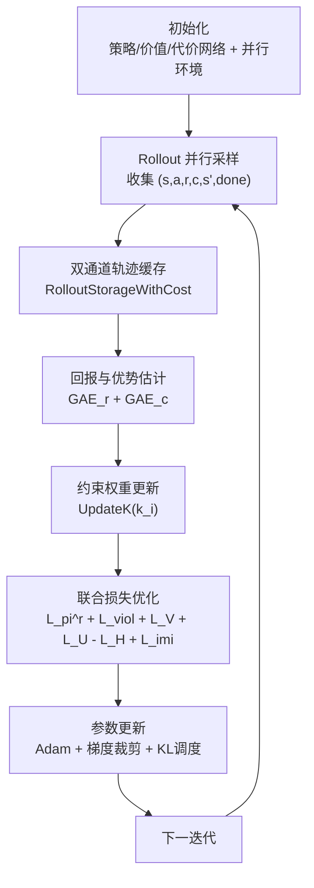

（算法 3-1 NP3O 训练伪代码）
```text
Input: 环境 E, 初始参数 θ, ψ, ξ, 约束权重 k, 阈值 d
for iteration = 1 ... MaxIter do
    # 1) 并行采样
    D ← Rollout(E, π_θ, T, N_env)

    # 2) 双通道回报估计
    Â^r, R̂ ← ComputeRewardGAE(D, V_ψ)
    Â^c, Ĉ ← ComputeCostGAE(D, U_ξ)

    # 3) 约束权重调度
    k ← UpdateK(k, iteration)

    # 4) 多轮小批量联合优化
    for epoch = 1 ... K_epoch do
        for minibatch in D do
            L_pi^r   ← PPOClipLoss(minibatch, Â^r)
            L_viol   ← ViolationLoss(minibatch, Â^c, k, d)
            L_V      ← ValueLoss(minibatch, R̂)
            L_U      ← CostValueLoss(minibatch, Ĉ)
            L_total  ← L_pi^r + λ_viol L_viol + λ_V L_V + λ_U L_U
                        - λ_H Entropy + λ_imi L_imi
            (θ, ψ, ξ) ← AdamStep(∇L_total, grad_clip, lr_schedule)
        end for
    end for
end for
Output: 训练后的策略参数 θ
```

（表 3-1 NP3O 与标准 PPO 流程对比表）

| 模块 | 标准 PPO 做法 | 本文 NP3O 做法 | 改进目的 |
|---|---|---|---|
| 样本组织 | 存储 \((s,a,r,s',done)\) | 存储 \((s,a,r,\mathbf{c},s',done)\) 双通道轨迹 | 显式引入安全语义 |
| 回报估计 | 仅奖励回报与奖励优势 | 同时估计奖励/代价回报与优势 | 同步评估性能与风险 |
| 价值学习 | 单价值网络 \(V(s)\) | 奖励价值 \(V(s)\) + 代价价值 \(U(s)\) | 提升约束可解释性 |
| 策略目标 | 裁剪策略损失 \(L_\pi\) | \(L_\pi^r + \lambda_{viol}L_{viol}\) | 抑制高回报高风险更新 |
| 约束处理 | 通常并入奖励或不显式建模 | 6 通道代价 + 通道权重 \(k_i\) + 阈值 \(d_i\) | 形成可控可调约束优化 |
| 训练监控 | reward/value/entropy 为主 | 增加 `cost_*` 与 `viol_loss` 指标 | 便于诊断安全学习过程 |

### 3.2 NP3O 目标函数与优化策略
在策略目标层，本文沿用 PPO 的裁剪概率比思想。定义
\[
\rho_t(\theta)=\frac{\pi_\theta(a_t|s_t)}{\pi_{\theta_{old}}(a_t|s_t)},
\]
则奖励通道的策略损失写为
\[
\mathcal{L}_{\pi}^{r}=
\mathbb{E}_t\left[\max\left(-\rho_t\hat A_t^r,\;-\operatorname{clip}(\rho_t,1-\epsilon,1+\epsilon)\hat A_t^r\right)\right].
\]
其中 \(\hat A_t^r\) 为奖励优势，\(\epsilon\) 为裁剪系数。

约束通道采用与 PPO 同形的代价代理项。令 \(\hat{\mathbf A}_t^c\in\mathbb{R}^m\) 为 \(m\) 维代价优势（本文 \(m=6\)），可写为
\[
\mathbf{\mathcal{L}}_{\pi}^{c}=
\mathbb{E}_t\left[\max\left(\rho_t\hat{\mathbf A}_t^c,\;\operatorname{clip}(\rho_t,1-\epsilon,1+\epsilon)\hat{\mathbf A}_t^c\right)\right].
\]
在实现中，代价代理项与违约统计共同构成违约损失。设 \(\mathbf{k}=[k_1,\dots,k_m]\) 为通道权重，\(\mathbf{v}\) 为违约量，则
\[
\mathcal{L}_{viol}=\sum_{i=1}^{m}k_i\cdot \operatorname{ReLU}\left(\mathcal{L}_{\pi,i}^{c}+v_i\right),\quad m=6.
\]
该项的物理含义是：仅惩罚“朝违约方向增加”的更新趋势，从而避免对已满足约束的通道产生过度抑制。

评论家部分由奖励价值损失与代价价值损失组成，二者均采用裁剪回归形式。记 \(V_\psi\) 为奖励价值、\(U_\xi\) 为代价价值，则有
\[
\mathcal{L}_{V}=\mathbb{E}_t\!\left[\max\!\left((V_\psi-\hat R_t)^2,\;(V_\psi^{clip}-\hat R_t)^2\right)\right],
\]
\[
\mathcal{L}_{U}=\mathbb{E}_t\!\left[\max\!\left((U_\xi-\hat C_t)^2,\;(U_\xi^{clip}-\hat C_t)^2\right)\right].
\]

在回报构造上，奖励通道与代价通道均采用 TD(\(\lambda\)) 递推。对代价通道，存储器先计算 \(\hat C_t-U_\xi(s_t)\) 得到代价优势，再按通道维度标准化，以减少各代价量纲差异带来的优化偏置。违约项则结合目标阈值 \(\mathbf d\) 进行中心化处理，使其更贴近“相对约束边界”的统计语义。

此外，策略熵正则用于维持探索，模仿/表征项用于提升历史编码质量。故总损失可写为
\[
\mathcal{L}=\mathcal{L}_{\pi}^{r}
\;+\;\lambda_{viol}\mathcal{L}_{viol}
\;+\;\lambda_V\mathcal{L}_{V}
\;+\;\lambda_U\mathcal{L}_{U}
\;-\;\lambda_H\mathcal{H}(\pi_\theta)
\;+\;\lambda_{imi}\mathcal{L}_{imi}.
\]
其中各 \(\lambda\) 对应实现中的损失权重系数。

结合代码实现，参数更新采用单 Adam 优化器、全局梯度裁剪与可选 KL 自适应学习率调度。约束权重 \(\mathbf{k}\) 在迭代中按
\[
\mathbf{k}\leftarrow \min\left(\mathbf{1},\mathbf{k}\cdot 1.0004^{\,it}\right)
\]
进行缓增，使训练节奏呈现“前期探索、中后期约束收紧”。这一策略可在训练初期避免过强约束造成策略停滞，并在后期提升可行域收敛能力。

值得强调的是，本文并未将代价项简单并入奖励，而是在目标函数层显式保留约束通道。这一设计提升了目标函数可解释性，使后续章节可直接从 `cost_*` 指标观察安全学习过程。

（图 3-2 NP3O 联合损失构成图）
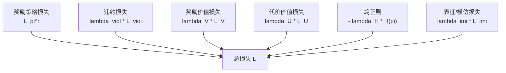

（表 3-2 第三章主要超参数表）

| 参数类别 | 参数符号/名称 | 本文设置 | 作用 | 调参敏感性 |
|---|---|---|---|---|
| 折扣与优势 | \(\gamma\) | 0.99 | 平衡短期与长期回报 | 中 |
| 折扣与优势 | \(\lambda\)（GAE） | 0.95 | 控制优势估计偏差-方差折中 | 中 |
| PPO 裁剪 | \(\epsilon\) | 0.2 | 限制策略单步更新幅度 | 高 |
| 约束损失 | \(\lambda_{viol}\) | 任务配置项（可调） | 控制约束抑制强度 | 高 |
| 代价价值损失 | \(\lambda_U\) | 任务配置项（可调） | 约束价值学习权重 | 中高 |
| 熵正则 | \(\lambda_H\) | 任务配置项（可调） | 维持探索，防止早收敛 | 中 |
| 优化器 | learning rate | Adam + KL 自适应 | 提升不同阶段收敛稳定性 | 高 |
| 梯度稳定 | `max_grad_norm` | 配置项（启用） | 防止梯度爆炸 | 中 |
| 数据利用 | `num_learning_epochs` | 5 | 单次采样多轮更新 | 中 |
| 数据利用 | `num_mini_batches` | 4 | 小批量优化粒度 | 中 |
| 并行采样 | `num_envs` | 4096 | 提升样本吞吐和统计稳定性 | 高 |
| 时序长度 | `num_steps_per_env` | 24 | 控制单轮 rollout 长度 | 中 |

### 3.3 策略—价值—代价联合网络架构
本文采用 `ActorCriticBarlowTwins` 三头联合架构，统一输出动作分布、奖励价值与代价价值。该架构遵循“决策端轻量、评估端增强”的原则：Actor 使用更贴近部署的输入子集，Critic/Cost Critic 使用更丰富状态信息以提升估计精度。

具体地，观测向量按固定切片分为本体特征 \(o^{prop}\)、地形扫描特征 \(o^{scan}\)、特权隐变量 \(o^{priv}\) 与历史特征 \(o^{hist}\)。策略头仅接收 \(o^{prop}\) 与 \(o^{hist}\)：先由 `MlpBarlowTwinsActor` 对历史窗口编码，再与当前本体拼接，经三层全连接（512-256-128）输出动作均值。动作分布采用对角高斯形式，方差参数为可学习全局向量，从而兼顾探索能力与实现简洁性。

奖励价值头与代价价值头共享“多分支编码 + 特征拼接”的输入结构：  
（1）扫描分支：\(187\) 维地形扫描经 MLP 编码为 \(32\) 维特征；  
（2）隐变量分支：\(36\) 维动力学相关隐变量（本配置中为恒等映射）；  
（3）历史分支：`StateHistoryEncoder` 输出 \(32\) 维时序潜变量；  
（4）本体分支：保留 \(33\) 维即时本体状态。  
拼接后送入评论家 MLP（512-256-128），分别得到标量价值 \(V(s)\) 与 6 维代价价值 \(U(s)\)。

从功能分工看，策略头回答“当前该怎么动”，奖励价值头回答“这样做是否更有利于任务收益”，代价价值头回答“这样做是否更接近违约边界”。三头协同使同一状态在“性能语义”和“安全语义”上均可被显式评估。

为保证代价预测的物理可解释性，代价头末端采用 Softplus 激活，使输出非负。这与代价“风险强度”语义一致，也能减少训练中因符号翻转导致的估计不稳定问题。与此同时，策略方差作为可学习参数与网络参数同步更新，可实现探索强度的自适应调节。

该网络结构与 NP3O 损失函数在语义上形成一一对应：奖励损失主要驱动策略与奖励价值头，违约损失主要通过策略梯度与代价价值估计共同作用，最终实现“同一策略、双重监督”的联合学习。

（图 3-3 Actor-Critic-Cost 三头网络结构图）
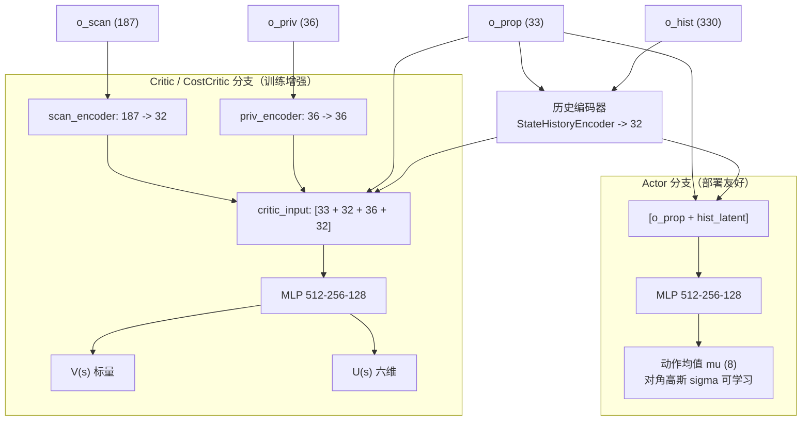

（表 3-3 网络各分支维度与层宽配置表）

| 模块 | 输入维度 | 隐藏层结构 | 输出维度 | 功能 |
|---|---:|---|---:|---|
| 历史编码器 | \(o^{prop}+o^{hist}\)（序列） | `StateHistoryEncoder` | 32 | 提取时序潜变量 |
| Actor 主干 | \(33 + 32\) | MLP `512-256-128` | 8（动作均值） | 生成控制动作分布 |
| Actor 方差头 | 可学习参数向量 | 参数化（非 MLP） | 8（对角方差） | 调节探索强度 |
| 扫描编码分支 | 187 | MLP 编码 | 32 | 压缩地形几何信息 |
| 隐变量分支 | 36 | 恒等/轻量映射 | 36 | 保留随机化语义 |
| Critic 主干 | \(33+32+36+32=133\) | MLP `512-256-128` | 1 | 估计奖励价值 \(V(s)\) |
| Cost Critic 主干 | 133 | MLP `512-256-128` | 6 | 估计代价价值 \(U(s)\) |

### 3.4 非对称信息利用与表征学习
在复杂地形盲走任务中，策略学习面临典型矛盾：若 Actor 直接依赖大量训练期特权信息，部署时易出现输入缺失或分布偏移；若 Critic 信息过少，优势估计又会高方差并影响收敛。本文采用非对称信息利用机制，以兼顾部署可行性与训练稳定性。

具体地，Actor 仅使用本体与历史信息形成动作决策，保持在线推理输入紧凑；Critic/Cost Critic 则融合扫描特征与隐变量信息，用于训练阶段提供更精确的值函数监督。该机制本质上是“用更多信息改进梯度，而非增加部署复杂度”。

为增强历史编码的判别性，本文引入 Barlow Twins 表征约束。设历史编码表征为 \(\mathbf{z}^{hist}\)，当前本体编码表征为 \(\mathbf{z}^{obs}\)，构造跨样本互相关矩阵 \(\mathbf{C}\)。损失由“对角接近 1”与“非对角接近 0”两部分组成：
\[
\mathcal{L}_{BT}
=\sum_i(C_{ii}-1)^2
+\beta\sum_{i\neq j}C_{ij}^2.
\]
该约束鼓励历史表征在保持信息充分性的同时去冗余，避免不同潜变量维度坍塌到相似语义。

除去相关约束外，模型还将历史编码前 10 维与特权子向量进行 MSE 对齐，作为训练早期的监督锚点。其目标不是替代强化学习目标，而是减少时序表征在早期阶段的随机漂移。最终辅助损失可写为
\[
\mathcal{L}_{imi}=\mathcal{L}_{BT}+\lambda_{priv}\mathcal{L}_{priv}.
\]
在工程调度上，当启用 `imi_flag` 且断点续训时，\(\lambda_{imi}\) 在训练前半程线性衰减至 0。该策略使模型先利用表征约束快速形成稳定特征空间，再由任务与约束目标主导后续优化，兼顾收敛速度与最终性能。

该设计与第三章总体目标一致：非对称输入保障部署可行性，表征约束保障训练稳定性，二者共同服务于约束强化学习在复杂地形场景中的工程落地。

（图 3-4 非对称信息利用与表征约束示意图）
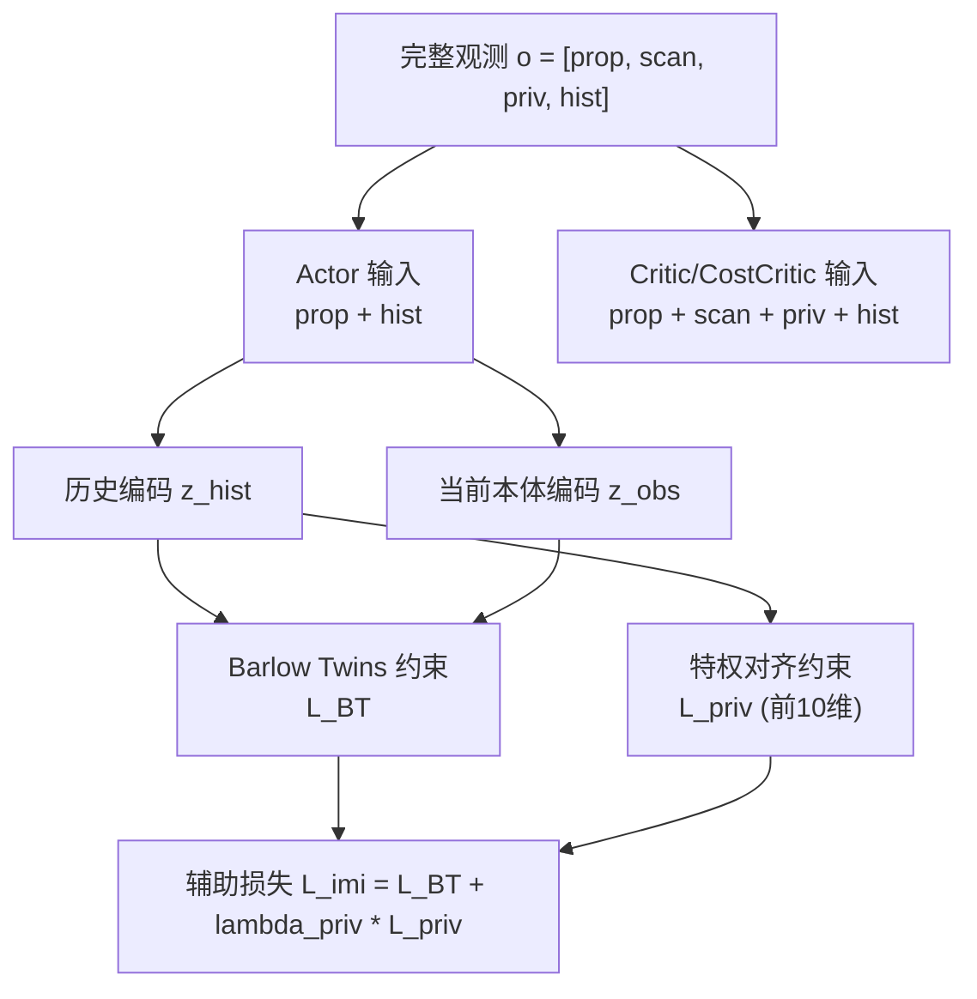

（表 3-4 非对称信息与表征约束配置表）

| 配置项 | 当前设置 | 作用对象 | 主要作用 | 启用条件/策略 |
|---|---|---|---|---|
| Actor 输入切片 | `prop + hist` | 策略分支 | 保持部署输入紧凑、降低依赖特权信息 | 始终启用 |
| Critic 输入切片 | `prop + scan + priv + hist` | 价值/代价分支 | 提升值函数估计精度，降低优势方差 | 训练阶段启用 |
| 历史编码器输出维度 | 32 | Actor/Critic 共享 | 提取短时动态信息 | 始终启用 |
| Barlow Twins 权重 | \(\beta\)（配置项） | 表征约束 | 去冗余、避免潜变量塌缩 | `imi_flag=True` |
| 特权对齐维度 | 前 10 维 | 历史特征与特权子向量 | 提供训练早期监督锚点 | `imi_flag=True` |
| 辅助损失系数 | \(\lambda_{imi}\) | 总损失项 | 平衡任务学习与表征约束 | 断点续训时前半程线性衰减至 0 |

### 3.5 训练稳定化机制
为应对复杂接触动力学引起的高方差梯度问题，本文在优化与数据处理层面引入了多种稳定化机制。

首先，在回报估计阶段采用 GAE（Generalized Advantage Estimation）计算奖励优势与代价优势，并分别做标准化处理。该方法在偏差与方差之间取得平衡，能够显著改善长时序任务中的策略更新稳定性。对于超时终止样本，系统采用 bootstrap 方式注入尾值，避免将“时间截断”误判为“失败终止”，从而提升价值学习一致性。

其次，在参数更新阶段采用 PPO 裁剪比率约束、价值函数裁剪回归与全局梯度裁剪（`max_grad_norm`）的组合。其作用分别对应：限制单次策略步长、抑制价值网络过冲、避免异常 batch 导致梯度爆炸。对角高斯策略的可学习方差参数则通过熵正则共同调节探索强度，使训练前期保持探索、后期逐步收敛。

再次，学习率调度采用基于 KL 偏差的自适应机制：当新旧策略差异过大时降低学习率，差异过小时适度提高学习率。该机制可在不同训练阶段自动匹配更新步长，降低人工调参压力。

在任务层面，终止惩罚与代价约束共同构成“硬失败 + 软违约”双层安全反馈：基座触地等失败事件触发显式终止惩罚，关节越界、冲击过大等风险行为通过代价通道持续抑制。两者配合可有效减少“高回报但高风险”的策略解。

最后，域随机化与外部扰动注入从数据分布层面增强鲁棒性。摩擦、质量、质心、驱动增益、执行时滞与外力推扰的随机化，使策略在训练中持续暴露于非理想工况，从而提升跨场景泛化能力与部署稳定性。

此外，本文还通过日志监控机制维持训练可诊断性：训练器持续记录 `Loss/value_function`、`Loss/cost_value_function`、`Loss/mean_viol_loss`、`Policy/mean_noise_std` 等关键指标，用于识别“价值过冲、约束失效、探索不足”等典型训练异常。这一机制虽然不直接参与梯度计算，但对稳定训练与快速定位问题具有关键工程价值。

综上，本文稳定化机制并非单点技巧，而是由“回报估计稳定—参数更新稳定—约束反馈稳定—数据分布稳定—过程监控稳定”五层共同构成。该体系为 NP3O 在高维接触系统中的可靠收敛提供了方法支撑，也为后续实验分析提供了可解释依据。

（表 3-5 训练稳定化机制归纳表）

| 机制类别 | 具体方法 | 对应代码实现 | 主要作用 | 可能副作用 |
|---|---|---|---|---|
| 回报估计稳定 | 奖励/代价双通道 GAE + 标准化 | `RolloutStorageWithCost` | 降低优势估计方差，改善收敛平滑性 | 过度标准化可能弱化极端样本信号 |
| 策略更新稳定 | PPO 裁剪比率约束 | `NP3O.update()` | 限制策略突变，防止训练发散 | 裁剪过强会降低学习速度 |
| 价值学习稳定 | 价值/代价价值裁剪回归 | `value_loss` / `cost_value_loss` | 抑制价值网络过冲 | 可能引入轻微估计偏差 |
| 梯度数值稳定 | 全局梯度裁剪 `max_grad_norm` | 优化器反向传播阶段 | 防止梯度爆炸 | 裁剪过小导致欠更新 |
| 学习率稳定 | KL 自适应学习率调度 | `desired_kl` 相关策略 | 自动匹配不同阶段步长 | 阈值设置不当会造成振荡 |
| 探索稳定 | 熵正则 + 可学习方差 | 策略分布头 | 避免早期陷入局部最优 | 熵权过大导致收敛变慢 |
| 安全反馈稳定 | 终止惩罚 + 6 通道代价约束 | 环境代价函数 + `viol_loss` | 抑制高风险高回报策略 | 约束过强可能保守 |
| 分布鲁棒稳定 | 域随机化 + 外部推扰 | 环境随机化配置 | 提升泛化与抗扰能力 | 训练难度上升、收敛更慢 |
| 训练可诊断性 | 关键日志持续监控 | `Train/*`, `Loss/*`, `Policy/*` | 快速定位异常与调参方向 | 监控项过多增加分析成本 |

### 3.6 本章小结

本章在第二章 CMDP 建模基础上，系统给出了基于 NP3O 的约束强化学习求解方法。核心思路是将奖励回报与代价回报并行建模，在 PPO 裁剪更新框架中同时优化策略损失、奖励价值损失、代价价值损失与违约惩罚项，从而显式处理“性能提升”与“安全约束”之间的冲突关系。相比标准 PPO，本文方法引入了代价优势估计与通道化违约约束，使优化目标由单一收益最大化扩展为“收益—风险”协同优化。

在工程实现上，本章明确了 `OnConstraintPolicyRunner`、`RolloutStorageWithCost` 与 `NP3O` 的模块分工，并给出了 Actor-Critic-Cost 联合网络、非对称信息利用以及 Barlow Twins 表征约束机制。通过 GAE 双通道估计、KL 自适应学习率、梯度裁剪、终止惩罚与域随机化等稳定化策略，训练流程形成“采样—估计—联合优化—迭代更新”的闭环体系。上述方法设计为第四章实验协议和第五章性能/安全性结果分析提供了可追溯的算法依据，也为后续 sim2sim 与 sim2real 扩展奠定了方法基础。
## 第四章 仿真平台与实验设计

### 4.1 并行仿真平台与实验环境
本章围绕“实验如何可复现、结论如何可验证”展开。与第三章方法论不同，本章关注实验系统的实现边界、参数组织方式和指标采集路径，目标是在工程层面回答“策略为何可信”。为此，本文将实验平台、地形机制、随机化策略、训练流程与评估协议统一纳入同一实验框架描述。

实验平台采用 NVIDIA Isaac Gym，物理引擎为 PhysX。训练入口由 `train.py` 发起，经 `task_registry` 完成任务注册、配置加载、环境构建与训练器实例化。该过程形成了稳定的执行链路：`register(task)` → `make_env()` → `make_alg_runner()` → `learn()`。由于任务配置与算法配置均通过注册器集中管理，实验参数可追溯性较好，便于后续复现实验与版本对比。

在并行规模上，本文采用 \(N_{env}=4096\) 个并行环境、每轮每环境采样 \(T=24\) 步，因此单次策略更新的采样规模为
\[
N_{sample}=N_{env}\times T=98304.
\]
该设置与约束策略梯度方法的高样本需求相匹配：一方面，大规模并行采样显著提高了样本吞吐率；另一方面，多环境随机初始化降低了单场景偶然性对梯度方向的干扰，使训练曲线更平滑、统计更稳定。

时间离散方面，仿真步长设为 \(dt_{sim}=0.0025\) s，控制降采样系数为 4，对应策略控制周期 \(dt_{ctrl}=0.01\) s（100 Hz）。该“快仿真—慢控制”结构的作用在于：仿真层以更高频率解析接触动力学，策略层以工程可实现频率输出控制意图，从而在计算开销与控制精度之间取得折中。

此外，训练过程中启用 `init_at_random_ep_len=True` 的随机初始 episode 长度机制，用于减少并行环境 reset 同步带来的数据相关性。该设计虽不改变任务定义，但可改善早期训练样本多样性，并提升统计估计稳健性。

（图 4-1 占位：实验系统执行链路图。建议展示“train.py→task_registry→LeggedRobot 环境→OnConstraintPolicyRunner→NP3O 更新”的调用关系。）

（表 4-1 占位：实验基础环境配置表。建议列出并行环境数、仿真步长、控制频率、每轮采样步数、训练迭代上限等关键参数。）

### 4.2 复杂地形与课程学习机制
复杂地形是本文实验的核心变量。为避免在规则地面上获得“虚高性能”结论，环境采用 `trimesh` 非结构化地形建模，并通过多子地形混合构造跨场景训练分布。基础参数包括：水平分辨率 \(0.1\) m、垂直分辨率 \(0.005\) m、单元地形尺寸 \(8\,\text{m}\times 8\,\text{m}\)、地形网格 \(10\times20\)。地形类型按配置比例混合平滑坡、粗糙坡、上/下台阶与离散障碍，覆盖轮足系统常见通过场景。

在观测侧，环境启用地形高度测量机制（`measure_heights=True`），将机体周围固定采样点的高度信息编码为扫描特征。该信息与本体状态、历史观测共同构成策略学习输入，使控制器不仅依据当前动力学状态作出反应，还能对局部地形趋势进行前馈补偿。

课程机制方面，本文启用地形课程（`terrain.curriculum=True`）。其基本逻辑是根据机器人在当前地形等级上的运动表现，动态调整环境初始化难度：表现稳定则提升等级，表现不足则维持或回退。该机制本质上是“能力驱动难度调度”，可显著缓解直接在高难地形训练导致的早期梯度无效问题。

需要强调的是，本任务中命令课程未启用（`commands.curriculum=False`），速度指令采样范围保持不变。因此，训练难度增长主要来源于地形几何复杂度，而非指令分布扩张。这一设定有利于在实验分析阶段将“控制能力提升”明确归因于地形适应学习本身。

从工程视角看，地形课程与并行采样耦合后形成了“多环境、多等级、动态分配”的数据生成机制。该机制直接决定了策略在训练阶段接触到的状态分布广度，是第五章泛化与鲁棒性分析的前提条件。

（图 4-2 占位：复杂地形生成与课程推进示意图。建议展示不同地形类型样例及课程等级递进关系。）

（表 4-2 占位：地形参数与课程机制配置表。建议按“参数项、当前设置、作用、对应代码位置”四列组织。）

### 4.3 域随机化与扰动注入策略
约束强化学习在复杂地形场景中的有效性，不仅取决于优化器本身，也取决于训练数据分布是否覆盖真实运行的不确定性。为此，本文在训练过程中引入系统化域随机化与外部扰动注入机制，以降低策略对“单一理想动力学模型”的依赖。

随机化变量主要包括三类：  
（1）**接触参数类**：摩擦系数、恢复系数；  
（2）**本体动力学类**：附加质量、质心偏移；  
（3）**执行器与控制链路类**：电机强度比例、PD 增益比例、控制时滞步数。  
上述变量在预设范围内随机采样并注入并行环境，使同一策略在训练阶段持续接触“参数漂移”状态，从而学习更具鲁棒性的控制规律。

除静态参数随机化外，环境还采用周期外力推扰机制（`push_robots=True`）。其作用是模拟现实中的突发外力、碰撞冲击或地面扰动，重点检验策略的恢复能力与姿态回正能力。该机制对安全约束学习尤为重要，因为不少失败事件并非来自稳态误差，而是来自短时冲击后的恢复失效。

从实验设计逻辑看，域随机化与扰动注入并非“额外噪声”，而是训练分布构造的一部分：随机化扩展了参数域，推扰扩展了动力学瞬态域，两者共同提高策略的跨场景泛化潜力。该设计与第二章“盲走任务不确定性”设定保持一致，也为第五章鲁棒性分析提供了直接证据链。

在实现层面，随机化与扰动均由环境侧统一管理，避免在算法侧引入额外分支逻辑，从而保持 NP3O 优化流程的完整性与可复现性。

（图 4-3 占位：域随机化与扰动注入流程图。建议展示“参数采样—环境实例化—训练交互—策略更新”的循环。）

（表 4-3 占位：随机化变量范围与物理含义表。建议列出摩擦、质量、质心、驱动增益、时滞、推扰间隔/强度等配置。）

### 4.4 训练配置与实现流程
训练配置遵循“固定协议、参数显式、流程可复现”的原则。算法执行栈为 `OnConstraintPolicyRunner + NP3O + ActorCriticBarlowTwins`，其中 Runner 负责采样调度与日志记录，NP3O 负责损失计算与参数更新，网络模块负责动作、价值与代价估计。

关键训练参数包括：每轮采样步数 24、mini-batch 数 4、学习 epoch 数 5、最大迭代数 10000、学习率 \(1\times10^{-3}\)、折扣因子 \(\gamma=0.99\)、GAE 系数 \(\lambda=0.95\)、PPO 裁剪系数 0.2。该组合在工程上形成“高采样并行 + 适度重复优化”的更新节奏，兼顾收敛速度与数值稳定性。

具体实现流程可细化为：  
（1）注册并加载 `tita_constraint` 任务与配置；  
（2）构建并行环境，初始化观测与缓存；  
（3）执行 rollout，写入奖励、代价、动作概率、价值估计；  
（4）计算奖励/代价回报与优势；  
（5）更新约束权重并执行多轮 mini-batch 反向传播；  
（6）输出日志、保存模型并进入下一迭代。  
其中第（3）至第（5）步构成每次迭代的核心训练内循环。

为提升工程可复现实验能力，项目支持断点续训（`resume=True`）与周期保存（默认每 100 iter 存储一次模型）。训练日志通过 TensorBoard 输出，记录 `Loss/*`、`Policy/*`、`Perf/*`、`Train/*` 与 `Episode/*` 多维指标。该记录机制能够支撑后续收敛性、稳定性与约束满足性的分层分析。

另外，训练过程中还实现了模仿/表征辅助损失权重随迭代衰减的调度机制，使优化过程由“表征先收敛”平滑过渡到“任务目标主导”。该调度虽属于算法细节，但在训练流程上体现为可观测的损失曲线变化，对结果解释具有辅助价值。

（图 4-4 占位：训练实现流程图。建议展示“初始化→采样→回报估计→参数更新→日志与模型保存”的迭代循环。）

（表 4-4 占位：训练超参数与实现配置表。建议按“类别、参数、取值、作用、敏感性说明”组织。）

### 4.5 评估协议与部署衔接设计
为保证实验结论具备可比性，本文在评估阶段采用“性能—安全—训练稳定性”三层指标体系。性能层关注速度跟踪误差、姿态偏差与通过连续性；安全层关注终止率与各代价通道统计；稳定性层关注损失曲线、违约损失演化与策略方差变化。该分层结构与第三章目标函数分解保持一致，使“指标—方法—结论”形成闭环。

数据采集路径方面，环境在 episode 结束时自动汇总 `rew_*` 与 `cost_*` 指标；Runner 在训练过程中同步记录 `Loss/*`、`Train/*`、`Episode/*` 与 `Perf/*`。因此，本文结果分析并非依赖离线手工统计，而是基于训练过程自动生成的结构化日志，具备可复核性。

为减少结果解释歧义，本文建议在评估协议中明确统计窗口（按迭代均值、按 episode 均值或按滑动窗口）、异常值处理策略以及对比基线配置。特别是在约束学习场景下，应避免仅汇报平均回报而忽略终止率与代价通道，防止出现“高收益、低安全”的偏置结论。

部署衔接方面，项目已具备策略导出链路：网络内部可导出 TorchScript/ONNX，外部脚本可执行 ONNX 到 TensorRT 引擎转换。该链路为后续 sim2sim/sim2real 提供了标准模型接口，但本文不直接给出部署端性能结论，而是将其作为扩展验证方向保留。

需要指出，导出模型在不同硬件与推理后端下可能出现时延和数值差异。因而部署实验应采用统一硬件、统一频率、统一 warmup 协议，并同时报告精度一致性与实时性指标，才能形成有意义的工程结论。

综上，第四章构建的评估与部署衔接协议，实质上是将“训练有效性”与“工程可迁移性”同时纳入实验设计边界，为第五章结果解释提供标准化依据。

（表 4-5 占位：评估指标定义与统计窗口表。建议按“指标类别、指标名称、数学定义/统计方式、数据来源、用途”五列组织。）

（图 4-5 占位：训练到部署的接口衔接示意图。建议展示“模型检查点→ONNX/TensorRT 导出→推理集成→跨平台验证”的流程。）

## 第五章 实验结果与分析

### 5.1 训练收敛特性分析
本节基于第四章定义的日志协议，对 NP3O 训练过程的收敛性进行定量分析。与“仅看平均回报”的传统汇报方式不同，本文采用收益、约束与优化稳定性三条证据链并行判断收敛质量：  
（1）**收益证据链**：`Train/mean_reward` 与 `Episode/rew_*` 的长期趋势；  
（2）**约束证据链**：`Episode/cost_*` 与 `Loss/mean_viol_loss` 的下降行为；  
（3）**优化证据链**：`Loss/value_function`、`Loss/cost_value_function`、`Loss/surrogate` 的振荡幅度与稳定区间。

为增强统计严谨性，建议采用滑动窗口均值与方差联合报告。记指标序列为 \(x_t\)，窗口长度为 \(W\)，则可计算
\[
\bar x_t=\frac{1}{W}\sum_{k=t-W+1}^{t}x_k,\qquad
s_t^2=\frac{1}{W-1}\sum_{k=t-W+1}^{t}(x_k-\bar x_t)^2.
\]
当 \(\bar x_t\) 进入平台区且 \(s_t\) 持续下降时，可判定该指标趋于稳定。该判据可避免由单次异常迭代造成的误判。

结合本文训练机制，收敛过程通常呈现阶段性特征：前期以探索为主，回报增长快但约束波动较大；中期回报继续提升且代价逐步下降；后期在约束权重增强与探索收缩作用下，回报增速放缓而约束指标趋稳。该现象与第三章“动态约束收紧”机制在理论上相一致。

若出现“回报上升但违约不降”或“违约下降但回报塌陷”的分离现象，应优先回查奖励尺度、约束权重更新速率、代价通道归一化与随机化强度配置。该诊断逻辑可直接映射到代码中的 `reward_scales`、`cost_k_values`、`compute_cost_returns` 与 `domain_rand` 模块，具备明确工程可操作性。

综上，本节强调的不是单一曲线“好看”，而是收益、约束和优化三条链路在统计意义上的一致收敛。只有三者协同稳定，才能支持后续性能与安全结论。

（图 5-1 占位：训练阶段关键曲线。建议至少包含 `Train/mean_reward`、`Loss/mean_viol_loss`、`Loss/value_function`、`Loss/cost_value_function` 四条主曲线。）

### 5.2 复杂地形运动性能分析
复杂地形性能评估聚焦“是否能走、是否走得准、是否走得稳”三个问题，对应通过能力、指令跟踪能力与姿态控制能力。基于当前任务定义，本文建议采用如下核心指标：
\[
e_v=\left\|\mathbf v_{xy}^{cmd}-\mathbf v_{xy}\right\|_2,\qquad
e_\omega=\left|\omega_z^{cmd}-\omega_z\right|,
\]
\[
e_{att}=\sqrt{\omega_x^2+\omega_y^2}\ \text{或}\ \sqrt{g_x^2+g_y^2}.
\]
其中 \(e_v\) 与 \(e_\omega\) 表征速度跟踪质量，\(e_{att}\) 表征姿态稳定程度。

考虑到复杂地形场景具有显著非高斯长尾特征，仅报告均值不足以刻画真实性能。建议同时报告中位数、90/95 分位数和最差分位区间，以刻画策略在“极端局部地形”下的控制边界。该做法可避免“均值较优但尾部失稳”的统计掩盖问题。

从工程实践角度，定量统计应与定性轨迹回放联动：坡面场景重点观察速度与俯仰耦合，台阶场景重点观察姿态恢复与接触冲击，离散障碍场景重点观察短时动作平滑性与不连续地形响应。若三类场景均表现为低跟踪误差与连续控制输出，可认为策略具备复杂地形下的可执行运动一致性。

此外，性能分析应与第四章的地形课程和随机化配置对应解释。例如，若在高难地形等级下仍保持稳定跟踪，说明策略并非仅记忆低难样本分布；若在外力推扰条件下跟踪误差短时上升后快速恢复，说明控制策略具备一定抗扰恢复能力。

本节最终目标不是证明“策略绝对最优”，而是通过可复核指标证明其在项目定义任务上的性能充分性，并为第五章安全分析提供前提。

（图 5-2 占位：复杂地形代表场景下的轨迹与姿态变化图。）

（表 5-1 占位：运动性能统计表。建议按“场景类型、速度误差、姿态偏差、成功率、备注”组织。）

### 5.3 约束满足与安全性分析
安全性分析是本文区别于纯性能强化学习工作的关键部分。依据第二章与第三章定义，本文将安全证据分为“硬约束结果”和“软约束趋势”两层：  
（1）**硬约束结果**：失败终止比例（如基座触地触发 reset）；  
（2）**软约束趋势**：六维代价通道 \(c^{pos},c^{torque},c^{vel},c^{acc},c^{force},c^{stumble}\) 的统计演化。

为便于跨实验对比，可定义单位时间违约率：
\[
p_i=\frac{1}{N}\sum_{t=1}^{N}\mathbb{I}(c_{i,t}>0),
\]
以及通道平均风险强度：
\[
\bar c_i=\frac{1}{N}\sum_{t=1}^{N}c_{i,t}.
\]
其中 \(p_i\) 描述“违约发生频度”，\(\bar c_i\) 描述“违约严重程度”。二者共同使用可避免把频繁轻微违约与少量严重违约混为一谈。

在约束学习框架下，安全结论应满足以下一致性：失败终止率下降、主要代价通道 \(p_i\) 下降、违约损失 `Loss/mean_viol_loss` 下降，且性能指标未发生不可接受退化。若仅有代价下降而性能大幅退化，则说明策略可能过于保守；若仅有回报上升而终止率不降，则说明存在“高收益高风险”的投机行为。

由于各约束通道间存在耦合关系，本节强调联动分析而非单通道孤立分析。例如，`acc_smoothness` 的加强通常会降低动作突变，但可能抑制急剧地形变化下的快速恢复；`feet_contact_forces` 的压制可减少冲击风险，但过强约束可能降低通过效率。该权衡关系应通过“代价—性能”二维散点或对比表展示，以支撑工程可用结论。

总体上，本文将安全性界定为“在可接受性能下持续满足约束边界的能力”，而非单一的零跌倒目标。这一定义更符合复杂地形控制的实际工程语境。

（图 5-3 占位：各约束代价通道随迭代变化曲线。）

（表 5-2 占位：终止事件与违约统计表。建议列出超时终止、失败终止、各代价通道均值/分位数。）

### 5.4 结构设计与关键机制讨论
本节不再重复“模块功能介绍”，而是从因果解释角度讨论第三章结构设计为何在本任务中有效。核心讨论对象包括：历史编码、评论家扫描分支、表征约束以及奖励—代价协同目标。

首先，历史编码机制通过引入短时序上下文，缓解了接触切换瞬间的部分可观测性问题。在轮足系统中，当前时刻动作效果常受上一时刻接触状态影响，单帧观测难以完整表征该隐状态。历史窗口使策略更容易学习“动作—接触—姿态”时序关系，从而降低高频抖动和短视控制风险。

其次，评论家侧融合地形扫描与隐变量信息，可提高价值估计与代价估计的判别能力。该设计并非为了增加策略部署复杂度，而是为了提升训练梯度质量。理论上，更准确的值函数估计将直接降低优势估计方差，进而改善策略更新稳定性。

再次，Barlow Twins + 特权对齐的辅助项在训练早期提供了结构化表征约束。其工程意义在于：当主任务梯度尚不稳定时，辅助约束可减少表示空间坍塌概率，使网络更快进入“可学习区域”。随后通过权重衰减逐步退出辅助监督，避免对最终策略形成过强先验束缚。

最后，奖励—代价协同目标从目标函数层面控制“性能-安全”权衡。与单奖励方案相比，约束通道将风险语义显式暴露给优化器，使策略在追求回报时仍受可行域限制。这一机制尤其适用于具有延迟风险后果的任务（如冲击累积、越界后跌倒），因为这类风险通常难以仅靠即时奖励建模。

为形成更强证据链，建议在后续实验中组织最小消融集：`w/o history`、`w/o scan critic`、`w/o BT`、`w/o cost`。通过对比收敛速度、终止率、违约率与跟踪误差，可将“结构设计有效”从经验判断提升为因果支持结论。

（表 5-3 占位：关键机制贡献与现象归因表。建议按“机制、去除后现象、可能原因、对工程部署影响”组织。）

### 5.5 扩展验证与工程可行性讨论（按实际结果撰写）
本节讨论方法的工程外推边界，即“仿真中有效的策略是否具备部署潜力”。基于当前代码，项目已具备从训练模型到推理模型的基本转换能力（TorchScript/ONNX/TensorRT 链路），因此可进一步开展部署可行性验证。

工程可行性建议围绕三类指标展开：  
（1）**格式可用性**：导出是否稳定、模型接口是否一致、推理后端是否可加载；  
（2）**实时性**：单步时延、时延抖动、控制频率满足度；  
（3）**行为一致性**：导出前后动作分布差异与控制效果偏差。  
其中行为一致性可通过
\[
\delta_a=\frac{1}{N}\sum_{t=1}^{N}\left\|a_t^{deploy}-a_t^{train}\right\|_2
\]
进行量化，以避免仅凭主观回放判断“部署是否一致”。

对于跨仿真器一致性（sim2sim）验证，本文建议采用“接口先对齐、结果后比较”的协议：先统一观测归一化、动作映射、控制频率与终止判据，再比较性能与安全指标。若直接在未对齐接口上比较结果，结论通常不可解释。

需要强调的是，部署评估与训练评估关注点不同：训练关注“是否学会”，部署关注“是否可稳定执行”。因此，部署实验必须同时报告精度和时延，而不能仅报告回报类指标。该观点与本文“性能-安全-工程可迁移”三重目标保持一致。

总体而言，本文方法在工程路径上已完成从训练到导出的接口闭环，但面向实机的最终结论仍依赖统一硬件协议下的独立量化实验。将该工作置于后续研究中，更符合当前项目边界与学术严谨性要求。

（图 5-4 占位：训练模型到部署模型的转换链路图。）

（表 5-4 占位：扩展验证实验设计表。建议包含“验证目标、输入输出对齐项、评价指标、风险点、结论口径”。）

## 第六章 结论与展望

### 6.1 研究工作总结
本文围绕“双轮足机器人复杂地形盲走控制”这一核心问题，完成了从任务建模到算法实现、再到实验评估与工程衔接的系统性研究。首先，在任务建模层面，本文将控制问题形式化为 CMDP，构建了由本体状态、地形扫描、历史信息与隐变量组成的复合观测，并明确了连续动作到执行器控制的映射关系，为后续学习优化提供了统一接口。

其次，在方法设计层面，本文基于 PPO 扩展提出面向约束优化的 NP3O 训练框架，构建“奖励回报—代价回报”双通道学习机制；通过策略—价值—代价三头联合网络，将性能学习与安全学习纳入同一优化流程；并结合历史编码与表征约束机制，提升复杂接触场景下的学习稳定性。

再次，在实验体系层面，本文依托 Isaac Gym 并行仿真平台完成复杂地形训练与评估流程设计，包含地形课程、域随机化、外部扰动注入、日志记录与模型保存等关键环节；通过速度跟踪、姿态稳定、终止事件与约束违约等多维指标建立了较完整的验证框架。

最后，在工程衔接层面，本文打通了策略导出与部署接口，形成“训练—评估—导出”的主干闭环，为后续跨仿真器验证与实机部署研究预留了可执行基础。整体工作体现了“问题定义清晰、方法实现可复现、评估逻辑可追溯”的研究组织思路。

### 6.2 主要结论与贡献
基于前述研究与实验分析，本文主要结论可归纳为以下四点。

第一，面向复杂地形盲走任务，将性能目标与安全目标在 CMDP 框架下显式解耦是必要且有效的。相较于将安全语义全部隐含于奖励函数的做法，奖励—代价并行建模更有利于抑制高风险行为，并提升训练过程的可解释性。

第二，采用 NP3O 进行联合优化能够在保持策略梯度训练稳定性的同时引入约束满足能力。通过代价优势估计、代价价值学习与违约惩罚机制，策略可在“提升任务表现”与“压制违约风险”之间实现动态平衡，符合工程控制中对性能与安全并重的需求。

第三，非对称信息利用与结构化表征设计对复杂地形任务具有显著方法价值。策略侧聚焦本体与历史信息、评论家侧融合扫描与隐变量的分工，可在不显著增加部署负担前提下提升价值估计质量；Barlow Twins 辅助约束则有助于早期训练稳定与表征去冗余。

第四，本文构建的实验与工程流程具备较好的复现性与扩展性。并行采样、课程机制、随机化扰动、日志体系与导出接口形成闭环，为后续开展部署时延评估、跨仿真器一致性分析和实机迁移研究提供了可复用技术基础。

综合而言，本文的主要贡献不仅在于提出约束强化学习在双轮足盲走任务中的实现方案，更在于给出了一条“任务建模—约束优化—多维评估—部署衔接”一体化的工程化研究路径。

（表 6-1 占位：本文主要结论与贡献对照表。建议按“结论编号、对应问题、核心发现、支撑证据、工程意义”五列组织。）

### 6.3 后续研究方向
尽管本文已完成仿真侧系统验证，但面向真实应用仍存在进一步提升空间，后续研究可从以下方向展开。

（1）**跨平台迁移与一致性验证**：在保持观测语义与控制接口一致前提下，系统开展 sim2sim 与 sim2real 迁移实验，重点分析不同物理引擎、接触模型与控制时序差异对策略稳定性的影响，建立标准化跨平台评测协议。

（2）**部署侧实时性优化**：围绕 TorchScript、ONNX、TensorRT 等推理链路，开展模型压缩、精度量化与算子融合研究，系统评估时延、吞吐与控制性能之间的权衡关系，提升策略在边缘计算平台上的可落地性。

（3）**约束机制自适应化**：进一步研究约束阈值与惩罚权重的在线自适应策略，使系统能够根据运行状态动态调整安全边界，减少人工调参与场景迁移成本。

（4）**多模态感知与长期鲁棒控制**：在保持盲走本体闭环优势基础上，探索将轻量视觉/触觉信息作为可选增强输入，提升对极端地形与突发扰动的先验感知能力；同时引入长时稳定性指标，关注策略在长周期运行中的性能退化问题。

（5）**实验体系完善与开源复现**：补充消融实验与统一统计口径，形成更完整的数据闭环；进一步固化训练配置、日志解析与结果复现实验脚本，提高方法在学术与工程场景中的可验证性。

总体上，未来工作将继续围绕“更强泛化、更高安全、更低时延、更易部署”四个方向推进，使约束强化学习在双轮足复杂地形自主运动中的应用从仿真验证走向工程实用。
